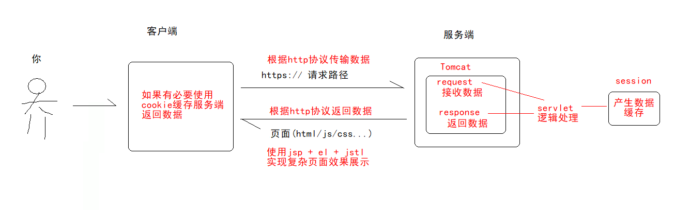

# Http&Servlet

# 学习目标 `*****`

- [ ] 理解什么是 HTTP 协议以及作用 `*****`
- [ ] 掌握请求头和响应头信息的结构 `*****`
- [ ] 掌握如何通过浏览器去查看请求头和响应头信息 `*****`
- [ ] 掌握 GET 请求和 POST 请求的区别 `***`
- [ ] 能够使用 IDEA 编写 Servlet（xml 和注解方式） `*****`
- [ ] 能够说出 Servlet 生命周期 `*****`
- [ ] 理解并掌握 Servlet 的请求流程 `*****`
- [ ] 掌握 Servlet 继承体系的小结内容 `*****`
- [ ] 掌握 ServletConfig 对象的作用 `*****`
- [ ] 了解 Servlet 映射细节 `***`


# 一、背景铺垫

在讲解web阶段知识点前，需要铺垫几个知识点

- Web应用程序
- Java Web应用程序

## 1.1 Web应用程序

**Web应用程序**：也称：Web项目，是一种可以通过网络访问并在浏览器中运行的软件应用程序。它们是建立在 Web 技术上的，通过互联网提供服务和功能。

常见的Web应用程序运用场景

- **社交媒体平台**: 社交媒体平台允许用户创建个人资料、分享信息、与其他用户互动，并构建在线社区。例如 Facebook、Twitter、Instagram 等。

- **电子商务平台**: 电子商务平台提供在线购物和交易服务，允许用户浏览产品、下订单、支付货款等。例如 Amazon、Alibaba、eBay 等。

- **新闻和媒体网站**: 新闻和媒体网站提供新闻报道、文章、视频等多媒体内容，以满足用户对信息的需求。例如 BBC News、CNN、新浪网等。

- **博客和个人网站**: 博客和个人网站允许个人或组织创建和分享自己的内容，包括博客文章、照片、作品等。例如 halo、OneBlog、蘑菇博客等。

- **在线教育平台**: 在线教育平台提供各种学习资源和课程，使学生可以通过互联网学习知识和技能。例如 Coursera、edX、学堂在线等。

- **在线银行和金融服务**: 在线银行和金融服务允许用户进行银行业务、投资、支付账单等金融操作。例如网上银行、支付宝、微信支付等。

- **在线游戏和娱乐平台**: 在线游戏和娱乐平台提供各种类型的游戏和娱乐内容，让用户在互联网上尽情娱乐。例如 Steam、网易云游戏、抖音等。

- **在线工具和应用程序**: 在线工具和应用程序提供各种实用工具和应用，如在线办公套件、云存储、日历、邮件等。例如 Google Docs、Microsoft 365、Evernote、Gmail 等。

- **医疗保健**: 医疗保健行业利用 Web 应用程序来提供在线预约、医疗咨询、远程诊断等服务。例如在线医生咨询平台、医院预约系统等。

- **房地产**: 房地产行业利用 Web 应用程序来展示房源信息、提供在线看房、预约看房、房屋销售等服务。例如房地产经纪网站、房屋租赁平台等。

- **旅游和酒店**: 旅游和酒店行业利用 Web 应用程序来提供在线预订、行程规划、景点介绍等服务。例如在线旅游预订平台、酒店预订网站等。

- **汽车和交通**: 汽车和交通行业利用 Web 应用程序来提供汽车销售、车辆租赁、交通信息查询等服务。例如在线汽车交易平台、交通导航应用等。

- **政府服务**: 政府部门利用 Web 应用程序提供各种公共服务，如在线缴税、申请证件、政府信息公开等。例如政府官方网站、在线政务服务平台等。

- **零售和消费品**: 零售和消费品行业利用 Web 应用程序提供在线购物、优惠促销、产品推广等服务。例如品牌官方网站、电商平台等。

- **人力资源**: 人力资源行业利用 Web 应用程序提供招聘、人才管理、员工培训等服务。例如在线招聘网站、人力资源管理软件等。

- **艺术和文化**: 艺术和文化领域利用 Web 应用程序提供艺术品展示、文化活动信息、在线购票等服务。例如艺术品交易平台、文化活动门户网站等。


思考一个问题：**Web应用程序(包括Java Web) 有什么共通点？**

共通点：**都是由客户端与服务端组成**

**客户端：**用户在自己的浏览器中运行的部分。它通常由 HTML、CSS 和 JavaScript 组成，用于在用户界面中呈现内容、样式和交互功能。客户端负责处理用户与应用程序的交互，并将用户的请求发送到服务器端进行处理。这里注意，移动互联网时代，客户端不仅限于浏览器，也可以是**app、小程序等**

**服务端：**运行在远程服务器上的部分，负责处理客户端发送的请求并生成响应。它通常由后端编程语言（如Python、Java、PHP 等）和数据库组成，用于处理业务逻辑、访问数据库、生成动态内容等。服务器端还负责与客户端进行通信，接收用户的输入并返回相应的结果。


以用户访问百度为例子


把上面操作换成任意Web应用程序基本都成立。

## 1.2 Java Web应用程序

**Java Web 应用程序是指使用 Java 技术开发的 Web 应用程序。**

生活中叫得上名字的应用程序基本都有Java Web身影。


## 1.3 Java 技术

如果想使用java 开发Web应用程序，需要学习哪些技术呢？（**当前我们要学的**）

客户端与服务端交互数据传输规则：Http协议

服务端处理客户端发过来数据：Request

服务端反馈客户端处理逻辑结果：Response

服务端处理客户端要求的操作逻辑：Servlet

客户端保存服务端返回数据：Cookie

服务端保存处理逻辑产生数据：Session

服务端给客户端返回展示页面：JSP

服务端给客户端返回展示页面用到数据：el + jstl

服务端需要运行环境：Tomcat




# 二、HTTP 协议(重点理解)

## 2.1 HTTP 协议概述

### 2.1.2 HTTP 协议概念和作用

- 概念：HTTP 是 **H**yper**T**ext **T**ransfer **P**rotocol (超文本传输协议)的简写，它是 TCP/IP 协议之上的一个应用层协议。简单理解就是 HTTP 协议底层是对 TCP/IP 协议的封装。
- **作用**：用于规定浏览器和服务器之间数据传输的格式
- 须知：HTTP 协议默认端口号是 80，Tomcat 默认是 8080


### 2.1.3 HTTP 协议的组成

- 请求：浏览器访问服务器（带数据给服务器）的过程
- 响应：服务器反馈数据给浏览器的过程

<br/>


### 2.1.3 HTTP 协议的特点

- 基于请求和响应：基本的特性，由客户端发起请求，服务端响应

- HTTP/1.0，每次请求需要通过 TCP 三次握手建立连接，请求结束通过四次挥手断开连接，一次连接只能处理一个请求数据的传输。HTTP/1.1 一次连接成功之后可以处理·。

<br/>

- 无状态：协议对客户端没有状态存储，认为每次请求都是独立的，没有关联。


## 2.2 请求概述（掌握）

### 2.2.1 浏览器查看请求内容

1. 在 HTML 页面上制作 2 个表单提交页面，用户名和密码，get 提交和 post 提交按钮，查看 HTTP 请求

```html
<!DOCTYPE html>
<html lang="en">
<head>
    <meta charset="UTF-8">
    <title>Title</title>
</head>
<body>
    <!--login是一个servlet-->
    <h2>GET提交</h2>
    <form action="login" method="get">
        用户名：
        <input type="text" name="username"><br/>
        密码：
        <input type="password" name="pwd"><br/>
        <input type="submit" value="登录">
    </form>
    <hr>
    <h2>POST提交</h2>
    <form action="login" method="post">
        用户名：
        <input type="text" name="username"><br/>
        密码：
        <input type="password" name="pwd"><br/>
        <input type="submit" value="登录">
    </form>
</body>
</html>
```

2. 查看浏览器与服务器的通讯


### 2.2.2 请求的组成内容


1. 请求行：请求方式  请求地址  协议和版本
2. 请求头：由各种键值对组成，是浏览器发送给服务器的信息，服务器可以获得这些信息
3. 请求体(只有POST请求才有请求体，数据在请求体中发送，GET方法没有请求体)


### 2.2.3 GET 和 POST 请求的区别

|        | POST 方式                              | GET 方式                                                     |
| ------ | -------------------------------------- | ------------------------------------------------------------ |
| 地址栏 | 数据在请求体中发送<br>地址上不显示参数 | 数据请求行中发送<br>在地址栏上可以看参数                     |
| 安全性 | 安全性更高                             | 安全性更低                                                   |
| 大小   | 数据没有限制大小                       | 请求的数据不能超过2K                                         |
| 缓存   | 发送数据不使用本地缓存                 | 从服务器上获取数据，会使用缓存。<br>如果本地浏览器已经缓存页面，而且服务器的数据<br>没有修改，不再从服务上得到数据。 |
| 类型   | 表单 method 为 post                    | 表单 method 为 get，超链接，浏览器直接访问资源等             |

**哪些请求是 GET ，哪些请求是POST**

简单理解： 除了 form 表单中 method=“post” 为 post 请求，其他都是 get 请求.

涉及到数据改动用Post, 没改动使用Get


## 2.3 响应概述（掌握）

### 2.3.1 浏览器查看响应内容


### 2.3.2 响应的组成内容


1. 响应行：协议和版本 状态码  状态信息
2. 响应头：由各种键值对组成，是服务器返回给浏览器的信息。
3. 响应体：服务器发送给浏览器的数据，如果是网页是字符类型的数据，如果是图片是二进制的数据


### 2.3.3 常见状态码及其含义

| **状态码** | **含义**                                  |
| ---------- | ----------------------------------------- |
| **200**    | 服务器正确响应                            |
| 302        | 浏览器端进行页面跳转                      |
| 304        | 服务器告诉浏览器使用本地缓存信息          |
| **404**    | 请求的资源找不到                          |
| 405        | Servlet 执行了原生的 doGet 或 doPost 方法 |
| **500**    | 服务器内部错误，通常是 Java 代码有问题    |


# 三、Servlet体系

## 3.1 Servlet 概述（理解）

### 3.1.1 Servlet 是什么


大白话：**Servlet 是Java编写的、运行在 Web服务器(如Tomcat服务器)的、能实现与客户端交互的应用程序**


### 3.1.2 Servlet 的作用

1. 开发动态资源：Servlet 也是服务器的一种**资源**，可以供客户端(浏览器)去访问。
2. 接收浏览器请求并响应数据给浏览器.

**servlet定位：接收请求(request)，处理请求，响应请求(response)**

### 3.1.3 Servlet 的开发步骤

- 创建一个类继承HttpServlet类

- 重写父类中的所有方法（service）

- 在 service 方法处理请求和响应数据

- 配置 Servlet 的访问地址(供外界:浏览器访问)
  - 可以通过 web.xml 文件配置
  - 可以通过注解配置
- tomcat部署servlet项目
- 客户端浏览器访问


## 3.2 HelloWorld-XML版（掌握）

**步骤1：新建项目**


然后再web目录夹下建立下面的目录

**

**WEB-INF** ：存放私密文件，后续通过servlet特定api进入

**classess**：java源文件编译之后存放的位置

**lib**：如果项目引入第三方jar包，此处存放jar包

**web.xml**：web项目与Tomcat服务器相互配置文件


web.xml文件配置下面文件

```xml
<?xml version="1.0" encoding="UTF-8"?>
<web-app xmlns="http://xmlns.jcp.org/xml/ns/javaee"
         xmlns:xsi="http://www.w3.org/2001/XMLSchema-instance"
         xsi:schemaLocation="http://xmlns.jcp.org/xml/ns/javaee http://xmlns.jcp.org/xml/ns/javaee/web-app_4_0.xsd"
         version="4.0">
</web-app>
```

**步骤2：配置web环境**

idea右上角

**


**这里注意**，如果没有看到Tomcat10，表示idea中没有配置tomcat，需要额外配置


**

**步骤3：创建serlvet类**

注意：继承HttpServlet啊

```java
package cn.wolfcode.servlet;

import jakarta.servlet.ServletException;
import jakarta.servlet.http.HttpServlet;
import jakarta.servlet.http.HttpServletRequest;
import jakarta.servlet.http.HttpServletResponse;

import java.io.IOException;

public class HelloServlet extends HttpServlet {
    @Override
    protected void service(HttpServletRequest req, HttpServletResponse resp) throws ServletException, IOException {
        System.out.println("hello, servlet");
    }
}

```

**步骤4：配置web.xml文件**

```xml
<?xml version="1.0" encoding="UTF-8"?>
<web-app xmlns="http://xmlns.jcp.org/xml/ns/javaee"
         xmlns:xsi="http://www.w3.org/2001/XMLSchema-instance"
         xsi:schemaLocation="http://xmlns.jcp.org/xml/ns/javaee http://xmlns.jcp.org/xml/ns/javaee/web-app_4_0.xsd"
         version="4.0">
	<!--刚刚写的helloServlet-->
    <servlet>
        <servlet-name>helloServlet</servlet-name>
        <servlet-class>cn.wolfcode.servlet.HelloServlet</servlet-class>
    </servlet>
    <!--对外暴露访问路径/hello-->
    <servlet-mapping>
        <servlet-name>helloServlet</servlet-name>
        <url-pattern>/hello</url-pattern>
    </servlet-mapping>
</web-app>
```

**步骤5：部署到tomcat服务器**


**步骤6：启动tomcat服务器**

**

**步骤7：访问测试**

http://localhost:8080/hello

**


新版的idea-2022+直接构建：Jakarta EE 即可

前提学会Maven


## 3.3 HelloWorld-注解版(掌握)

上面一般需要再web.xml配置serlvet，相对麻烦，java web 提供一种简化方式：注解版

**步骤1：新建新的servlet**

```java
package cn.wolfcode.servlet;

import jakarta.servlet.ServletException;
import jakarta.servlet.annotation.WebServlet;
import jakarta.servlet.http.HttpServlet;
import jakarta.servlet.http.HttpServletRequest;
import jakarta.servlet.http.HttpServletResponse;

import java.io.IOException;

@WebServlet("/helloAnno")
public class HelloAnnoServlet extends HttpServlet {
    @Override
    protected void service(HttpServletRequest req, HttpServletResponse resp) throws ServletException, IOException {
        System.out.println("hello, servlet anno...");
    }
}
```


| @WebServlet注解属性         | 说明                                                         |
| --------------------------- | ------------------------------------------------------------ |
| name =  "helloAnnoServlet"  | Servlet名字，等价`<servlet-name>helloAnnoServlet</servlet-name>` |
| urlPatterns =  "/helloAnno" | 访问地址，等价 `<url-pattern>/helloAnno</url-pattern> `      |
| value="/helloAnno"          | 如果其它属性都不写，可以省略 value，只写访问地址即可。<br />不能与urlPatterns同时指定 |

**步骤2：重启tomcat，再访问**

http://localhost:8080/helloAnno


## 3.4 Servlet 的生命周期（掌握）

生命周期： 从出生到死亡以及中间所经历的过程则称为一个生命周期

类的生命周期： 创建对象-->初始化操作--> 运行操作-->销毁操作


### 3.4.1 思考三个问题

- [ ] Servlet 对象是谁负责创建的？
- [ ] Servlet 对象是什么时候创建的？
- [ ] Servlet 对象是什么时候销毁的？


### 3.4.2 Servlet的生命周期

Servlet 对象的生命周期：Servlet 创建对象-->初始化操作--> 运行操作-->销毁操作

Web 服务器(Tomcat)管理了 Servlet 的生命周期，Servlet 对象整个过程都是 Web 服务器来管理的。

### 3.4.3 Servlet  接口中生命周期方法

| 生命周期方法                                           | 作用                                                   | 运行次数 |
| ------------------------------------------------------ | ------------------------------------------------------ | -------- |
| 构造方法                                               | 在对象实例化的时候执行<br />必须有公共的无参数构造方法 | 1次      |
| void init(ServletConfig  config)                       | 在初始化的时候执行                                     | 1次      |
| void  service(ServletRequest req, ServletResponse res) | 每次请求都会执行                                       | n次      |
| void destroy()                                         | 在服务器正常关闭的时候                                 | 1次      |

```java
package cn.wolfcode.servlet._02_cycle;

import jakarta.servlet.ServletConfig;
import jakarta.servlet.ServletException;
import jakarta.servlet.annotation.WebServlet;
import jakarta.servlet.http.HttpServlet;
import jakarta.servlet.http.HttpServletRequest;
import jakarta.servlet.http.HttpServletResponse;

import java.io.IOException;

@WebServlet("/life")
public class LifeCycleServlet extends HttpServlet {
    
    public LifeCycleServlet(){
        System.out.println("LifeCycleServlet 被创建了....");
    }

    @Override
    public void init(ServletConfig config) throws ServletException {
        System.out.println("初始化了....init");
    }

    @Override
    protected void service(HttpServletRequest req, HttpServletResponse resp) throws ServletException, IOException {
        System.out.println("执行逻辑...service ....");
    }

    @Override
    public void destroy() {
        System.out.println("销毁...destroy...");
    }
}
```


- 生命周期方法执行顺序图


### 3.4.4 总结回顾

- [x] Servlet 对象是谁负责创建的？答：Web服务器(Tomcat)负责创建
- [x] Servlet 对象是什么时候创建的？答：用户第1次访问的时候
- [x] Servlet 对象是什么时候销毁的？答：服务器正常关闭或重启时销毁
- [x] Servlet 是单例还是多例的？答：Servlet 只在第一次访问时创建了对象，所以是单例的


## 3.5 Servlet 的请求流程（掌握）

```java
localhost:8080/hello
1. 浏览器发送请求，Tomcat接收到请求并通过解析请求地址获取到要访问的项目和资源路径
  	资源路径：   /hello
2. Tomcat服务器启动时内部会扫描 servlet-demo项目下的所有 Servlet：获得每一个 Servlet 的访问地址并存储到集合中：
    这里会扫描2个地方：一个是web.xml配置servlet 一个是贴了@WebServlet注解的servlet
    Map<String,String> map1 = new HashMap<>();
	map1.put("/hello","cn.wolfcode.servlet._01_hello.HelloServlet");
	map1.put("/helloAnno","cn.wolfcode.servlet._01_hello.HelloAnnoServlet");
	map1.put("/life","cn.wolfcode.servlet._02_cycle.LifeCycleServlet");
3. 将资源路径 /hello 作为键从 map1 集合中获得值：得到类全限定名
4. 需要判断是否是第一次访问:
	Servlet实例缓存池: Map<String, Servlet> map2 = new HashMap<>();
	if(map2.get(“全限定名”) == null){
		// 第一次访问,执行第5步
	} else{
		// 第N次,直接执行第7步
	}
5. 通过反射技术实例化这个 Servlet 对象,存入实例缓存池(map2) 中.
6. Tomcat 创建 ServletConfig 对象然后调用 init 方法
7. 创建 request 和 response 对象
8. 调用 service 方法，将 request和 response 对象传递进来,在 service 方法中通过 response对象返回输出到浏览器，在浏览器上显示出来。
9. 等待下一次的访问
```


## 3.6 Servlet 的继承体系（了解）

来说一下这个servlet体系，这段了解即可


Servlet---定制servlet规则

GenericServlet---实现上面规则，但是定制逻辑方法：service 没有实现

HttpServlet---处理http请求， 实现类service方法，仅仅做了请求分流（根据请求方法方式分流）

​                      doGet---查请求  doPost--增请求   doPut---改请求   doDelete---删请求

XxxxServlet---自定义Servlet，有2种写法： 1>分流方式，重写crud4个方法   2>不分流方式， 重写service


### 3.6.1 Servlet的继承结构

更详细介绍


### 3.6.2 小结（掌握）

1. GenericServlet 是一个通用的 Servlet，可以用来处理各种协议发出的请求和响应。

2. HttpServlet 是专门用来处理 HTTP 协议发送的请求，现在所有的浏览器发请求都是使用 HTTP 协议，因此以后我们开发 Servlet 只需要继承 HttpServlet 即可，可以按照如下步骤开发：

```
1. 创建类继承 HttpServlet
2. 重写参数带着 Http 开头的 service 方法：在该方法中处理请求并响应数据。
	 注意事项：不要在该方法中调用父类的 service 方法(405)
```


## 3.7 ServletConfig 对象（掌握）

### 1.6.1 作用

- 用来封装 Servlet 初始化的时候的一些配置信息
- 为什么要配置初始化参数？
  - 某些serlvet访问时必须传入某些参数，做一些特定逻辑，比如：设置UTF-8字符编码，比如：加载某些配置文件等

### 1.6.2 常用方法

| ServletConfig接口常用方法         | 说明                     |
| --------------------------------- | ------------------------ |
| String getInitParameter("参数名") | 通过指定的参数名得到参数 |

### 1.6.3 使用演示

**需求**：执行ServletConfigServlet时需要加载：**jdbc:mysql://localhost/mydatabase** 配置

**第一版-硬编码**

```java
public class ServletConfigServlet extends HttpServlet {

    @Override
    protected void service(HttpServletRequest req, HttpServletResponse resp) throws ServletException, IOException {
        //简单明了
        System.out.println("jdbc:mysql://localhost/mydatabase");
    }
}
```

```xml
<servlet>
    <servlet-name>ServletConfigServlet</servlet-name>
    <servlet-class>cn.wolfcode.servlet._03_config.ServletConfigServlet</servlet-class>
</servlet>

<servlet-mapping>
    <servlet-name>ServletConfigServlet</servlet-name>
    <url-pattern>/config</url-pattern>
</servlet-mapping>
```

弊端：硬编码，代码写死

**第二版-ServletConfig**

```java
public class ServletConfig2Servlet extends HttpServlet {

    @Override
    protected void service(HttpServletRequest req, HttpServletResponse resp) throws ServletException, IOException {
        //从xml配置中直接获取
        String databaseUrl = this.getServletConfig().getInitParameter("databaseUrl");
        System.out.println(databaseUrl);
    }
}
```

```xml
<servlet>
    <servlet-name>ServletConfig2Servlet</servlet-name>
    <servlet-class>cn.wolfcode.servlet._03_config.ServletConfig2Servlet</servlet-class>
    <init-param>
        <param-name>databaseUrl</param-name>
        <param-value>jdbc:mysql://localhost/mydatabase</param-value>
    </init-param>
</servlet>

<servlet-mapping>
    <servlet-name>ServletConfig2Servlet</servlet-name>
    <url-pattern>/config2</url-pattern>
</servlet-mapping>
```

弊端：好了丢丢，后只需改动web.xml文件，不需要改源码，省了编译过程

**第三版-ServletConfig-注解**

```java
@WebServlet(value = "/config3", initParams = {@WebInitParam(name = "databaseUrl", value = "jdbc:mysql://localhost/mydatabase")})
public class ServletConfig3Servlet extends HttpServlet {

    @Override
    protected void service(HttpServletRequest req, HttpServletResponse resp) throws ServletException, IOException {
        //从xml配置中直接获取
        String databaseUrl = this.getServletConfig().getInitParameter("databaseUrl");
        System.out.println(databaseUrl);
    }
}

```


## 3.8 loadOnStartup 属性（了解）

### 3.8.1 一种场景

正常情况下，都是客户端发起请求，tomcat才会去创建，初始化，执行serlvet，如果某个servlet初始化非常耗时间，会出现啥问题？

用户体验感巨差！！怎么解决？使用：servlet的loadOnStartup 属性

### 3.8.2 作用

- loadOnStartup 能让 web 容器启动的时候创建并初始化 Servlet。

### 3.8.3 用法

```java
public class StartUpServlet extends HttpServlet {

    public StartUpServlet(){
        System.out.println("start 被创建了....");
    }

    @Override
    public void init(ServletConfig config) throws ServletException {
        System.out.println("初始化了....init" );
    }

    @Override
    protected void service(HttpServletRequest req, HttpServletResponse resp) throws ServletException, IOException {
        System.out.println("执行逻辑...service ....");
    }

    @Override
    public void destroy() {
        System.out.println("销毁...destroy...");
    }
}

```

```xml
<servlet>
    <servlet-name>StartUpServlet</servlet-name>
    <servlet-class>cn.wolfcode.servlet._04_startup.StartUpServlet</servlet-class>
    <!--如果多个serlvet都配置，越小加载越早-->
    <load-on-startup>1</load-on-startup>
</servlet>

<servlet-mapping>
    <servlet-name>StartUpServlet</servlet-name>
    <url-pattern>/start</url-pattern>
</servlet-mapping>
```

注解版

```java
@WebServlet(value="/start", loadOnStartup = 1)
public class StartUpServlet extends HttpServlet {

    public StartUpServlet(){
        System.out.println("start 被创建了....");
    }

    @Override
    public void init(ServletConfig config) throws ServletException {
        System.out.println("初始化了....init" );
    }

    @Override
    protected void service(HttpServletRequest req, HttpServletResponse resp) throws ServletException, IOException {
        System.out.println("执行逻辑...service ....");
    }

    @Override
    public void destroy() {
        System.out.println("销毁...destroy...");
    }
}
```


### 3.8.4 使用场景

​		在后续学习的框架中，有些核心的Servlet需要在服务器启动时创建并做初始化操作。比如 SpringMVC 的核心控制器，如下配置：

 


## 3.9 Servlet映射细节（了解）

### 3.9.1 配置多个路径

#### 3.9.1.1 配置方式1

- 一个 `<servlet-mapping>` 中写多个 `<url-pattern>`

```xml
<servlet-mapping>
    <servlet-name>HelloServlet</servlet-name>
    <url-pattern>/demo1</url-pattern>
    <url-pattern>/demo2</url-pattern>
</servlet-mapping>
```

#### 3.9.1.2 配置方式2

- 一个`<servlet>`对应多个`<servlet-mapping>`

```xml
<servlet-mapping>
		<servlet-name>HelloServlet</servlet-name>
		<url-pattern>/demo1</url-pattern>
</servlet-mapping>
<servlet-mapping>
		<servlet-name>HelloServlet</servlet-name>
		<url-pattern>/demo2</url-pattern>
</servlet-mapping>
```

注意： `<url-pattern>` 中的内容必须唯一，必须以 / 开头。


serlvet 中路径必须保证唯一， 

  **一个路径映射一个serlvet，** 一个servlet可以映射多个路径


### 3.9.2 通配符映射 *

| 通配符格式            | 说明                                                         |
| --------------------- | ------------------------------------------------------------ |
| `/*`<br />`/目录名/*` | /* ：匹配所有的访问地址，必须以 / 开头<br />/admin/*：匹配 admin 目录下的所有地址 |
| `*.扩展名`            | 匹配某个扩展名结尾的访问地址。如：*.action  *.do             |

> 注意：不能同时 `/*.扩展名` 的访问路径：会导致整个web项目加载失败，所有的web资源都不能访问。项目启动会报如下错误：

```xml
Caused by: java.lang.IllegalArgumentException: Invalid <url-pattern> /admin/*.action in servlet mapping
```


### 3.9.3 映射注意事项

- 映射路径必须保证唯一性，除通配符结合扩展名使用，否则必须以 / 开头

- servlet-name 不能叫做 default 和 jsp

  - Tomcat内部已有两个Servlet，一个叫default，一个叫 jsp。
  - DefaultServlet 是用来处理静态资源
  - JSPServlet 是用来将 JSP 文件翻译成 Java 文件
  -  如果我们的名字和内部的重名了，则我们的 servlet 会覆盖内部的 servlet。在 tomcat 的配置文件中 conf/web.xml, 该文件是当前服务器所有的项目都可以公用的信息.

   


### 3.9.4 面试题

- 创建 2 个 Servlet，一个 Servlet1，一个 Servlet2，在下列情况下，访问哪个Servlet

| 请求URL       | Servlet1 | Servlet2 | 访问哪个 |
| ------------- | -------- | -------- | -------- |
| /abc/a.html   | /abc/*   | /*       | Servlet1 |
| /abc          | /abc/*   | /abc     | Servlet2 |
| /abc/a.do     | /abc/*   | *.do     | Servlet1 |
| /a.do         | /*       | *.do     | Servlet1 |
| /xxx/yyy/a.do | /*       | *.do     | Servlet1 |

- 结论
  - 优先级：/开头的优先级大于扩展名结尾
  - 匹配原则：精确匹配的原则，哪个更匹配就使用那个 


# 小结

1. 理解 HTTP 协议 作用
2. 掌握使用浏览器来查看请求和响应信息
3. 掌握请求和响应信息的结构
4. 掌握 GET 和 POST请求的区别
5. 理解 Servlet 作用,可以帮咱们完成什么功能?
6. 掌握 第一个helloword 程序的开发(2.5 的 web.xml 配置方式,3.0  的注解使用方式)
7. 理解并掌握 Servlet 的生命周期
   1. 首次访问 Servlet 时 创建对象并调用 init 方法,然后调用 service 方法
   2. 非首次访问,直接调用 service 方法
   3. 正常关闭服务器时调用销毁方法 destroy 方法
8. 掌握 Servlet 的请求流程 (能独立画流程图或用文字的形式写清请求流程) 浏览器 -- 服务器Servlet 的过程
9. 掌握继承体系中的小结
10. 掌握使用 ServletConfig 对象来解决硬编码问题即可,(会配置web.xml ,能Servlet中获取web.xml 中的配置信息即可)
11. 理解 loadOnStartup 配置的作用即可(配置下,看下效果即可)


# 练习

1 书写两个表单，一个是 get 请求一个 post 请求，观看 get  和 post 请求的区别，通过浏览器来查看请求和响应信息（注册:账号，邮箱，手机号码）

2 书写 Servlet 2.5 和 3.0 的 hello 程序（在2.5中完成数组中数据统计，int[]{1,3,4,5,6,9}）

3 书写 Servlet 来演示 Servlet 的生命周期

4 理解并自行书写Servlet 的请求流程（图文 || 文字）

5 书写 Servlet 来演示 ServletConfig 对象的使用(获取账号和密码==>【可拓展自动登录功能】)

6 简单使用 loadOnStarup 属性

7 收集异常

8 总结（脑图 或 md）

9 复习 JDBC 和 SQL 和 HTML