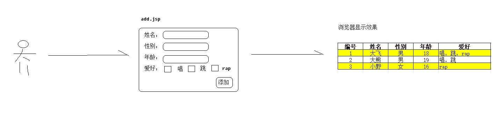

# Request&Response&Jsp

# 学习目标 `*****`

- [ ] 掌握使用 request 对象获取 HTTP 协议请求的内容 `*****`
- [ ] 掌握处理 HTTP 请求参数的中文乱码问题 `*****`
- [ ] 掌握使用 response 对象操作 HTTP 响应内容 `*****`
- [ ] 掌握处理响应中文乱码问题 `*****`

- [ ] 能够说出 jsp 的优势 `****`
- [ ] 了解 jsp 脚本片段、声明、脚本表达式 `*`
- [ ] 能够书写 jsp 页面来写标签即可 `*****`


# 一、开场白

每天来上一遍，没有学不会的Web，回想一下，上节课讲内容属于哪一块？

今天的课堂主角有3个：

**Request**：来自客户端的馈赠

**Response**：来自服务端回礼

**JSP**：那我呢？一赠品（服务端赠品）


# 二、Request对象（掌握）

Web项目精髓点在于客户端与服务端交互，他们交互载体就是请求与响应。当前先讲**请求对象**

**核心点**：

**数据流向：客户端流向服务端，或者说浏览器流向servlet**


## 2.1 Request 概述

客户端(浏览器)发起请求，Tomcat接收请求，根据http协议，将客户端发送过来请求数据(比如：请求行/请求头/请求体等)解析，并全部封装到HttpServletRequest 对象中。

在servlet中想要操作这些请求数据，需求借助HttpServletRequest 的API方法了。

## 2.2 Request 常用API

| request 与请求行相关方法      | 功能描述                                                     |
| ----------------------------- | ------------------------------------------------------------ |
| String getMethod()            | 获得请求方式 GET 或 POST                                     |
| **String getRequestURI()**    | Uniform Resource Identifier统一资源标识符，代表一个资源名字  |
| StringBuffer  getRequestURL() | Uniform Resource  Locator 统一资源定位符，代表一个可以访问地址 |
| String  getProtocol()         | 获得协议和版本                                               |
| **String getContextPath()**   | 获得上下文路径(项目名path)                                   |

| request 与请求头相关方法           | **功能描述**                                                 |
| ---------------------------------- | ------------------------------------------------------------ |
| String  getHeader(String headName) | 得到指定的请求头的值  <br />参数：键的名字  <br />返回：相应请求头的值 |

| request与请求参数相关方法                     | 功能描述                                             |
| --------------------------------------------- | ---------------------------------------------------- |
| **String getParameter(String  name)**         | 通过参数名得到一项参数值                             |
| **String[] getParameterValues(String  name)** | 根据参数名得到一组同名的值<br />复选框，下拉列表多选 |
| Enumeration  getParameterNames()              | 获得所有的参数名                                     |
| Map  getParameterMap()                        | 得到表单所有的参数键和值，封装成Map对象              |

| Enumeration接口中方法      | 说明                       |
| -------------------------- | -------------------------- |
| boolean  hasMoreElements() | 如果还有其它元素，返回true |
| E  nextElement()           | 返回下一个元素             |


## 2.3 获取请求行和请求头

```java
package cn.wolfcode._04request;

import javax.servlet.ServletException;
import javax.servlet.annotation.WebServlet;
import javax.servlet.http.HttpServlet;
import javax.servlet.http.HttpServletRequest;
import javax.servlet.http.HttpServletResponse;
import java.io.IOException;

@WebServlet("/line")
public class LineAndHeaderServlet extends HttpServlet {
    protected void service(HttpServletRequest request, HttpServletResponse response) throws ServletException, IOException {
        // 获取请求信息中的请求行和请求头信息
        System.out.println("请求方法：" + req.getMethod());
        System.out.println("获取统计资源标识符：" + req.getRequestURI());
        System.out.println("获取统一资源定位符：" + req.getRequestURL());
        System.out.println("获取协议和版本:" + req.getProtocol());
        System.out.println("获取项目目录：" + req.getContextPath());
		
        // 获取一个请求头信息
        System.out.println("获取请求头host:" + req.getHeader("host"));
    }
}
```

- 浏览器访问控制台输出效果如下：

 


## 2.4 获取请求参数

**需求：实现用户注册**

分析：

1>用户注册要一个收集用户注册信息html页面

2>收集好之后，点击注册，将收集好注册信息发送到服务器(servlet)

3>Servlet调用jdbc方法将数据保存到用户表【拓展】


**步骤1：在web目录下创建一个项目regist.html**

```html
<!DOCTYPE html>
<html lang="en">
<head>
    <meta charset="UTF-8">
    <title>Title</title>
</head>
<body>
<h2>用户注册</h2>
<!--action 用于接收数据的servlet 映射路径-->
<form action="/register" method="post" >
    账号： <input type="text" name="username"><br/>
    性别: <input type="radio" name="gender" value="boy" checked="checked"/>男
    <input type="radio" name="gender" value="girl"/>女 <br/>
    城市：
    <select name="city">
        <option value="gz">广州</option>
        <option value="sz">深圳</option>
        <option value="dg">东莞</option>
    </select>
    <br/>
    爱好：
    <input type="checkbox" name="hobby" value="coding1"/>敲代码
    <input type="checkbox" name="hobby" value="coding2"/>撸代码
    <input type="checkbox" name="hobby" value="sing"/>唱歌
    <input type="checkbox" name="hobby" value="dance"/>跳舞
    <br/>
    <input type="submit" value="注册"/>
</form>
</body>
```

**步骤2：定义新RegisterServlet接收客户端(页面)传入的参数**

```java
@WebServlet("/register")
public class RegisterServlet extends HttpServlet {
    protected void service(HttpServletRequest req, HttpServletResponse resp) throws ServletException, IOException {
        // 获取请求参数（请求体和请求行中的用户数据）
        // 获取单个数据
        String username = req.getParameter("username");
        System.out.println("账号：" + username);
        System.out.println("性别：" + req.getParameter("gender"));
        System.out.println("城市：" + req.getParameter("city"));
        // 获取多个数据
        System.out.println("爱好：" + Arrays.toString(req.getParameterValues("hobby")));

        System.out.println("=============");
        // 得到所有参数名字（一般情况下不常用的api->框架常用）
        Enumeration<String> names = req.getParameterNames();
        while (names.hasMoreElements()) {
            String name = names.nextElement();
            System.out.println(name + ":" + Arrays.toString(req.getParameterValues(name)));
        }
		System.out.println("=============");
        // 得到所有参数名和参数值转为 Map集合（一般情况下不常用的api->框架常用）
        Map<String, String[]> map = req.getParameterMap();
        Set<String> keys = map.keySet();
        for (String key : keys) {
            System.out.println(key + ":" + Arrays.toString(map.get(key)));
        }
    }
}
```

**步骤3：启动tomcat服务器，访问页面**

http://localhost:8080/regist.html

**注意，这种访问方式称之为静态资源访问，只要将静态文件放置在web项目目录，都可以直接+ip端口访问**

 

- 如果参数中带中文，参数乱码如下：

 


## 2.5 请求参数乱码问题

### 2.5.1 请求参数产生乱码的原因

在浏览器发送数据给服务器的时候，使用 utf-8 编码，但服务器解码默认使用 ISO-8859-1 解码：欧洲码，不支持汉字的。

 

> 注意：如果是 GET 请求且 Tomcat 版本大于8.0.5，则不需要考虑乱码问题，否则 GET 请求也需要考虑乱码问题。


### 2.5.2 POST 方式乱码解决方案

1. 解决方法：request.setCharacterEncoding("utf-8")  设置请求参数的编码为UTF-8

2. 代码位置：设置请求的编码这句话一定放在获取请求参数之前

3. 页面的编码：这个编码一定要与页面的编码相同。如果页面使用的是 GBK，则这里也要用GBK

```java
@WebServlet("/register")
public class RegisterServlet extends HttpServlet {
    protected void service(HttpServletRequest req, HttpServletResponse resp) throws ServletException, IOException {
        // 给请求对象中所有的数据字符集编码设置为 UTF-8,必须放在获取请求参数之前
        req.setCharacterEncoding("UTF-8");
         // 获取单个数据
        String name1 = req.getParameter("name");
        /*byte[] bytes = name1.getBytes("ISO-8859-1");
        name1 = new String(bytes, "UTF-8");*/
        System.out.println("账号：" + name1);
        // 省略......
    }
}
```


# 三、Response对象（掌握）

跟请求相反，**数据流向：服务端流向客户端，或者说servlet流向浏览器**

## 3.1 Response 对象概述

当服务端处理完请求之后，会向客户端反馈处理结果，这时，Response对象就得登场了。

Tomcat会将响应数据(比如：响应行，响应头，响应体)，以及响应方式全都封装到HttpServletResponse对象。

客户端想收到响应信息，就需要在servlet中借助HttpServletResponse 的API方法了

## 3.2 数据响应

### 3.2.1 响应数据相关方法

| 响应体相关的方法                        | 功能描述                                                     |
| --------------------------------------- | ------------------------------------------------------------ |
| OutputStream  getOutputStream()         | 如果服务器端返回的是二进制数据<br />则使用这个方法，比如图片 |
| PrintWriter  getWriter()                | 如果服务器端返回的是字符的文本数据，使用这个方法             |
| response.setCharacterEncoding("字符集") | 用于设置响应体的字符集  <br />设置打印流使用的码表           |
| void setContentType(String  type)       | 1. 告诉浏览器返回内容类型<br />2. 设置打印流编码<br/>**注意**: 必须在获取流之前设置,否则无效 |


### 3.2.2 响应数据代码

**内容1：普通字符串**

```java
@WebServlet("/resp")
public class ResponseServlet extends HttpServlet {

    protected void service(HttpServletRequest request, HttpServletResponse response) throws ServletException, IOException {
        // 获得字符打印流对象
        PrintWriter out = resp.getWriter();
        // 响应数据给浏览器显示
        out.print("1111111111111111");
    }
}
```

**内容2：html格式的字符串**

```java
@WebServlet("/resp")
public class ResponseServlet22 extends HttpServlet {
    @Override
    protected void service(HttpServletRequest req, HttpServletResponse resp) throws ServletException, IOException {
        resp.setContentType("text/html;charset=utf-8");  //明确自定返回是文本类型的html格式
        // 获得字符打印流对象
        PrintWriter out = resp.getWriter();
        // 响应数据给浏览器显示
        out.print("<span style='color:red'>你啊哈 browser</span>");
    }
}
```

**内容3：json格式的字符串**

```java
@WebServlet("/resp")
public class ResponseServlet22 extends HttpServlet {
 	@Override
    protected void service(HttpServletRequest req, HttpServletResponse resp) throws ServletException, IOException {
        resp.setContentType("application/json;charset=utf-8");
        // 获得字符打印流对象
        PrintWriter out = resp.getWriter();
        // 响应数据给浏览器显示
        out.print("{[{\"name\":\"大飞\", \"age\":18},{\"name\":\"小野\", \"age\":16}]}");
    }
}
```

**内容4：二进制流方式**

```java
@WebServlet("/resp")
public class ResponseServlet22 extends HttpServlet {
    @Override
    protected void service(HttpServletRequest req, HttpServletResponse resp) throws ServletException, IOException {
        resp.setContentType("image/jpg");

        FileInputStream inputStream = new FileInputStream("H:\\a.jpg");
        ServletOutputStream outputStream = resp.getOutputStream();

        byte[] buffer = new byte[1024];
        int len = 0;
        while ((len = inputStream.read(buffer)) != -1) {
            outputStream.write(buffer, 0, len);
        }
        inputStream.close();
    }
}
```

拓展：常用的contentType类型

```java
文本类型：
text/plain：普通文本文件，例如 .txt 文件。
text/html：HTML 文档类型，用于网页。
text/css：Cascading Style Sheets (CSS) 文件类型，用于定义网页样式。
text/javascript：JavaScript 脚本文件类型。
    
图片类型：
image/jpeg：JPEG 图片格式。
image/png：PNG 图片格式。
image/gif：GIF 图片格式。
image/svg+xml：SVG 图像格式。
    
音频/视频类型：
audio/mpeg：MPEG 音频格式。
audio/ogg：Ogg Vorbis 音频格式。
video/mp4：MP4 视频格式。
video/webm：WebM 视频格式。
    
应用程序类型：
application/json：JSON 数据格式。
application/xml：XML 数据格式。
application/pdf：PDF 文档格式。
application/octet-stream：二进制数据流，通常用于文件下载。
```


# 四、动态页面JSP (了解)

## 4.1 一个问题

一个请求发出后，浏览器想返回一个页面，有几种实现方式？（**暂时不考虑vue，这是另外一个宇宙**）

**方式1**：直接html页面---静态请求(html属于静态资源)

**方式2**：使用servlet，借助response返回带html格式页面---动态请求


方式1优缺点：书写方便，但实现不了复杂动态效果功能。

方式2优缺点：书写复杂，但可以实现相对复杂动态功能。


**比如：模拟不同用户登录成功，在页面上显示不同用户的昵称**

```java
@WebServlet("/login")
public class LoginServlet extends HttpServlet {
    @Override
    protected void service(HttpServletRequest req, HttpServletResponse resp) throws ServletException, IOException {

        resp.setContentType("text/html;charset=utf-8");
        PrintWriter writer = resp.getWriter();
        StringBuilder sb = new StringBuilder(100);
        sb.append("<html>");
        sb.append("<body>");
        sb.append("当前登录用户：");
        sb.append("<span style='color:red;'>"+req.getParameter("nickname")+"</span>");
        sb.append("</body>");
        sb.append("</html>");
        writer.write(sb.toString());
    }
}
```

servlet 虽说能实现，但是拼接html太难了，怎么办？答案是：**JSP **= html + servlet


## 4.1 JSP 概述（理解）

### 4.1.1 什么是 JSP


​	**JSP——Java Server Page运行在服务器端的 Java 页面，以前学习的 HTML 运行在浏览器端。JSP 是运行在服务器上，最终还是解析成静态的HTML，运行在浏览器。我们在浏览器上看到的HTML页面，其实是 JSP 在服务器上运行的结果。**


### 4.1.2 JSP 的优势

| 技术    | 特点                                                         |
| ------- | ------------------------------------------------------------ |
| HTML    | 静态页面  优点：方便页面美化操作，写JS脚本和CSS代码都比较方便。  <br />缺点：不能写动态的内容。 |
| Servlet | 运行在服务器上小 Java 程序 <br />优点：制作动态内容  <br />缺点：不方便写 HTML 以及 CSS 和 JS 代码 |
| JSP     | JSP = HTML + Servlet  <br />特点：既有 HTML 的优点：方便美化和编写 JS 代码。 <br />又有 Servlet 优点：可以在页面写 Java 代码（不建议），可以制作动态内容。 |

### 4.1.3 JSP 初体验

- 需求：在浏览器上输出服务器当前的时间


```HTML
<%--导入包--%>
<%@ page import="java.util.Date" %>
<%--jsp的page指令:  指定页面内容的类型，编码。页面使用编程语言：Java  --%>
<%@ page contentType="text/html;charset=UTF-8" language="java" %>
<html>
<head>
    <title>显示时间</title>
</head>
<body>
   <%=new Date()%>
</h1>
</body>
</html>
```

### 4.1.4 JSP 再体验

```jsp
<%@ page contentType="text/html;charset=UTF-8" language="java" %>
<html>
<head>
    <title>Title</title>
</head>
<body>
<%
    String name = request.getParameter("nickname");
%>
<%=name%>
</body>
</html>
```


## 4.2 JSP 运行过程（了解）

​	JspServlet 首先会将 jsp 文件代码翻译成 Servlet 的 Java 代码，然后再编译成字节码文件执行,其底层就是一个 Servlet。


1. 浏览器请求 JSP 页面，Tomcat 中的 JspServlet 会先 JSP 文件翻译成 Servlet 文件：xxx_jsp.java

2. 将 xxx_jsp.java 文件编译产生字节码文件：xxx_jsp.class

3. 加载字节码文件 xxx_jsp.class 并创建 xxx_jsp 对象

4. 调用 xxx_jsp 的 service 方法处理请求并响应数据

   

## 4.3 JSP常见问题（了解）

### 4.3.1 JSP 翻译的 Servlet 位置在哪里？

不同idea版本存放地址不一样

```xml
c:\Users\Administrator\.IntelliJIdea2019.3\system\tomcat\tomcat版本_项目名\work\Catalina
C:\Users\Administrator\AppData\Local\JetBrains\IntelliJIdea2021.3\tomcat\
```

tomcat启动时，观察控制台输出


### 4.3.2 JSP 和 Servlet 是什么关系？

1. 查看源码：

```java
public final class login_jsp extends org.apache.jasper.runtime.HttpJspBase
public abstract class HttpJspBase extends HttpServlet
```

2. 结论：JSP 底层就是 Servlet


### 4.3.3 JSP 什么时候翻译成 Servlet？翻译多少次？

​	浏览器第一次访问 JSP 的时候，由 Tomcat 将 JSP 翻译成了 Servlet，并且编译成字节码文件，只生成1次。如果这期间修改了JSP内容，就会重新翻译。


## 1.4 JSP 基本语法（了解）

### 1.4.1 JSP 的注释

| JSP 注释语法       | 说明                                                         |
| ------------------ | ------------------------------------------------------------ |
| <%-- 注释内容 --%> | 这是注释，不会翻译到Servelt 中<br />在翻译到java文件的时候,会忽略该注释的内容. |

### 1.4.2 JSP 脚本片段

| JSP 脚本片段 | 说明                                                         |
| ------------ | ------------------------------------------------------------ |
| 语法         | <% 一行或多行 Java 代码;   %>                                |
| 作用         | 在 JSP 的页面上执行一段 Java 代码，必须符合 Java 的语法规则。<br />每行代码以分号结束。  <br />可以在脚本片段中使用 Java 的单行或多行注释语法<br/>代码被翻译到 service 方法中 |

### 1.4.3 JSP 脚本表达式

| JSP脚本表达式 | 说明                                                         |
| ------------- | ------------------------------------------------------------ |
| 语法          | <%= 变量名或表达式%>  <br />翻译成 Servlet 变成 out.print() 打印输出  <br />注意：后面没有分号 |
| 作用          | 直接输出变量的值或对表达式进行计算                           |

- **JSP 代码演示**

```jsp
JSP脚本表达式：
<%
    String name = "孙悟空";
%>
<%=name%> <br>
<%=3*4%>  <br>
```

- **在 Servlet 中生成**

```java
out.write("JSP脚本表达式：\r\n");

String name = "孙悟空";

out.write('\r');
out.write('\n');
out.print(name);
out.write(" <br>\r\n");
out.print(3*4);
out.write("<br>\r\n");
```

### 1.4.4 JSP 声明

| JSP声明 | 说明                                                         |
| ------- | ------------------------------------------------------------ |
| 语法    | <%!   全局变量或方法  %>                                     |
| 作用    | 用于在JSP页面上声明全局变量或方法  <br />注：很少在页面上声明方法 |

- **JSP 代码演示**

  1)  在脚本片段中创建一个字符串，使用脚本表达式输出

  2)  在声明中也创建一个同名的字符，使用脚本表达式输出，会不会有问题？

```html
<h2>JSP声明</h2>
<%--JSP脚本片段--%>
<%
    String name = "jack";
%>
<%--JSP声明--%>
<%!
    String name="rose";
%>
<%=name%><br>
<%=this.name%><br>
```

- **效果如下**


- **生成的Servlet代码**

```java
String name = "jack";
out.print(name);  // jack定义在方法中
out.write("<br>\r\n");
out.print(this.name);   //rose是声明的一个成员变量，出现在类中，而不是在方法中。
```

- **结论**

  JSP 声明中声明变量是在类中的成员变量。而在 JSP 脚本片段中声明的变量是局部变量，声明在_jspService()方法中。

  

### 1.4.5 JSP 脚本小结

| JSP三种脚本   | 功能                                  | 语法               |
| ------------- | ------------------------------------- | ------------------ |
| JSP脚本片段   | 在 JSP 中执行Java代码-service         | <% Java代码; %>    |
| JSP脚本表达式 | 在JSP中输出变量值或表达式结果-service | <%= 变量或表达式%> |
| JSP声明       | 声明全局变量或方法-类里面             | <%! 声明 %>        |


# 五、拓展练习

**需求1：用户添加与列表**

要求：

1>用户访问add.jsp/add.html，填写信息，点添加，添加成功后返回用户列表

2>多次执行添加操作，用户列表数据逐步增加



**需求2：用户列表与删除**

要求：

1>在需求1基础上实现用户删除，点击删除，列表减少一条数据

2>多次执行删除操作，用户列表数据逐步减少

