# Servlet交互&作用域&EL&JSTL

# 目标 `*****`

- [x] 能够说明为什么需要做组件的跳转和数据的共享 `***`
- [x] 理解转发和重定向两种跳转方式的区别/特点 `****`
- [x] 能够使用转发和重定向实现页面跳转 `*****`
- [x] 能够往三大作用域中存取数据 `*****`
- [x] 能够说出 EL 表达式的作用并能够使用 EL 表达式 `*****`
- [x] 能够说出 JSTL 标签库的作用 `*****`
- [x] 能够使用 JSTL 标签库的 foreach if  choose 标签 `*****`


# 一、开场白

每天来上一遍，没有学不会的Web，回想一下，上节课讲内容属于哪一块？

今天的课堂主角有4个：

# **请求跳转**----请求转发与重定向

**数据共享**----三大作用域对象

**数据获取**----EL表达式

**数据加工**----JSTL标签

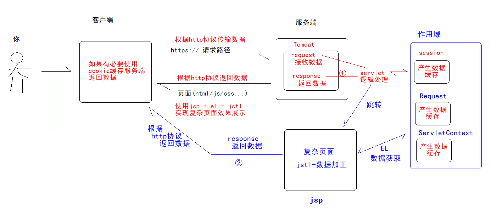

# 二、转发和重定向

## 2.1 一个问题

**问：为什么要做跳转？**

答：为了让 Jsp 和 Servlet 更加的责任分离,去做自己擅长的事情。怎么理解？

分析：

​	前面讲过JSP 兼顾有 html + Servlet 特性，但开发之后发现，在JSP中混用Servlet代码逻辑，容易出现代码混乱问题，后期难以维护。所以最终演化成servlet 做逻辑处理，JSP做数据展示。

​	当客户端发送请求，先在servlet中执行请求逻辑，然后将处理后的数据放置到共享作用域中后，直接跳转到JSP做数据展示。


## 2.2 跳转方式

Servlet到Jsp跳转方式分为2种：**请求转发** + **请求重定向**


## 2.3 请求转发（理解）

### 2.3.1 跳转位置

- 在**服务器端**进行的组件(资源)的跳转

### 2.3.2 转发原理

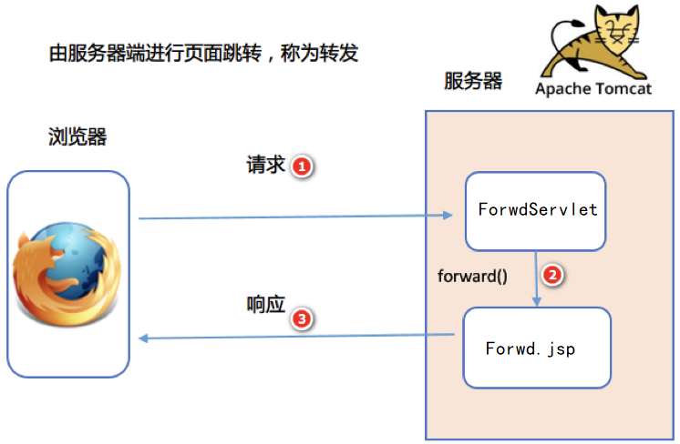


### 2.3.3 转发方法(掌握)

| request 对象与转发相关方法                                   |
| ------------------------------------------------------------ |
| request.getRequestDispatcher("/要跳转到的地址")**.forward(request, response);** |


### 2.3.4 请求转发特点(掌握)

需求：创建 ForwdServlet 和 forwd.jsp，实现浏览器访问 ForwdServlet ，使用转发到  forwd.jsp

```java
@WebServlet("/fw")
public class ForwdServlet extends HttpServlet {

    @Override
    protected void service(HttpServletRequest req, HttpServletResponse resp) throws ServletException, IOException {
        System.out.println("-------------");
        req.getRequestDispatcher("/forwd.jsp").forward(req, resp);
    }
}
```

```jsp
<%@ page contentType="text/html;charset=UTF-8" language="java" %>
<html>
<head>
    <title>Title</title>
</head>
<body>
  进来了。。。
</body>
</html>

```

**特点1：地址栏不变**

访问serlvet，浏览器地址栏没有变化，还是fw，但页面进入forwd.jsp

*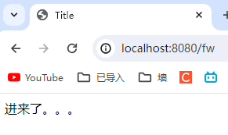*

**特点2：服务端跳转**

所有逻辑都是服务端处理成功后，返回浏览器，为服务端操作

**特点3：请求数据不会丢失**

在ForwdServlet的请求作用域设置一个username=dafei参数，在forwd.jsp 中可以获取到

1>请求参数--浏览器发送参数--getParameter

2>共享数据--Aserlvet共享Bservlet/Bjsp数据--getAttribute

**请求作用域：**数据共享空间，只有在同一个请求中数据才会共享

```java
@WebServlet("/fw")
public class ForwdServlet extends HttpServlet {

    @Override
    protected void service(HttpServletRequest req, HttpServletResponse resp) throws ServletException, IOException {
        System.out.println("-------------");
        //将数据放置在请求共享作用域中
        req.setAttribute("username", "dafei");
        req.getRequestDispatcher("/forwd.jsp").forward(req, resp);
    }
}
```

```jsp
<%@ page contentType="text/html;charset=UTF-8" language="java" %>
<html>
<head>
    <title>Title</title>
</head>
<body>
<%
    String username = (String) request.getAttribute("username");
%>
  进来了。。。<%=username%>
</body>
</html>
```

**特点4：请求转发可以跳转访问到WEB-INF私密资源**

将forwd.jsp 放置到WEB-INF/views下

*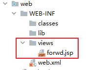*

```java
@WebServlet("/fw")
public class ForwdServlet extends HttpServlet {

    @Override
    protected void service(HttpServletRequest req, HttpServletResponse resp) throws ServletException, IOException {
        System.out.println("-------------");
        //将数据放置在请求共享作用域中
        req.setAttribute("username", "dafei");
        req.getRequestDispatcher("/WEB-INF/views/forwd.jsp").forward(req, resp);
    }
}
```

**特点5：不能跨域访问**

http://localhost:8080/fw?username=dafei

https://www.baidu.com:80/

**跨域**：协议 + IP + 端口  只有一个不一样就称之为跨域

```java
@WebServlet("/fw")
public class ForwdServlet extends HttpServlet {

    @Override
    protected void service(HttpServletRequest req, HttpServletResponse resp) throws ServletException, IOException {
        System.out.println("-------------");
        //将数据放置在请求共享作用域中
        req.setAttribute("username", "dafei");
        //404
        req.getRequestDispatcher("https://www.baidu.com").forward(req, resp);
    }
}
```


## 2.4 重定向概述（理解）

### 2.4.1 跳转位置

- 在**浏览器端**进行的页面(组件/资源)跳转

### 2.4.2 重定向原理

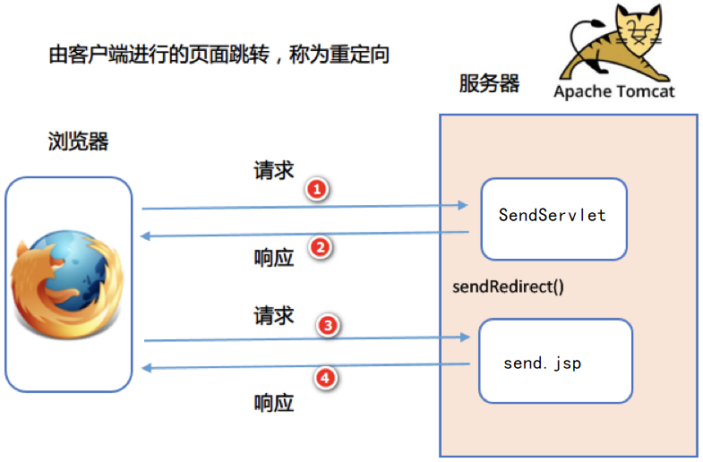

### 2.4.3 重定向方法(掌握)

| response对象与重定向相关方法          |
| ------------------------------------- |
| response.sendRedirect("要跳转的地址") |

### 2.4.4 重定向特点(掌握)

需求：创建 SendServlet 和 send.jsp，实现浏览器访问 SendServlet，使用转发到  send.jsp

```java
@WebServlet("/send")
public class SendServlet extends HttpServlet {

    @Override
    protected void service(HttpServletRequest req, HttpServletResponse resp) throws ServletException, IOException {
        System.out.println("-------------");

        resp.sendRedirect("/send.jsp");
    }
}

```

```jsp
<%@ page contentType="text/html;charset=UTF-8" language="java" %>
<html>
<head>
    <title>Title</title>
</head>
<body>

send-进来了。。。
</body>
</html>

```

**特点1：地址栏会发生变化**

访问serlvet，浏览器地址栏会发生变化，原先是/send，最后是/send.jsp

*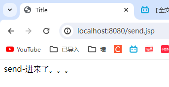*

F12后地址栏显示结果

*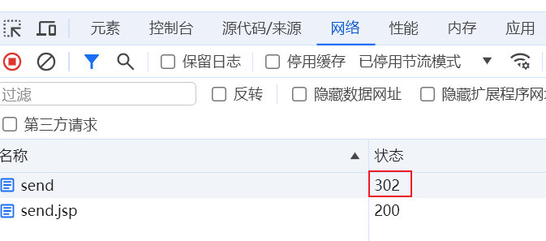*


**特点2：浏览器跳转**

**302 状态码**：重定向码，服务端执行完/send请求后，响应302码 + Location响应头(跳转地址)，浏览器识别成功后，会自动发起重定向请求。

从上面分析看出都是浏览器在主导操作。

*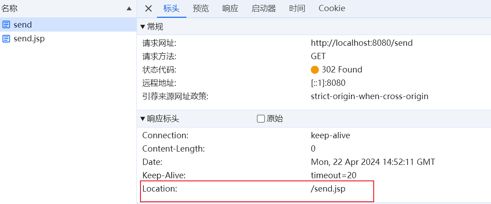*


**特点3：请求数据会丢失**

在SendServlet中请求作用域设置一个username=dafei参数，在send.jsp 中不能获取

原因：重定向发起2次请求， 每个请求对象都是独立，2个请求的数据是不能在**请求作用域**中共享

```java
@WebServlet("/send")
public class SendServlet extends HttpServlet {

    @Override
    protected void service(HttpServletRequest req, HttpServletResponse resp) throws ServletException, IOException {
        System.out.println("-------------");
        req.setAttribute("username", "dafei");
        resp.sendRedirect("/send.jsp");
    }
}
```

```jsp
<%@ page contentType="text/html;charset=UTF-8" language="java" %>
<html>
<head>
    <title>Title</title>
</head>
<body>
<%
    String username = (String) request.getAttribute("username");
%>
send-进来了。。。<%=username%>
</body>
</html>

```

**特点4：重定向不可以跳转访问到WEB-INF私密资源**

将send.jsp 放置到WEB-INF/views下

*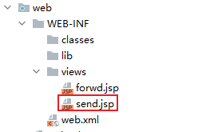*

```java
@WebServlet("/send")
public class SendServlet extends HttpServlet {

    @Override
    protected void service(HttpServletRequest req, HttpServletResponse resp) throws ServletException, IOException {
        System.out.println("-------------");
        req.setAttribute("username", "dafei");
        //resp.sendRedirect("/send.jsp");
        resp.sendRedirect("/WEB-INF/views/send.jsp");
    }
}
```

*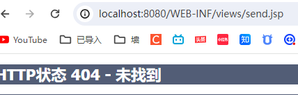*

**特点5：可以跨域访问**

```java
@WebServlet("/send")
public class SendServlet extends HttpServlet {

    @Override
    protected void service(HttpServletRequest req, HttpServletResponse resp) throws ServletException, IOException {
        System.out.println("-------------");
        req.setAttribute("username", "dafei");
        //resp.sendRedirect("/send.jsp");
        //resp.sendRedirect("/WEB-INF/views/send.jsp");
        resp.sendRedirect("https://www.baidu.com");
    }
}
```

## 2.5 转发和重定向区别(掌握)

| 区别          | 转发 forward                                                 | 重定向 redirect                                              |
| ------------- | :----------------------------------------------------------- | ------------------------------------------------------------ |
| 项目路径path  | 服务端的根目录：<br />`http://localhost:8080/项目地址/`<br/>跳转的 path 不用写项目路径(虚拟目录) | 浏览器的根目录(端口之后):<br />`http://localhost:8080`<br/>跳转 path 需加上项目路径(虚拟目录) |
| 地址栏        | 地址栏不会发生变化，还是上一个地址                           | 会变化，显示新的地址                                         |
| 跳转位置      | 在 **服务端** 进行跳转                                       | 在 **浏览器端** 跳转                                         |
| 请求对象(域)  | 请求域数据不会丢失，因为是同一个请求                         | 请求域数据会丢失，因为不是同一个请求                         |
| WEB-INF下资源 | 请求转发可以跳转到 WEB-INF 下的资源                          | 重定向不可以跳转到 WEB-INF 下的资源                          |
| 跨域访问      | 请求转发不可以跳转到其他域名或项目下的资源<br/>（例：http://www.baidu.com） | 重定向可以跳转到其他域名或项目下的资源<br/>（例：http://www.baidu.com） |

## 2.6 常见面试题(掌握)

- [x] 什么时候使用转发，什么时候使用重定向？

```
如果需要保留请求域中的数据，使用转发
如果要跳转到 WEB-INF 目录中的页面（资源），使用请求转发
如果要访问其他项目(跨域)，使用重定向
其他的任选
```

- [x] 转发或重定向后续的代码是否还会运行？

```
无论是重定向还是转发，后续代码都会执行，但一般转发或重定向后面不会有代码，没有执行的意义了，因为不管是转发还是重定向浏览器最终显示的都是跳转后页面的数据
```


# 三、三大作用域

## 3.1 什么是作用域(掌握)

用于 Servlet 之间或者Servlet与Jsp间数据共享的服务器内存区域，作用域结构是一个 Map<String, Object>

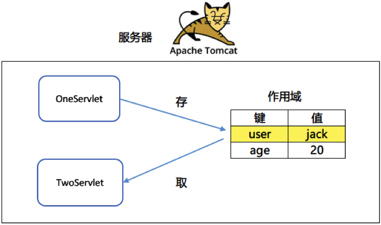


## 3.2 作用域类型(掌握)

| 作用域   | 类型               | 作用范围                                                     |
| -------- | ------------------ | ------------------------------------------------------------ |
| 请求域   | HttpServletRequest | 只在同一次请求中起作用                                       |
| 会话域   | HttpSession        | 同一个会话中起作用<br/>浏览器第1次访问服务器的资源直到浏览器关闭<br/>的整个过程称为1次会话 |
| 上下文域 | ServletContext     | 同一个应用中起作用<br/>服务器启动直到服务器关闭的整个过程都起作用 |

 

## 3.3 作用域方法(掌握)

| 与作用域有关的方法                 | 作用                     |
| ---------------------------------- | ------------------------ |
| Object getAttribute("键")          | 从中得到一个值           |
| void setAttribute("键",Object数据) | 向作用域中存储键值对数据 |
| void removeAttribute("键")         | 删除作用域中的键值对数据 |

- **哪个作用域对象调用方法就操作对应的作用域数据。**


## 3.4 作用域操作（理解）

### 3.4.1 Servlet跳转Servlet

**需求**：在 FirstServlet 存储键值到作用域中，转发到另一个 SecondServlet，从 SecondServlet 中取出键值并且输出。

**FirstServlet代码**

```java
@WebServlet("/first")
public class FirstServlet extends HttpServlet {
   
    protected void service(HttpServletRequest req, HttpServletResponse resp) throws ServletException, IOException {
        // 往请求域存储键值对
        req.setAttribute("name", "request");
        // 往会话域存储键值对
        req.getSession().setAttribute("name", "session");
        // 往上下文域存储键值对
        req.getServletContext().setAttribute("name", "servletContext");
        // 转发到second
        req.getRequestDispatcher("/second").forward(request, response);
    }
}
```

**SecondServlet代码**

```java
@WebServlet("/second")
public class SecondServlet extends HttpServlet {
    @Override
    protected void service(HttpServletRequest req, HttpServletResponse resp) throws ServletException, IOException {
         // 设置内容类型和编码
         resp.setContentType("text/html;charset=utf-8");
         // 获得字符打印流
         PrintWriter out = resp.getWriter();

         // 从请求域中获取数据
         Object reqName = req.getAttribute("name");
         // 从会话域中获取数据
         Object sessionName = req.getSession().getAttribute("name");
         // 从上下文域中获取数据
         Object appName = req.getServletContext().getAttribute("name");

         out.print("请求域数据：" + reqName + "<br>");
         out.print("会话域数据：" + sessionName + "<br>");
         out.print("上下文域数据：" + appName + "<br>");
    }
}
```

- 浏览器访问FirstServlet效果：

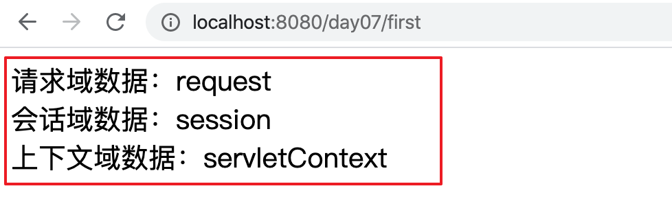

### 3.4.2 Servlet跳转Jsp

需求：在 FirstServlet 存储键值到作用域中，转发到另一个second.jsp，从  Second.jsp 中取出键值并且输出。

```java
@WebServlet("/first")
public class FirstServlet extends HttpServlet {
   
    protected void service(HttpServletRequest req, HttpServletResponse resp) throws ServletException, IOException {
        // 往请求域存储键值对
        req.setAttribute("name", "request");
        // 往会话域存储键值对
        req.getSession().setAttribute("name", "session");
        // 往上下文域存储键值对
        req.getServletContext().setAttribute("name", "servletContext");
        // 转发到second
        req.getRequestDispatcher("/second.jsp").forward(request, response);
    }
}
```

```jsp
<%@ page contentType="text/html;charset=UTF-8" language="java" %>
<html>
<head>
    <title>Title</title>
</head>
<body>
<%

    // 从请求域中获取数据
    Object reqName = request.getAttribute("name");
    // 从会话域中获取数据
    Object sessionName = request.getSession().getAttribute("name");
    // 从上下文域中获取数据
    Object appName = request.getServletContext().getAttribute("name");
%>

请求域数据：<%=reqName%><br>
会话域数据：<%=sessionName%><br>
上下文域数据：<%=appName%><br>
</body>
</html>

```


### 3.4.3 作用域范围演示案例（理解）

**需求**: 从 ScopeServlet 中分别从三个作用域中的获取各自的数据 num, 如果能获取到则加1，然后再存入,如果获取不到则存入 num 的值为1， 操作完后跳转到result.jsp 页面显示各个作用域的数据.

ScopeServlet.java

```java
@WebServlet("/scope")
public class ScopeServlet extends HttpServlet {
    protected void service(HttpServletRequest req, HttpServletResponse resp) throws ServletException, IOException {
        // 在 ScopeServlet 中获取三个作用域中的数据 num, 如果获取到则加1再存入,
        // 如果获取不到则存入 num 的值为1,跳转到 ResultServelt 中来做数据的获取和显示
        Object strNum = req.getAttribute("num");
        if(strNum == null){
            req.setAttribute("num",1);
        }else{
            Integer num = (Integer)strNum;
            req.setAttribute("num",num + 1);
        }

        // session作用域
        HttpSession session = req.getSession();
        Object sessinoNum = session.getAttribute("num");
        if(sessinoNum == null){
            session.setAttribute("num",1);
        }else{
            Integer num = (Integer)sessinoNum;
            session.setAttribute("num",num + 1);
        }

        // servletContext 作用域
        ServletContext context = super.getServletContext();
        Object ctNum = context.getAttribute("num");
        if(ctNum == null){
            context.setAttribute("num",1);
        }else{
            Integer num = (Integer)ctNum;
            context.setAttribute("num",num + 1);
        }

        // 跳转
        req.getRequestDispatcher("/result").forward(req,resp);

    }
}
```

result.jsp

```java
<%@ page contentType="text/html;charset=UTF-8" language="java" %>
<html>
<head>
    <title>Title</title>
</head>
<body>
<%

    // 从请求域中获取数据
    Object reqnum = request.getAttribute("num");
    // 从会话域中获取数据
    Object sessionnum = request.getSession().getAttribute("num");
    // 从上下文域中获取数据
    Object appnum = request.getServletContext().getAttribute("num");
%>

请求域数据：<%=reqnum%><br>
会话域数据：<%=sessionnum%><br>
上下文域数据：<%=appnum%><br>
</body>
</html>

```

**测试**

1>同一个浏览器不同页面访问
chrome: http://localhost:8080/scope

2>切换不同浏览器访问

chrome: http://localhost:8080/scope

edge: http://localhost:8080/scope

3>关闭某个浏览器再访问

chrome: http://localhost:8080/scope


## 3.5 如何选择作用域

- 先考虑作用范围小的作用域，如果小作用范围的作用域能满足需求就使用小作用范围的作用域。
- 考虑顺序：请求域-->会话域-->上下文域


# 四、EL表达式

## 4.1 EL 表达式概述（理解）

**EL 表达式**

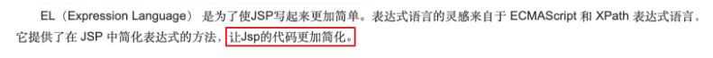

- 用于替换 JSP 页面中的脚本表达式，让 JSP 的代码更加简化。

| EL概念                                                  | EL语法                     | EL作用                                                       |
| ------------------------------------------------------- | -------------------------- | ------------------------------------------------------------ |
| 英文名称：Expression Language<br />中文名称：表达式语言 | **${** 属性名或表达式**}** | 1.用于输出**作用域中** 属性值<br />2.用于各种运算：算术，逻辑，<br />关系，三元运算等 |

- EL 与 JSP 脚本表达式的区别

| 区别         | JSP脚本表达式                           | EL                                     |
| ------------ | --------------------------------------- | -------------------------------------- |
| 语法         | <%=m%>                                  | ${m}                                   |
| 输出哪里的值 | 输出的是脚本变量  <br /><% int m= 5; %> | 输出的是作用域中的值  <br /><br />${m} |

- 案例：分别输出脚本变量和作用域中变量值

```html
<%@ page contentType="text/html;charset=UTF-8" language="java" %>
<html>
<head>
    <title>Title</title>
</head>
<body>
<%
    int m=5;
    // 向请求域中添加一个变量
    request.setAttribute("num", 6);
%>
输出m:
<%=m%><br>
输出作用域中值：
<%= request.getAttribute("num")%><br>

使用 EL 表达式输出：
${num}

</body>
</html>
```


## 4.2 EL 表达式获取不同类型数据（掌握）

> 从 EL 中取值的前提：数据必须放在作用域中。

### 4.2.1 示例1

**执行效果**

*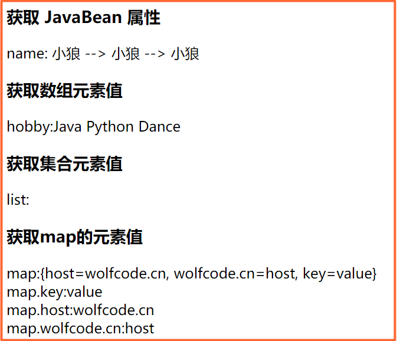*


**示例1代码**

```java
@ToString
@Getter
public class Employee {
    private Long id = 1L;
    private String name = "小狼";
    private String[] hobby = {"Java","Python","Dance"};
    private List<String> list = Arrays.asList("沉鱼","落雁","闭月","羞花");
    private Map<String,String> map = new HashMap<>(){
        {
            this.put("key","value");
            this.put("host","wolfcode.cn");
            this.put("wolfcode.cn","host");
        }
    };
}
```

```java
@WebServlet("/el2")
public class EL2Servlet extends HttpServlet {
    protected void service(HttpServletRequest req, HttpServletResponse resp) throws ServletException, IOException {
        // 从数据库中来获取数据（模拟数据），然后跳转到jsp 来显示
        Employee emp = new Employee();
        req.setAttribute("emp",emp);
        req.getRequestDispatcher("/el/el2.jsp").forward(req,resp);
    }
}
```

el2.jsp

```jsp
<h3>获取 JavaBean 属性</h3>
name: ${emp.name} --> ${emp.getName()} --> ${emp["name"]}
<h3>获取数组元素值</h3>
hobby:${emp.hobby[0]} ${emp.hobby[1]} ${emp.hobby[2]}
<h3>获取集合元素值</h3>
list:${emp.list[1]} ${emp.list[2]} ${emp.list[3]}
<h3>获取map的元素值</h3>
map:${emp.map}
<br/>map.key:${emp.map.key}
<br/>map.host:${emp.map.host}
<br/>map.wolfcode.cn:${emp.map["wolfcode.cn"]}
```

### 4.2.2 注意事项

- JavaBean 的属性名或 map 的键名中如果有特殊字符的写法

| 变量名["键名"]                                |
| --------------------------------------------- |
| 可以使用双引号或单引号，如：${map["no3-no4"]} |

### 4.2.3 示例2

**执行效果**

*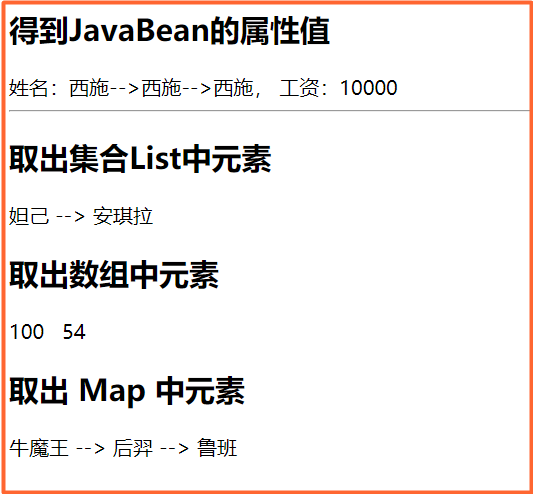*

**示例2代码**

```java
package cn.wolfcode.domain;

@Getter
@Setter
@ToString
public class Person {
    private String name;
    private BigDecimal salary;
}
```

```jsp
<%@ page import="cn.wolfcode.domain.Person" %>
<%@ page import="java.util.Arrays" %>
<%@ page import="java.util.List" %>
<%@ page import="java.util.HashMap" %>
<%@ page contentType="text/html;charset=UTF-8" language="java" %>
<html>
<head>
    <title>EL得到不同类型的值</title>
</head>
<body>
    <%
        // 将员工对象放在页面域
        Person p = new Person("西施", new BigDecimal("10000"));
        // 放到页面域中
        request.setAttribute("p", p);
    %>

    <h2>得到JavaBean的属性值</h2>
    <%-- 本质上是调用 get方法 --%>
    姓名：${p.name}-->${p.getName()}-->${p["name"]}， 工资：${p.salary}
    <hr>

    <%
        List<String> names = Arrays.asList("妲己", "安琪拉","王昭君");
        // 放在请求域中
        request.setAttribute("names",names);
    %>

    <h2>取出集合List中元素</h2>
    ${names[0]}  -->  ${names[1]}
    <%
        int[] nums = {100,200,300,54};
        // 数组放在请求域
        request.setAttribute("nums", nums);
    %>
    <h2>取出数组中元素</h2>
    ${nums[0]} &nbsp;  ${nums[3]}

    <%
        Map<String, String> map = new HashMap<>();
        map.put("no1", "牛魔王");
        map.put("no2", "后羿");
        map.put("no3-no4", "鲁班");
        //放在请求域
        request.setAttribute("map",map);
    %>
    <h2>取出 Map 中元素</h2>
    <%-- map对象.键名 --%>
    ${map.no1}  -->  ${map.no2} --> ${map["no3-no4"]}
</body>
</html>
```

## 4.3 EL 中使用表达式

### 4.3.1 算术表达式

*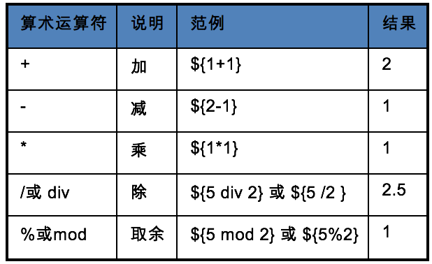*

> Tip：在EL表达式中执行算术运算，只要字符串是数值都会执行算术运行。
>
> ```jsp
> <%
> 	request.setAttribute("a", "20");
> 	request.setAttribute("b", "20");
> %>
> ${a+b}  
> ${a*b}
> ${a/b}
> ${a%b}
> ${1 + 1} , ${2 - 1}
> ```

### 4.3.2 比较表达式

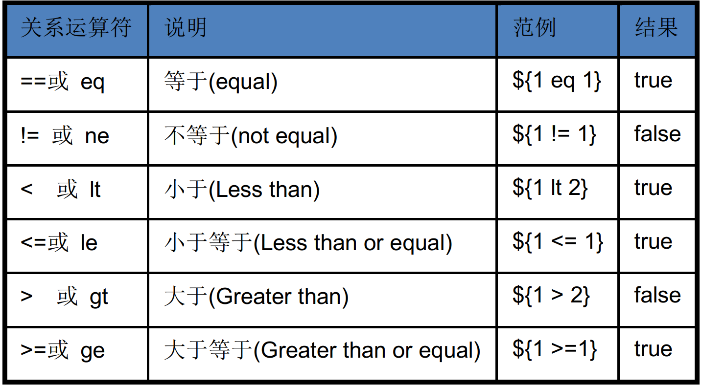

### 4.3.3 逻辑表达式

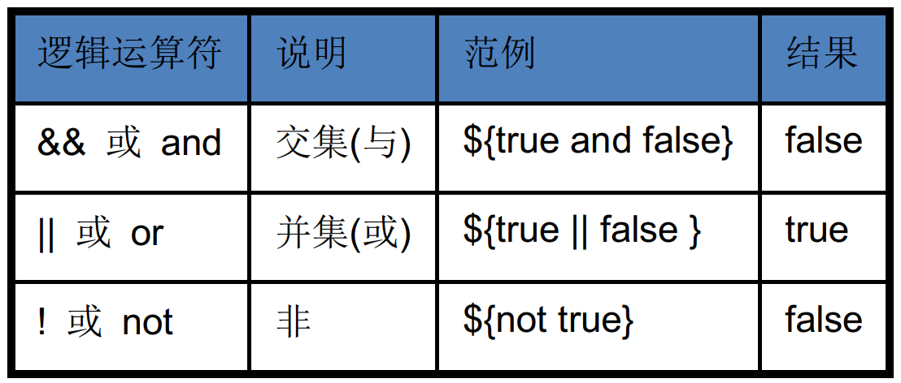


### 4.3.4 三元运算

**

### 4.3.5 判空表达式

判空,判断的是内容是否为空,不是对象是否为空.

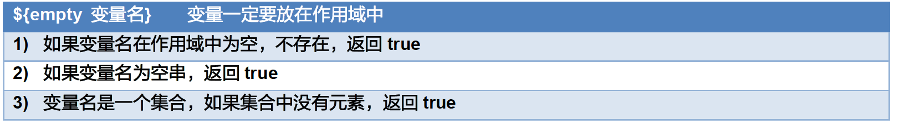

### 4.3.6 示例代码：使用上面所有的运算符

```html
<%@ page import="java.util.ArrayList" %>
<%@ page import="java.util.List" %>
<%@ page contentType="text/html;charset=UTF-8" language="java" %>
<html>
<head>
    <title>Title</title>
</head>
<body>
    <h2>算术运算符</h2>
        ${1+1}<br>
        ${2-1}<br>

    <h2>比较运算符</h2>
        ${1 eq 1}<br>
        ${1 != 1}<br>
        ${1 lt 2}<br>

    <h2>逻辑运算符</h2>
        ${true and false}<br>
        ${true || false}<br>
        ${not true}<br>

    <h2>三元运算</h2>
        ${5>6?"男":"女"}

    <h2>判空表达式</h2>
        ${empty aaa} <br>
        <%
            request.setAttribute("bbb","");
            // 集合中没有元素
            List<String> names = new ArrayList<>();
            names.add("唐僧");
            request.setAttribute("ccc", names);
        %>
        ${empty bbb}<br>
        ${empty ccc}<br>
</body>
</html>
```


## 4.4 EL 从四个作用域中取值（掌握）

**EL 获取数据的方式是从 4 个作用域对象中，从小到大的去获取**，如果需要指定作用域获取数据，可使用以下 EL 的内置对象来指定。

### 4.4.1 PageContext 对象

- JSP 本质是 Servlet，但比 Servlet 多了一个作用域：**页面域**，在 JSP 中有四大作用域。

- 什么是页面域：只在一个JSP页面中起作用，不同的 JSP 之间不能实现数据的共享，比请求域范围还要小。

- 页面域对象名：pageContext，是 JSP 其中一个内置对象名


| PageContext 操作有关的方法                   | 说明                                                         |
| -------------------------------------------- | ------------------------------------------------------------ |
| void  setAttribute(String key, Object value) | 向页面域中添加键和值                                         |
| Object  getAttribute(String key)             | 从页面域中得到值                                             |
| void  removeAttribute(String key)            | 删除四个域中同名的键                                         |
| Object findAttribute(String key)             | 自动从四个作用域中去查某个键，<br />从小到大的范围来查找，如果找到就停止。<br />如果没有找到，返回null |


示例代码：

*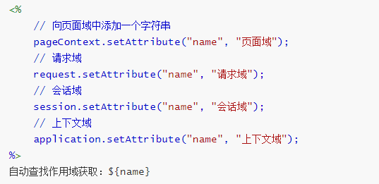*

**从小到大注释作用域设置数据代码，可看到 EL 表达式在往下获取数据。**


### 4.4.2 EL 指定域获取数据

| 作用域   | EL的写法                                                 |
| -------- | -------------------------------------------------------- |
| 页面域   | ${pageScope.键名}---pageContext.getAttribute(“键名”);    |
| 请求域   | ${requestScope.键名}---request.getAttribute(“键名”);     |
| 会话域   | ${sessionScope.键名}---session.getAttribute(“键名”);     |
| 上下文域 | ${applicationScope.键名}---context.getAttribute(“键名”); |

- 示例代码  				

```html
<%@ page contentType="text/html;charset=UTF-8" language="java" %>
<html>
<head>
    <title>EL指定域获取数据</title>
</head>
<body>
    <%
        // 向页面域中添加一个字符串
        pageContext.setAttribute("name", "页面域");
        // 请求域
        request.setAttribute("name", "请求域");
        // 会话域
        session.setAttribute("name", "会话域");
        // 上下文域
        application.setAttribute("name", "上下文域");
    %>
        
    从页面域获取：${pageScope.name}
    <hr>
    从请求域获取：${requestScope.name}
    <hr>
    从会话域获取：${sessionScope.name}
    <hr>
    从上下文域获取：${applicationScope.name}
    <hr>
    	自动查找作用域获取：${name}
    <hr>
</body>
</html>
```

- 执行效果

*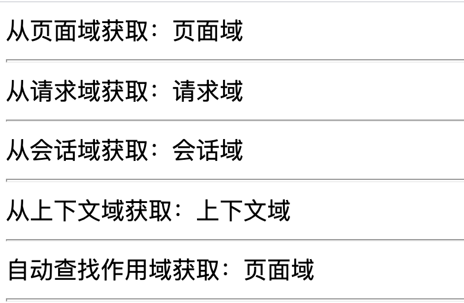*


# 五、JSTL 标签库

JSTL 引入代码

```java
@WebServlet("/emp")
public class EmployeeListServlet extends HttpServlet{
    protected void service(HttpServletRequest req, HttpServletResponse resp) throws ServletException, IOException {
        // 模拟从数据库中去读取到员工列表,真实项目开发,把以下代码换为从数据库中去读取即可
        List<Employee> list = new ArrayList<Employee>();
        list.add(new Employee("凯哥",new BigDecimal("1000")));
        list.add(new Employee("猴子",new BigDecimal("1000")));
        list.add(new Employee("李白",new BigDecimal("1000")));

        // 把数据放到作用域中
        req.setAttribute("list",list);
        // 跳转到 jsp 中来显示列表
        req.getRequestDispatcher("/list.jsp").forward(req,resp);
    }
}
```

```jsp
    ${list[0].username} -> ${list[0].salary}<br/>
    ${list[1].username} -> ${list[1].salary}<br/>
    ${list[2].username} -> ${list[2].salary}<br/>
```

目前使用 EL 只能一个一个元素使用索引去获取,又因为数据库的数据条数是不固定,所以需要使用循环来获取.

但是目前只能使用 Java 脚本来做循环,但是在jsp 页面中不要使用Java脚本,所以需要学 新的标签库(JSTL标签库)


## 5.1 JSTL 概述（理解）

### 5.1.1 为什么使用 JSTL

1. 因为 JSP 页面主要用于显示的，最好不要写 Java 代码 <%%>，如果不用 JSTL 就得写 Java 代码。

2. 对于页面设计人员来说，使用 Java语言操作动态数据是比较困难的，而采用标签和表达式语言相对容易一些， JSTL 的使用为页面设计人员和后台开发人员的分工协作提供了便利。

3. 终极目标：为了简化 JSP 页面的设计。

   

### 5.1.2 什么是 JSTL

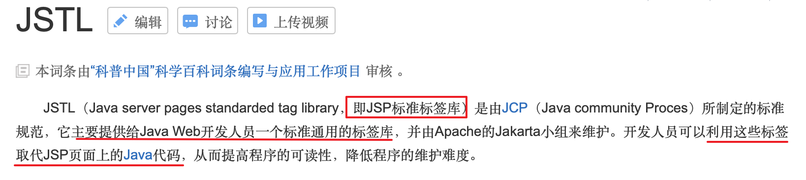

- **JSTL 是 JSP 标准标签库，利用标签库的标签可以取代 JSP 页面上的 Java 代码，为页面设计人员和后台开发人员的分工协作提供了便利。**

  

### 5.1.3 JSTL 常用标签库

| 标签库名     | URL字符串                           | 作用                                      | 前缀 |
| ------------ | ----------------------------------- | ----------------------------------------- | ---- |
| 核心标签库   | `http://java.sun.com/jsp/jstl/core` | 用于页面逻辑控制<br />如：if、forEach     | c    |
| 格式化标签库 | `http://java.sun.com/jsp/jstl/fmt`  | 用于执行格式操作<br/>如：格式化日期字符串 | fmt  |

### 5.1.4 JSTL 使用步骤

1. 导入 jar 包，每个标签底层其实都是用 Java 代码实现的，复制 jar 包到 **web/WEB-INF/lib** 目录

*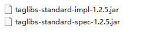*

**

2. **导入 jar (File -> project structure -> Modules) (必须)**

   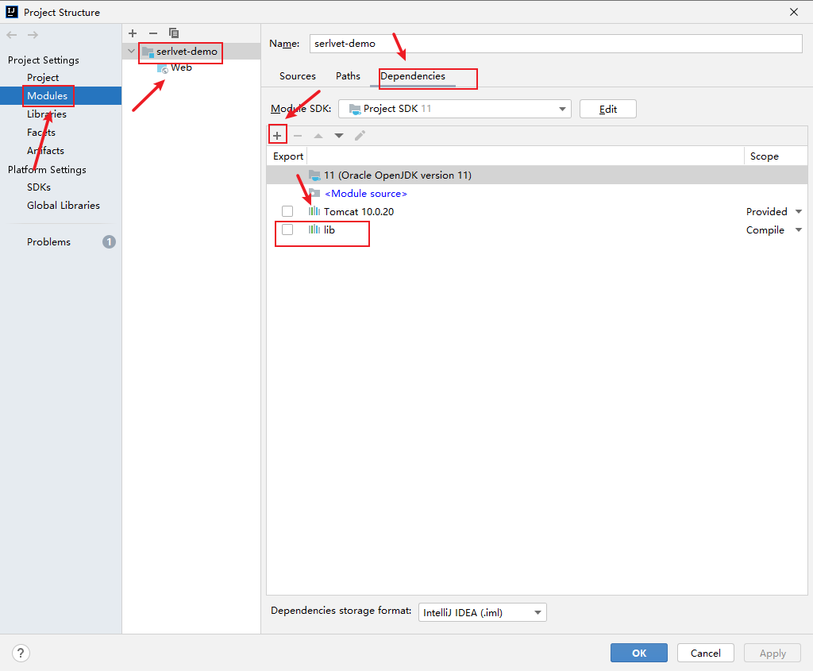

3. 创建 JSP 页面，使用 taglib 的指令引用标签库

```html
<%--prefix表示前缀，固定为c，uri 标识 --%>
<%@taglib prefix="c" uri="http://java.sun.com/jsp/jstl/core" %>
```

4. 在 JSP 页面中就可以使用标签库定义好的标签，比如：`<c:if>`


## 5.2 核心标签库常用标签

### 5.2.1 `<c:if>` 标签（掌握）

- 作用： 用于页面上单条件判断。

| 属性名 | 是否支持EL      | 属性类型  | 属 性 描 述                                                 |
| ------ | --------------- | --------- | ----------------------------------------------------------- |
| test   | 支持，必须是 EL | boolean值 | EL 中条件为真则执行标签体内容<br />注意：没有对应 else 标签 |

- 示例：如果用户提交的 age 值大于等于18，则显示你已经成年，否则显示未成年。

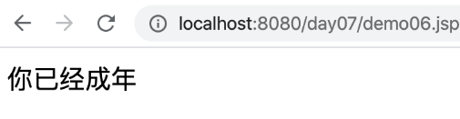<br/>

- 代码

```jsp
<%@ page contentType="text/html;charset=UTF-8" language="java" %>
<%--prefix表示前缀，固定为c，uri 标识 --%>
<%@taglib prefix="c" uri="http://java.sun.com/jsp/jstl/core" %>
<html>
<head>
    <title>if标签</title>
</head>
<body>
    <% 
    	// 设置 age 到请求作用域
    	request.setAttribute("age",20);
    %>
    <c:if test="${age >=18}">
        你已经成年
    </c:if>
    <c:if test="${age < 18}">
        未成年，请绕行
    </c:if>
</body>
</html>
```


### 5.2.2 `<c:choose>`标签（掌握）

- 作用：用于多分支判断(多条件判断)

| 标签名    | 作用                                                         |
| --------- | ------------------------------------------------------------ |
| choose    | 类似于 java 中swtich,  choose只是一个容器，包含下面两个元素  |
| when      | 可以出现多个,<br />用于每个判断条件，类似于 switch 中 case。有一个 test 属性，与 if 的 test 功能相同 |
| otherwise | 如果上面所有的条件都不满足，执行 otherwise 内容。类似于 switch 中 default |

- 示例：接收用户提交的分数，根据分数输出等级
  - 80~100优秀 
  - 60~80及格 
  - 0~60不及格 
  - 其它输出分数不正确。

*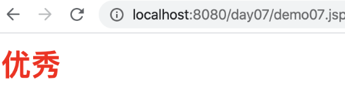*

- 代码

```html
<%@ page contentType="text/html;charset=UTF-8" language="java" %>
<%@taglib prefix="c" uri="http://java.sun.com/jsp/jstl/core" %>
<html>
<head>
    <title>choose标签</title>
</head>
<body>
    <% 
    	// 设置 age 到请求作用域
    	request.setAttribute("score",80);
    %>
    <c:if test="${not empty score}">
        <c:choose>
            <c:when test="${score >=80 && score<=100}">
                <h2 style="color: red">优秀</h2>
            </c:when>
            <c:when test="${score >=60 && score<80}">
                <h2 style="color: green">良好</h2>
            </c:when>
            <c:when test="${score >=0 && score<60}">
                <h2 style="color: dodgerblue">不及格</h2>
            </c:when>
            <c:otherwise>
                <h2 style="color: orange">分数不正确</h2>
            </c:otherwise>
        </c:choose>
    </c:if>
</body>
</html>
```


### 5.2.3 `<c:forEach>`标签（掌握）

- 作用：用于遍历集合或数组  for(类型 变量名 : 集合)


| 属性名    | 是否支持EL | 属性类型   | 属性描述                                                     |
| --------- | ---------- | ---------- | ------------------------------------------------------------ |
| items     | true       | 数组或集合 | 使用 EL 表达式，代表集合或数组                               |
| var       | false      | String     | var 的变量名代表集合中的每一个元素                           |
| varStatus | false      | String     | 代表每个元素的状态对象，<br />一共有4个属性，属性的含义见下表 |

- varStatus属性

| 属性      | 数据类型 | 含义                                          |
| --------- | -------- | --------------------------------------------- |
| index     | int      | 当前遍历到的这个元素索引号，从 0 开始         |
| **count** | int      | 遍历到当前为止，一共遍历了多少个元素,从1 开始 |
| first     | boolean  | 如果当前遍历的是第1个元素，则返回true         |
| last      | boolean  | 如果当前遍历的是最后1个元素，则返回true       |

- 示例：遍历集合

  学生信息：包含编号，姓名，性别，成绩。在 Servlet 中得到所有的学生信息，把信息放到请求域中，转发到JSP 页面，在 JSP 页面上使用 forEach 标签输出所有的学生信息。

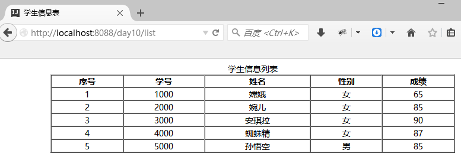

- Student 代码

```java
@Getter
@Setter
@AllArgsConstructor
@NoArgsConstructor
@ToString
public class Student {
    private int id;
    private String name;
    private boolean gender; // true 男 false 女
    private double score;
}
```

- Servlet 代码

```java
@WebServlet("/list")
public class ListStudentServlet extends HttpServlet {

    @Override
    protected void service(HttpServletRequest request, HttpServletResponse response) throws ServletException, IOException {
        // 创建集合存储学生信息：假装从数据库查询的学生信息
        List<Student> stus = new ArrayList<Student>();
        stus.add(new Student(1000,"嫦娥",false,65));
        stus.add(new Student(2000,"婉儿",false,85));
        stus.add(new Student(3000,"安琪拉",false,90));
        stus.add(new Student(4000,"蜘蛛精",false,87));
        stus.add(new Student(5000,"孙悟空",true,85));

        // 将集合存储请求域中
        request.setAttribute("stus", stus);

        // 转发到JSP页面显示数据
        request.getRequestDispatcher("/list.jsp").forward(request, response);
    }
}
```

- JSP代码

```html
<%@ page contentType="text/html;charset=UTF-8" language="java" %>
<%@ taglib prefix="c" uri="http://java.sun.com/jsp/jstl/core" %>
<html>
<head>
    <title>学生信息表</title>
    <style>
        tr {
            text-align: center;
        }
    </style>
</head>
<body>
<table align="center" border="1" cellspacing="0" cellpadding="0" width="80%">
    <caption>学生信息列表</caption>
    <tr>
        <th>序号</th>
        <th>学号</th>
        <th>姓名</th>
        <th>性别</th>
        <th>成绩</th>
    </tr>

    <%--
        forEach标签：用于JSP页面遍历集合和数组
            items属性：设置要遍历的集合或数组：一般从作用域中获取
            var属性：设置一个变量名：用来接收遍历到的每一个元素

            varStatus属性：设置一个变量名：记录当前遍历元素的状态(状态对象)
                index 属性：当前遍历元素的在集合中的索引值：从0开始
                count 属性：遍历到当前元素为止已经遍历了多少个元素,从 1 开始
    --%>
    <c:forEach items="${stus}" var="stu" varStatus="status">
        <!-- 给偶数行设置背景颜色 -->
        <tr style="background-color:${status.count % 2 == 0 ? 'gray;' : ''}">
            <td>${status.count}</td>
            <td>${stu.id}</td>
            <td>${stu.name}</td>
            <td>${stu.gender? "男":"女"}</td>
            <td>${stu.score}</td>
        </tr>
    </c:forEach>
</table>
</body>
</html>
```


## 5.3 格式化标签库常用标签

### 5.3.1 `<fmt:formatDate>`

- 作用：用于对日期进行格式化

| 属性名  | 属性类型 | 属 性 描 述        |
| ------- | -------- | ------------------ |
| value   | Date     | 要格式化的日期对象 |
| pattern | String   | 指定日期格式       |

- 示例代码

```jsp
<%@ page import="java.util.Date" %>
<%@ page contentType="text/html;charset=UTF-8" language="java" %>
<%-- 引入标签库 --%>
<%@taglib prefix="fmt" uri="http://java.sun.com/jsp/jstl/fmt" %>
<html>
<head>
    <title>formatDate标签</title>
</head>
<body>
    <%
        request.setAttribute("date", new Date());
    %>
    当前时间：
    <fmt:formatDate value="${date}" pattern="yyyy-MM-dd HH:mm:ss"></fmt:formatDate>
</body>
</html>
```


# 小结

1. 理解为什么需要做跳转和数据共享
2. 掌握请求转发和重定向的使用
3. 理解 请求转发和重定向的区别(验证)
4. 掌握 请求转发和重定向的选用问题
5. 理解作用域的作用以及三大作用域的作用范围
6. 掌握三大作用域如何共享数据(API:1  如何获取作用域对象,2 如何通过作用域对象去共享数据)
7. 理解 EL 表达式的作用 : 从四个作用域中从小到大去获取数据
8. 掌握 使用 EL 表达式去获取各种类型的数据
9. 理解 JSTL 标签库的作用
10. 掌握 使用 JSTL 标签库的使用步骤
11. 掌握 JSTL 标签库的常用标签 (条件判断标签,循环标签)
12. 了解 JSTL 标签库的格式化标签(Date 格式化) 


