# 目标 `*****`

- [ ] 理解用户注销的业务逻辑 `*****`
- [ ] 掌握用户注销实现 `***`
- [ ] 理解验证码的原理 `*****`
- [ ] 通过文档完成验证码的实现 `***`
- [ ] 理解 Filter 所处位置以及作用 `*****`
- [ ] 掌握字符编码过滤器的应用 `***`
- [ ] 掌握登录过滤器的实现 `***`
- [ ] 理解监听器的作用及分类 `*****`
- [ ] 掌握使用监听器创建系统默认管理员账号 `***`
- [ ] 了解页面美化操作 `*`


# 一、项目美化

使用资源中的模块给pmis进行美好，以达到下面效果

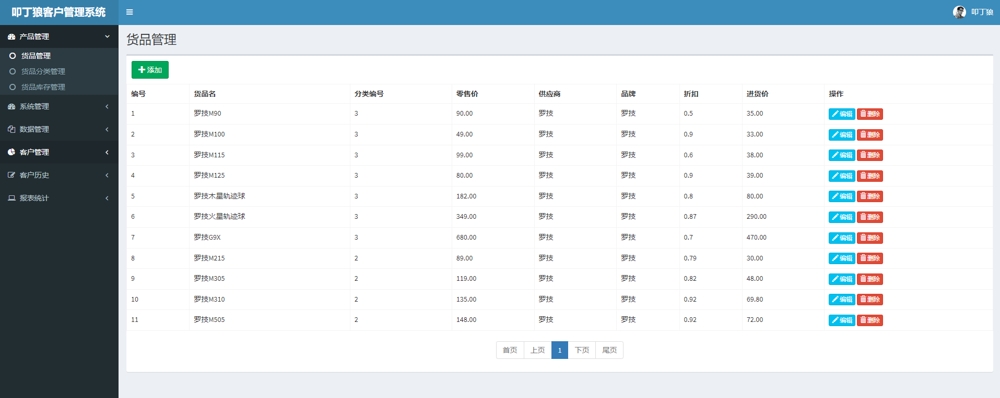

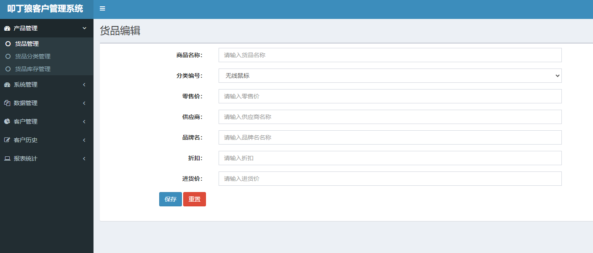

## 1.1 页面美化

**步骤1：备份pmis项目中的web目录，然后将资料中web模版替换pmis模版**

*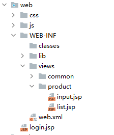*

**步骤2：启动项目，直接访问/product**

**步骤3：按照货品要求将静态input.jsp /list.jsp改造成动态的jsp**

**list.jsp**

```jsp
<%@ page contentType="text/html;charset=UTF-8" language="java"%>
<%@taglib prefix="c" uri="http://java.sun.com/jsp/jstl/core" %>
<!DOCTYPE html>
<html>
<head>
<meta charset="utf-8">
<meta http-equiv="X-UA-Compatible" content="IE=edge">
<title>货品管理</title>
<jsp:include page="/WEB-INF/views/common/link.jsp" />

</head>
<body class="hold-transition skin-blue sidebar-mini">

	<div class="wrapper">
		<%@include file="/WEB-INF/views/common/navbar.jsp"%>
		<!--菜单回显-->
		<c:set var="currentMenu" value="product" />
		<%@include file="/WEB-INF/views/common/menu.jsp"%>
		<div class="content-wrapper">
			<section class="content-header">
				<h1>货品管理</h1>
			</section>
			<section class="content">
				<div class="box">
					<!--高级查询--->
					<form class="form-inline" id="searchForm"
						action="#" method="post">
						<input type="hidden" name="currentPage" id="currentPage" value="1">
						<a href="/product?cmd=input" class="btn btn-success inputBtn" style="margin: 10px">
							<span class="glyphicon glyphicon-plus"></span>
							添加
						</a>
					</form>
					<!--编写内容-->
					<div class="box-body table-responsive no-padding ">
						<table class="table table-hover table-bordered">
							<tr>
								<th>编号</th>
								<th>货品名</th>
								<th>分类编号</th>
								<th>零售价</th>
								<th>供应商</th>
								<th>品牌</th>
								<th>折扣</th>
								<th>进货价</th>
								<th>操作</th>
							</tr>
							<c:forEach var="product" items="${list}" varStatus="status">
								<tr>
									<td>${status.count}</td>
									<td>${product.productName}</td>
									<td>${product.dirId}</td>
									<td>${product.salePrice}</td>
									<td>${product.supplier}</td>
									<td>${product.brand}</td>
									<td>${product.cutoff}</td>
									<td>${product.costPrice}</td>
									<td>
										<a class="btn btn-info btn-xs inputBtn" href="/product?cmd=input&id=${product.id}">
											<span class="glyphicon glyphicon-pencil"></span>
											编辑
										</a>
										<a href="/product?cmd=delete&id=${product.id}" class="btn btn-danger btn-xs btn_delete">
											<span class="glyphicon glyphicon-trash"></span>
											删除
										</a>
									</td>
								</tr>
							</c:forEach>
						</table>
						<!--分页-->
						<%@include file="/WEB-INF/views/common/page.jsp"%>
					</div>
				</div>
			</section>
		</div>
		<%@include file="/WEB-INF/views/common/footer.jsp"%>
	</div>
</body>
</html>

```

**input.jsp**

```jsp
<%@ page contentType="text/html;charset=UTF-8" language="java"%>
<%@taglib prefix="c" uri="http://java.sun.com/jsp/jstl/core"%>
<!DOCTYPE html>
<html>
<head>
<meta charset="utf-8">
<meta http-equiv="X-UA-Compatible" content="IE=edge">
<title>部门管理</title>
<jsp:include page="/WEB-INF/views/common/link.jsp" />
</head>
<body class="hold-transition skin-blue sidebar-mini">
	<div class="wrapper">
		<%@include file="/WEB-INF/views/common/navbar.jsp"%>
		<!--菜单回显-->
		<c:set var="currentMenu" value="product" />
		<%@include file="/WEB-INF/views/common/menu.jsp"%>
		<div class="content-wrapper">
			<section class="content-header">
				<h1>货品编辑</h1>
			</section>
			<section class="content">
				<div class="box">
					<form class="form-horizontal" action="/product?cmd=saveOrUpdate"
						method="post" id="editForm">
						<input type="hidden" name="id" value="${product.id}">
						<div class="form-group" style="margin-top: 10px;">
							<label for="productName" class="col-sm-2 control-label">商品名称：</label>
							<div class="col-sm-6">
								<input type="text" class="form-control" id="productName" name="productName" value="${product.productName}"
									placeholder="请输入货品名称">
							</div>
						</div>

						<div class="form-group" style="margin-top: 10px;">
							<label for="productName" class="col-sm-2 control-label">分类编号：</label>
							<div class="col-sm-6">
								<select name="dirId" class="form-control form-control-placeholder">
									<option value="2" ${product.dirId == 2 ? 'selected' : ''}>无线鼠标</option>
									<option value="3" ${product.dirId == 3 ? 'selected' : ''}>有线鼠标</option>
									<option value="4" ${product.dirId == 4 ? 'selected' : ''}>游戏鼠标</option>
								</select>
							</div>
						</div>
						<div class="form-group" style="margin-top: 10px;">
							<label for="salePrice" class="col-sm-2 control-label">零售价：</label>
							<div class="col-sm-6">
								<input type="number" class="form-control" id="salePrice" name="salePrice" value="${product.salePrice}"
									   placeholder="请输入零售价">
							</div>
						</div>
						<div class="form-group" style="margin-top: 10px;">
							<label for="supplier" class="col-sm-2 control-label">供应商：</label>
							<div class="col-sm-6">
								<input type="text" class="form-control" id="supplier" name="supplier" value="${product.supplier}"
									   placeholder="请输入供应商名称">
							</div>
						</div>
						<div class="form-group" style="margin-top: 10px;">
							<label for="brand" class="col-sm-2 control-label">品牌名：</label>
							<div class="col-sm-6">
								<input type="text" class="form-control" id="brand" name="brand" value="${product.brand}"
									   placeholder="请输入品牌名名称">
							</div>
						</div>
						<div class="form-group" style="margin-top: 10px;">
							<label for="cutoff" class="col-sm-2 control-label">折扣：</label>
							<div class="col-sm-6">
								<input type="number" class="form-control" id="cutoff" name="cutoff" value="${product.cutoff}" step="0.1"
									   placeholder="请输入折扣">
							</div>
						</div>

						<div class="form-group" style="margin-top: 10px;">
							<label for="costPrice" class="col-sm-2 control-label">进货价：</label>
							<div class="col-sm-6">
								<input type="number" class="form-control" id="costPrice" name="costPrice" value="${product.costPrice}" step="0.1"
									   placeholder="请输入进货价">
							</div>
						</div>
						<div class="form-group">
							<div class="col-sm-offset-1 col-sm-6">
								<button id="submitBtn" type="submit" class="btn btn-primary">保存</button>
								<button type="reset" class="btn btn-danger">重置</button>
							</div>
						</div>
					</form>

					<br />
				</div>
			</section>
		</div>
		<%@include file="/WEB-INF/views/common/footer.jsp"%>
	</div>

</body>
</html>

```

## 1.2 用户登录

切换到模版页面即可，逻辑一样

*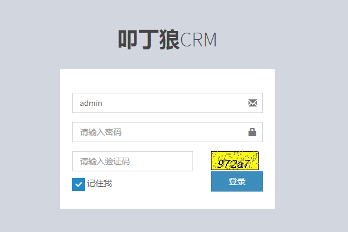*


# 二、系统常见功能

## 2.1 用户注销

用户注销则为退出登录状态，将当前登录的用户信息销毁。而我们之前做的用户登录功能，是把当前登录用户信息是存在 session 中的，所以只需要清除 session 中的用户信息即可实现用户注销。

**步骤1：编写注销serlvet**

```java
package cn.wolfcode.pmis.web.servlet;

import jakarta.servlet.ServletException;
import jakarta.servlet.annotation.WebServlet;
import jakarta.servlet.http.HttpServlet;
import jakarta.servlet.http.HttpServletRequest;
import jakarta.servlet.http.HttpServletResponse;

import java.io.IOException;

@WebServlet("/logout")
public class LogoutServlet extends HttpServlet {
    @Override
    protected void service(HttpServletRequest req, HttpServletResponse resp) throws ServletException, IOException {
        // 方式一：删除用户共享数据
        // req.getSession().removeAttribute("USER_IN_SESSION");
        // 方式二：销毁整个 Session 对象
        req.getSession().invalidate();
        resp.sendRedirect("/login.jsp");
    }
}
```

**步骤2：设置注销逻辑**

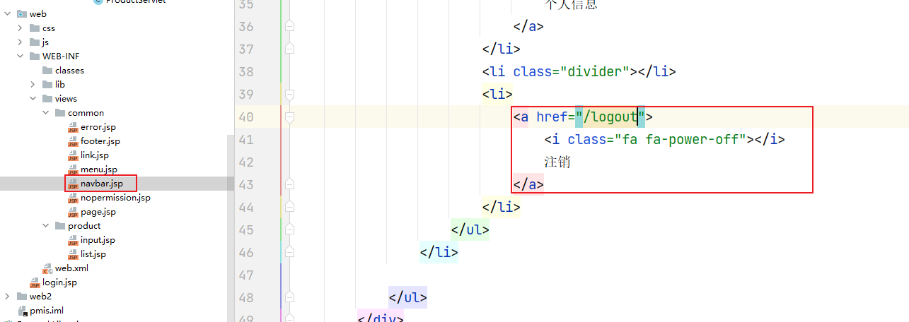


## 2.2 记住账号

为了提升用户体验，在用户登录的时候可以选择记住账号信息，在指定时间范围内可以不用再重新填写账户信息。
因为需要将用户信息保存一段时间，放 session 的话浏览器关闭则会失效，所以选择使用 Cookie 来实现。


**思考**：如何实现记住用户？

分析：每次刷新login.jsp页面都发现用户名存在，这现象跟之前学的编辑回想一直，可以做类比

**思考**：编辑回显原理是啥，怎么类比？

分析：编辑回显前提是：input---共享数据---回显， 意味着记住账号逻辑，也涉及到数据共享 + 回显

**思考**：如何共享数据，如何回显

分析：共享数据方案： 前端：cookie  后端：page， request， session， context

**思考**：request， session， context因为作用域范围问题，可排除， 剩下cookie跟page怎么选择？

分析：

​       page/cookie：共享数据--->回显   

​       共享数据怎么来？--->登录成功 + 勾上记住我 

​		登录成功之后，跳转到list.jsp页面， 没有机会跳转到login.jsp进行数据存储， 很明显Page是没有共享数据机会。所以， page不可能。

​        cookie是最佳实践----原因：登录成功， 跳转list.jsp页面，那表示有响应，意味着浏览器能缓存cookie数据了。


**步骤1：修改 login.jsp**

提供勾选记住我复选框，点击登录时会传递参数 remeberMe 给 LoginServlet。

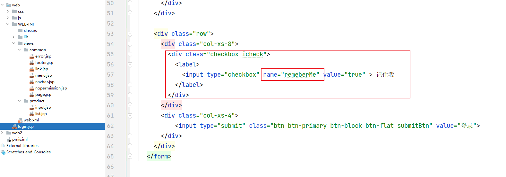

**步骤2：修改 LoginServlet.java**

获取请求参数 remeberMe，若是选中（true），创建 Cookie，指定时间并响应给浏览器；若没有选中，清除 Cookie 对象。

```java
package cn.wolfcode.pmis.web.servlet;

import cn.wolfcode.pmis.dao.IUserDAO;
import cn.wolfcode.pmis.dao.impl.UserDAOImpl;
import cn.wolfcode.pmis.domain.User;
import jakarta.servlet.ServletException;
import jakarta.servlet.annotation.WebServlet;
import jakarta.servlet.http.Cookie;
import jakarta.servlet.http.HttpServlet;
import jakarta.servlet.http.HttpServletRequest;
import jakarta.servlet.http.HttpServletResponse;

import java.io.IOException;

@WebServlet("/login")
public class LoginServlet extends HttpServlet {
    private IUserDAO userDAO = new UserDAOImpl();
    @Override
    protected void service(HttpServletRequest req, HttpServletResponse resp) throws ServletException, IOException {
        // 接受请求参数，封装成对象
        User user = new User();
        user.setUsername(req.getParameter("username"));
        user.setPassword(req.getParameter("password"));
        // 调用业务方法来处理登录请求
        User u = userDAO.checkUser(user);
        if(u == null){
            // 通知用户账号或密码错误
            req.setAttribute("errorMsg", "账号或密码错误");
            req.getRequestDispatcher("/login.jsp").forward(req, resp);
            return;
        }
        // 登录成功时往 Session 中加入一个登录成功的标识
        req.getSession().setAttribute("USER_IN_SESSION", u);

        //============== 是否记住我 ===============
        boolean remeberMe = Boolean.valueOf(req.getParameter("remeberMe"));
        Cookie cookie = new Cookie("username", user.getUsername());
        cookie.setPath("/");
        if (remeberMe){
            // 设置 Cookie 有效时间为一周
            cookie.setMaxAge(60 * 60 * 24 * 7);
        }else{
            // 删除 Cookie
            cookie.setMaxAge(0);
        }
        resp.addCookie(cookie);


        // 登录成功，重定向产品列表页面
        resp.sendRedirect("/product");
    }
}

```

**步骤3：登录页面回显和记住账号**

修改 login.jsp 使用 EL 表达式回显账号和记住我。

```jsp
<input type="text" class="form-control" placeholder="请输入账号" name="username" value="${cookie.username.value}">
```

```jsp
<label>
    <input type="checkbox" name="remeberMe" value="true"
        ${cookie.username.value != null ? 'checked' : ''}> 记住我
</label>
```


## 2.3 验证码

### 2.3.1 作用

验证码（CAPTCHA）是 “Completely Automated Public Turing test to tell Computers and Humans Apart”（**全自动区分计算机和人类的图灵测试**）的缩写，是一种**区分用户是计算机还是人的公共全自动程序**。可以**防止：恶意破解密码、刷票、论坛灌水，有效防止黑客对某一个特定注册用户用特定程序暴力破解方式进行不断的登录尝试**，实际上用验证码是现在很多网站通行的方式，我们利用比较简易的方式实现了这个功能。这个问题可以由计算机生成并评判，但是必须只有人类才能解答。由于计算机无法解答 CAPTCHA 的问题，所以回答出问题的用户就可以被认为是人类。

### 2.3.2 分类

- 图片验证码（最常用）。
- 手机短信验证码。
- 手机语音验证码。
- 视频验证码。

### 2.3.3 图片验证码原理

图片验证码功能分三个部分：
- A 程序生成随机内容的验证码图片展现给用户。
- 用户根据图片输入验证码文本。
- B 程序判断用户输入的验证码和 A 程序生成的验证是否相同。

**问题**：生成验证码的程序 A 和判断用户填写验证码的程序 B 不是同一个，如何在程序 B 中获取到程序 A 生成的验证码文本做判断？

**解决**：因为两个程序我们都是使用 Servlet 来实现的，所以可以把 A 程序生成 验证码之后存入 Session ，B 程序从 Session 中来获取。

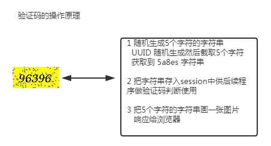
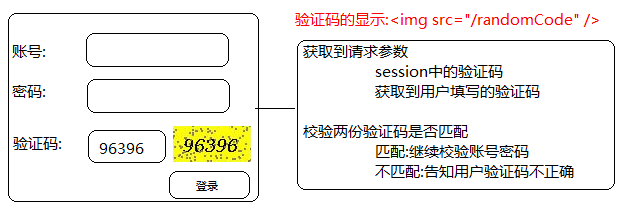

### 2.3.4 图片验证码实现

需求：防止恶意登录，给登录加上验证码。

**步骤1：RandomCodeServlet.java**

这个负责生成图片验证码，并把验证码存在 Session 中。

```java
package cn.wolfcode.pmis.web.servlet;

import java.awt.Color;
import java.awt.Font;
import java.awt.Graphics;
import java.awt.image.BufferedImage;
import java.io.IOException;
import java.util.Random;
import java.util.UUID;

import javax.imageio.ImageIO;
import jakarta.servlet.ServletException;
import jakarta.servlet.annotation.WebServlet;
import jakarta.servlet.http.HttpServlet;
import jakarta.servlet.http.HttpServletRequest;
import jakarta.servlet.http.HttpServletResponse;

@WebServlet("/randomCode")
public class RandomCodeServlet extends HttpServlet {
	private static final long serialVersionUID = 1L;

	protected void service(HttpServletRequest req, HttpServletResponse resp)
			throws ServletException, IOException {
		//生成随机数
		String randomCode = UUID.randomUUID().toString().substring(0, 5);

		//把随机数放进Session中
		req.getSession().setAttribute("RANDOMCODE_IN_SESSION", randomCode);

		//创建图片对象
		int width = 80;
		int height = 40;
		int imageType = BufferedImage.TYPE_INT_RGB;
		BufferedImage image = new BufferedImage(width, height, imageType);

		//画板
		Graphics g = image.getGraphics();
		g.setColor(Color.YELLOW);
		//绘制一个实心的矩形
		g.fillRect(1, 1, width - 2, height - 2);

		//把随机数画进图片中
		g.setColor(Color.BLACK);//设置随机数的颜色
		Font font = new Font("宋体", Font.BOLD + Font.ITALIC, 20);
		g.setFont(font);//设置随机数的字体和大小
		g.drawString(randomCode, 10, 28);
		//干扰线
		g.setColor(Color.GRAY);
		Random r = new Random();
		for (int i = 0; i < 100; i++) {
			g.fillRect(r.nextInt(width), r.nextInt(height), 2, 2);
		}

		//关闭
		g.dispose();
		//把图片对象以流的方式保存出去
		ImageIO.write(image, "jpg", resp.getOutputStream());
	}
}
```

**步骤2：修改在 login.jsp ，显示验证码**

提供 img 标签，显示验证码。

```jsp
<div class="row">
    <div class="col-xs-8">
        <input type="text" class="form-control" placeholder="请输入验证码" name="randomCode">
    </div>
    <div class="col-xs-4">
        
    </div>
</div>
```

**步骤3：修改 LoginServlet.java，校验验证码**

加入验证码判断。

```java
package cn.wolfcode.pmis.web.servlet;

import cn.wolfcode.pmis.dao.IUserDAO;
import cn.wolfcode.pmis.dao.impl.UserDAOImpl;
import cn.wolfcode.pmis.domain.User;
import jakarta.servlet.ServletException;
import jakarta.servlet.annotation.WebServlet;
import jakarta.servlet.http.Cookie;
import jakarta.servlet.http.HttpServlet;
import jakarta.servlet.http.HttpServletRequest;
import jakarta.servlet.http.HttpServletResponse;

import java.io.IOException;

@WebServlet("/login")
public class LoginServlet extends HttpServlet {
    private IUserDAO userDAO = new UserDAOImpl();
    @Override
    protected void service(HttpServletRequest req, HttpServletResponse resp) throws ServletException, IOException {
        // 接受请求参数，封装成对象
        User user = new User();
        user.setUsername(req.getParameter("username"));
        user.setPassword(req.getParameter("password"));

        // 判断验证码是否正确
        String randomCode = req.getParameter("randomCode");
        String sessionRandomCode = (String) req.getSession().getAttribute("RANDOMCODE_IN_SESSION");
        if(sessionRandomCode != null && sessionRandomCode.equalsIgnoreCase(randomCode)) {
            // 跳回登录页面重新填写验证码
            req.setAttribute("errorMsg", "验证码错误");
            req.getRequestDispatcher("/login.jsp").forward(req, resp);
            return;
        }
        
        // 调用业务方法来处理登录请求
        User u = userDAO.checkUser(user);
        if(u == null){
            // 通知用户账号或密码错误
            req.setAttribute("errorMsg", "账号或密码错误");
            req.getRequestDispatcher("/login.jsp").forward(req, resp);
            return;
        }
        // 登录成功时往 Session 中加入一个登录成功的标识
        req.getSession().setAttribute("USER_IN_SESSION", u);

        //============== 是否记住我 ===============
        boolean remeberMe = Boolean.valueOf(req.getParameter("remeberMe"));
        Cookie cookie = new Cookie("username", user.getUsername());
        cookie.setPath("/");
        if (remeberMe){
            // 设置 Cookie 有效时间为一周
            cookie.setMaxAge(60 * 60 * 24 * 7);
        }else{
            // 删除 Cookie
            cookie.setMaxAge(0);
        }
        resp.addCookie(cookie);


        // 登录成功，重定向产品列表页面
        resp.sendRedirect("/product");
    }
}

```

**步骤4：修改验证码**

生成的图片验证码可能存在用户识别不了的情况，可提供点击更换图片验证码功能。

**思路**: 当 img 标签的 src 属性值改变了，浏览器会自动发送新的请求。那么我们就给图片添加一个点击事件处理，点击了图片，修改该图片 src 的值即可，重新请求验证码图片。

修改 login.jsp：

```jsp
<!-- 为图片绑定一个点击事件 -->

```

```js
// 点击图片执行下面的函数
function changeImg(imgEl) {
    // 修改验证码 img 标签的 src 属性值，为什么要带参数，禁用浏览器缓存
    imgEl.src="/randomCode?" + new Date().getTime();
}
```

浏览器有缓存，将 get 请求的结果缓存到本地磁盘，若请求相同的资源，不再发送新的请求，而是直接使用缓存中的结果。我们可以通过携带参数不一样来欺骗浏览器我们请求的资源不是同一个资源（实际上是同一个)。


# 三、过滤器 Filter

## 3.1 定义及应用

Filter 是 Servlet 2.3 新增加的功能，Java Web 组件之一。

**使用户可以改变一个 request 和修改一个 response**。

Filter 不是一个 Servlet，它不能产生一个 response，它能够在一个 request 到达 Servlet 之前预处理 request，也可以在 response 离开 Servlet 后处理 response。换种说法，Filter 其实是一个 "Servlet chaining"（Servlet 链）。

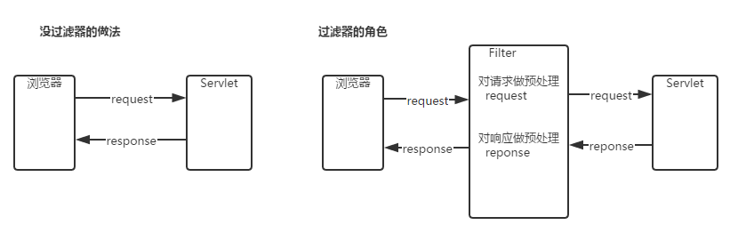

**Java web流程图**

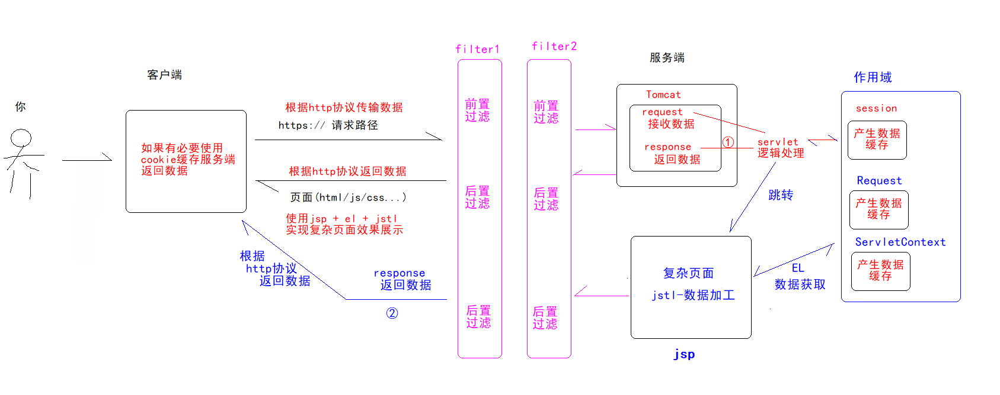

过滤器使用场景：核心特征：**请求进入servlet之前，做拦截**

- 字符编码处理。
- 登录校验。
- 论坛敏感字过滤。
- 做前端框架的分发器。


## 3.2 Filter开发步骤

- 创建filter 实现 javax.servlet.Filter接口

  覆写其中的 3 个方法。
  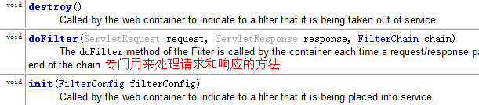

  新版JDK  接口的init  跟 destroy 方法已经默认实现了，实际上只需要重写doFilter接口即可

  还有一种方式，直接**继承HttpFilter**

- 将写好的 Filter 交给 Tomcat 来管理（XML/注解）


## 3.3 Filter入门案例

**需求**：定义一个OneServlet，一个One.jsp，一个OneFilter，要求访问OneServlet然后转发到One.jsp，在进入oneServlet前，OneFilter对他做拦截

**步骤1：编写 OneServlet**

```java
package cn.wolfcode.servlet._16_filter;

import jakarta.servlet.ServletException;
import jakarta.servlet.annotation.WebServlet;
import jakarta.servlet.http.HttpServlet;
import jakarta.servlet.http.HttpServletRequest;
import jakarta.servlet.http.HttpServletResponse;

import java.io.IOException;

@WebServlet("/one")
public class OneServlet  extends HttpServlet {
    @Override
    protected void service(HttpServletRequest req, HttpServletResponse resp) throws ServletException, IOException {
        System.out.println("-----------------one");
        req.getRequestDispatcher("/one.jsp").forward(req, resp);
    }
}

```

**步骤2：编写one.jsp**

```jsp
<%@ page contentType="text/html;charset=UTF-8" language="java" %>
<html>
<head>
    <title>filter</title>
</head>
<body>
1111111111
</body>
</html>

```

**步骤3：编写OneFilter **

**方式一：xml方式**

```java
package cn.wolfcode.servlet._16_filter;

import jakarta.servlet.*;
import jakarta.servlet.annotation.WebFilter;
import jakarta.servlet.http.HttpFilter;
import jakarta.servlet.http.HttpServletRequest;
import jakarta.servlet.http.HttpServletResponse;

import java.io.IOException;

public class OneFilter extends HttpFilter {
    @Override
    protected void doFilter(HttpServletRequest request, HttpServletResponse response, FilterChain chain) throws IOException, ServletException {
        System.out.println("-拦截了.....");
    }
}

```

web.xml

```xml
<filter>
    <filter-name>OneFilter</filter-name>
    <filter-class>cn.wolfcode.servlet._16_filter.OneFilter</filter-class>
</filter>

<filter-mapping>
    <filter-name>OneFilter</filter-name>
    <url-pattern>/one</url-pattern>
</filter-mapping>
```

**方式二：注解方式**

```java
package cn.wolfcode.servlet._16_filter;

import jakarta.servlet.*;
import jakarta.servlet.annotation.WebFilter;
import jakarta.servlet.http.HttpFilter;
import jakarta.servlet.http.HttpServletRequest;
import jakarta.servlet.http.HttpServletResponse;

import java.io.IOException;

@WebFilter("/one")
public class OneFilter extends HttpFilter {
    @Override
    protected void doFilter(HttpServletRequest request, HttpServletResponse response, FilterChain chain) throws IOException, ServletException {
        System.out.println("-拦截了.....");
    }
}

```

**步骤4：测试**

启动 Tomcat 访问 localhost/one测试一下。

在doFilter方法中添加放行逻辑，再测试

```java
chain.doFilter(request, response);
```


## 3.3 过滤路径

过滤器的 url-pattern 是指 Filter 对哪一些资源做过滤操作。注意与 Servlet 区别：
- **Servlet 中的 url-pattern 的作用**：为当前 Servlet 起一个资源名称，外界通过该名字找到对应的 Servlet 对象。
- **Filter 中的 url-pattern 的作用**：指定对哪些资源做过滤。

配置过滤器路径举例说明：

```java
/hello   	  // 说明当前 Filter 只会对 /hello 做拦截/过滤。
/employee     // 说明当前 Filter 只会对 /employee 资源做过滤
/system/*     // 说明当前 Filter 只会对以 /system/ 作为前缀的资源路径做拦截。
/*            // 说明当前 Filter 会对所有的资源访问都会被拦截。
```


## 3.4 Filter 的生命周期

### 3.4.1 生命周期

**Filter 的生命周期**：指 Filter 从创建到销毁的整个过程。过程如下：

- **对象的创建**：在启动服务器的时候创建所有的 Filter 对象。
- **init 方法的执行**：在启动服务器的时候调用 Filter 对象中的 init 方法。
- **doFilter 方法的执行**：每次请求对应的资源的时候都会执行，只要路径符合。
- **destroy 方法的执行**：正常关闭服务器的时候，执行销毁操作，非正常关闭不会执行。

### 2.4.2 代码验证

修改 HelloFilter.java，提供构造器，并在其他初始化方法和销毁方法里面打印，修改完启动 Tomcat，访问 localhost/hello 测试一下，看打印结果。

```java
package cn.wolfcode.servlet._16_filter;

import jakarta.servlet.FilterChain;
import jakarta.servlet.FilterConfig;
import jakarta.servlet.ServletException;
import jakarta.servlet.annotation.WebFilter;
import jakarta.servlet.http.HttpFilter;
import jakarta.servlet.http.HttpServletRequest;
import jakarta.servlet.http.HttpServletResponse;

import java.io.IOException;

@WebFilter("/one")
public class LifeCycleFilter  extends HttpFilter {

    public LifeCycleFilter(){
        System.out.println("create....");
    }
    @Override
    public void init(FilterConfig filterConfig) throws ServletException {
        System.out.println("init...");
    }

    @Override
    protected void doFilter(HttpServletRequest request, HttpServletResponse response, FilterChain chain) throws IOException, ServletException {
        System.out.println("dofilter....");
        chain.doFilter(request, response);
    }

    @Override
    public void destroy() {
        System.out.println("destroy....");
    }
}

```

### 3.4.3 执行顺序

创建对象（一次）---> init 方法（一次）---> doFilter 方法（N 次）---> destroy 方法(一次/ 0 次)


## 3.5 FilterChain（过滤器链） 

在开发中会存在并配置了多个过滤器时，多个过滤器按照一定的顺序，排列起来，多个 Filter 组合在一起都形成一个 Filter 链，使用 FilterChain 对象来做牵引关联。

*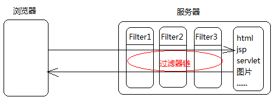*

**程序中，存在多个过滤器的时候，过滤器的先后执行顺序由谁来决定？**

- 由在 web.xml 中配置的 `<filter-mapping>` 的先后顺序来决定。
- 注解配置时则是由 Filter 的名称的字母先后顺序来决定。


## 3.6 过滤方式（了解）

默认过滤器只对请求操作做过滤，针对转发是没有做过滤的，若要对转发方式等做过滤，需要设置过滤方式。过滤方式如下：

- REQUEST   ：一次全新的请求，只有全新的请求才会经过过滤器（默认）。
- FORWARD ：请求转发。
- ERROR       :   错误页面跳转。

### 3.6.1 过滤转发

在 web.xml 修改 OneFilter 的过滤器方式，如下：

```xml
<filter-mapping>
    <filter-name>OneFilter</filter-name>
    <url-pattern>/*</url-pattern>
    <!-- 过滤请求 -->
    <dispatcher>REQUEST</dispatcher>
    <!-- 过滤转发 -->
    <dispatcher>FORWARD</dispatcher>
</filter-mapping>
```

### 3.6.2 过滤器错误

**编写 404.jsp 和 500.jsp**

在 web 目录下新建 404.jsp 和 500.jsp，404.jsp 内容提示用户访问的资源不存在，500.jsp 内容提示用户程序员正在努力修复程序。

**配置通用的错误页面**

在 web.xml 中配置如下：

```xml
<error-page>
    <error-code>404</error-code>
    <location>/404.jsp</location>
</error-page>
<error-page>
    <error-code>500</error-code>
    <location>/500.jsp</location>
</error-page>
```

**修改过滤器过滤方式**

在 web.xml 修改 OneFilter 的过滤器方式，如下：

```xml
<filter-mapping>
    <filter-name>OneFilter</filter-name>
    <url-pattern>/*</url-pattern>
    <!-- 过滤请求 -->
    <dispatcher>REQUEST</dispatcher>
    <!-- 过滤转发 -->
    <dispatcher>FORWARD</dispatcher>
    <!-- 过滤错误 -->
    <dispatcher>ERROR</dispatcher>
</filter-mapping>
```


## 3.7 登录校验过滤器

### 3.7.1 登录校验过滤器引入

在实际开发中，我们项目中会存在很多的资源都需要在登录之后才能访问，所以我们需要在请求到达这些资源之前先判断当前用户是否登录，如果没有应该跳转到登录页面。之前我们是在需要登录访问的的资源加上登录判断代码，代码如下：

```java
Object obj = req.getSession().getAttribute("USER_IN_SESSION");
if(obj == null){
    resp.sendRedirect("/login.jsp");
    return;
}
```

以上操作能够解决登录检查的需求，但存在大量重复代码，在每个资源的代码中都会编写检查登录的代码，从增加维护成本。

**目标**：一处设置，到处有效（设置一次，所有 Servlet 共用）。
**方案**：访问到 Servlet 之前对请求进行登录校验处理（Filter）。


### 3.7.2 代码实现

**步骤1：修改所有 Servlet**

删除其中对请求登录校验处理的代码。

**步骤2：编写 CheckLoginFilter.java**

过滤器请求，做登录校验。

```java
package cn.wolfcode.pmis.web.filter;

import jakarta.servlet.FilterChain;
import jakarta.servlet.ServletException;
import jakarta.servlet.http.HttpFilter;
import jakarta.servlet.http.HttpServletRequest;
import jakarta.servlet.http.HttpServletResponse;

import java.io.IOException;

public class CheckLoginFilter extends HttpFilter {
    @Override
    protected void doFilter(HttpServletRequest request, HttpServletResponse response, FilterChain chain) throws IOException, ServletException {
        // 把请求和响应转化为符合 HTTP 协议的对象
        Object obj = request.getSession().getAttribute("USER_IN_SESSION");
        // 没有登录，重定向到登录页面
        if(obj == null) {
            response.sendRedirect("/login.jsp");
            return;
        }
        // 登录过，放行访问
        chain.doFilter(request, response);
    }

}
```

**步骤3：配置 CheckLoginFilter**

在 web.xml 配置此过滤器，如下：

```xml
<filter>
    <filter-name>checkLoginFilter</filter-name>
    <filter-class>cn.wolfcode.web.filter.CheckLoginFilter</filter-class>
</filter>
<filter-mapping>
    <filter-name>checkLoginFilter</filter-name>
    <url-pattern>/*</url-pattern>
</filter-mapping>
```

**步骤4：匿名访问资源**

匿名访问资源指的是不需要登录也可以访问的资源，比如 /login.jsp，/login，/randomCode 和静态资源等等。若不排除，那么当浏览器中请求这些资源，也需要登录，这就会造成这些资源访问不到了。

针对上面的情况，只需要指定 CheckLoginFilter 对哪些资源做登录校验处理或者不对哪些资源做登录校验处理。

**方式一**

指定 CheckLoginFilter 不对哪些资源做登录校验处理。

修改 CheckLoginFilter，配置初始化参数，指定哪些资源不做登录校验，如下：

```xml
<filter>
    <filter-name>checkLoginFilter</filter-name>
    <filter-class>cn.wolfcode.web.filter.CheckLoginFilter</filter-class>
    <init-param>
        <param-name>unCheckUri</param-name>
        <param-value>/login.jsp;/login;/randomCode;/css/*;/js/*;/images/*</param-value>
    </init-param>
</filter>
<filter-mapping>
    <filter-name>checkLoginFilter</filter-name>
    <url-pattern>/*</url-pattern>
</filter-mapping>
```

```java
package cn.wolfcode.pmis.web.filter;

import jakarta.servlet.FilterChain;
import jakarta.servlet.FilterConfig;
import jakarta.servlet.ServletException;
import jakarta.servlet.http.HttpFilter;
import jakarta.servlet.http.HttpServletRequest;
import jakarta.servlet.http.HttpServletResponse;

import java.io.IOException;
import java.util.Arrays;
import java.util.List;

public class CheckLoginFilter extends HttpFilter {
    private List<String> unCheckUriList;

    @Override
    public void init(FilterConfig filterConfig) throws ServletException {
        this.unCheckUriList = Arrays.asList(filterConfig.getInitParameter("unCheckUri").split(";"));
    }

    @Override
    protected void doFilter(HttpServletRequest request, HttpServletResponse response, FilterChain chain) throws IOException, ServletException {
        // 把请求和响应转化为符合 HTTP 协议的对象
        Object obj = request.getSession().getAttribute("USER_IN_SESSION");
        // 获取请求的资源路径
        String uri = request.getRequestURI();
        // 没有登录且访问的不是匿名资源，重定向到登录页面
        if(obj == null && !unCheckUriList.contains(uri)) {
            response.sendRedirect("/login.jsp");
            return;
        }
        // 登录过，放行访问
        chain.doFilter(request, response);
        // 登录过，放行访问
        chain.doFilter(request, response);
    }

}
```

**方式二**

因为会发现，上面那样处理还是会导致静态资源不可以访问到，而实际开发中，我们需要排除的资源较多的话，尤其是像静态资源，会很麻烦。所以这次指定 CheckLoginFilter 对哪些资源做登录校验处理。将需要受检查的资源通通存放到 check 路径下。


修改 CheckLoginFilter 的过滤路径，如下：

```xml
<filter>
    <filter-name>checkLoginFilter</filter-name>
    <filter-class>cn.wolfcode.web.filter.CheckLoginFilter</filter-class>
</filter>
<filter-mapping>
    <filter-name>checkLoginFilter</filter-name>
    <!-- 只有在 check 路径下的资源访问会做登录的校验 -->
    <url-pattern>/check/*</url-pattern>
</filter-mapping>
```

修改 CheckLoginFilter，如下：

```java
package cn.wolfcode.web.filter;

public class CheckLoginFilter implements Filter {

    @Override
    public void init(FilterConfig filterConfig) throws ServletException {

    }

    @Override
    public void doFilter(ServletRequest servletRequest, ServletResponse servletResponse, FilterChain filterChain) throws IOException, ServletException {
        HttpServletRequest req = ((HttpServletRequest) servletRequest);
        HttpServletResponse resp = ((HttpServletResponse) servletResponse);

        Object obj = req.getSession().getAttribute("USER_IN_SESSION");
        // 没有登录，重定向到登录页面
        if(obj == null) {
            resp.sendRedirect("/login.jsp");
            return;
        }
        // 登录过，放行访问
        filterChain.doFilter(req, resp);
    }

    @Override
    public void destroy() {

    }
}
```

最后只要修改需要做登录校验的资源，加上 /check 路径即可（记得把 list.jsp 查询产品的路径和登录成功重定向的的路径改了），如下：

```java
@WebServlet("/check/product")
public class ProductServlet extends HttpServlet {
    // 省略......
}
```


# 四、监听器 Listener

Listener 是 Java Web 组件之一，主要的作用是用于**监听作用域对象**的创建和销毁动作以及**作用域属性值**的改变动作。若用户触发了这些动作，那么会立即执行相应的的监听器的操作。

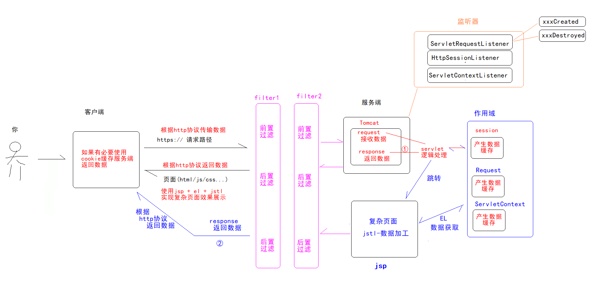

## 4.1 监听及分类

**监听的对象**：作用域对象，作用域属性。
**监听的动作**：作用域对象的创建和销毁，作用域属值的增删改。

监听器分类

- 按作用域对象：
    - ServletRequestListener
    - HttpSessionListener
    - ServletContextListener--web容器监听器--监控web容器tomcat)启动与销毁
- 按作用域属性分：
    - ServletRequestAttributeListener
    - HttpSessionAttributeListener
    - ServletContextAttributeListener

## 4.2 开发监听器的步骤

- 创建一个类，根据需求实现对应的接口。
- 实现其中的方法。
- 配置将监听器交给 Tomcat 管理。

## 4.3 统计游客数量

案例：统计游客数量。

**步骤1：编写 VisitorListener.java**

```java
public class VisitorListener implements HttpSessionListener {

    private static long totalCount = 0;

    // Session 对象创建会执行下面的方法
    @Override
    public void sessionCreated(HttpSessionEvent httpSessionEvent) {
        totalCount++;
        System.out.println("在线人数：" + totalCount);
    }

    // Session 对象销毁会执行下面的方法
    @Override
    public void sessionDestroyed(HttpSessionEvent httpSessionEvent) {
        totalCount--;
    }
}
```

**步骤2：配置 VisitorListener**

可以使用注解配置（直接在自己写监听器类上贴 @WebListener 即可），也可以是 XML 配置，XML 配置如下：

```xml
<listener>
    <listener-class>cn.wolfcode.pmis.web.listener.VisitorListener</listener-class>
</listener>
```


## 4.4 创建系统默认管理员

一般系统最开始部署到用户的服务器时，需要在用户的表中添加一个默认的超级管理员账户，再由该管理员来管理其他的账户的添删改查操作。

**思考的问题**

- 超级管理员什么时候创建？服务器启动的时候创建。
- 哪些技术可以在服务器启动做操作？
答案：可以使用 Servlet 和 Filter 来实现，也可以使用 ServletContextListener 这个监听器来完成，这个监听器可以用来监听 ServletContext 对象的创建，而这个对象的创建就是在 Tomcat 启动的时候。

**步骤1：编写并配置 CreateSuperUserListener**

在其 contextInitialized 方法中创建管理员账户：
- 查询用户表中是否存在管理员的账户。
- **存在则不做操作，不存在则创建账号**。

```java
@WebListener
public class CreateSuperUserListener implements ServletContextListener {

    private IUserDAO userDAO = new UserDAOImpl();

    // 容器启动的时候会执行下面的方法
    public void contextInitialized(ServletContextEvent servletContextEvent) {
        // 判断是否存在超级管理员，存在说明不是第一次部署，不能再创建账号
        User user = userDAO.checkUser("admin");
        if(user == null) {
            // 保存管理员账号
            User adminUser = new User();
            adminUser.setUsername("admin");
            adminUser.setPassword("admin");
            userDAO.insert(adminUser);
        }
    }

    public void contextDestroyed(ServletContextEvent servletContextEvent) {
    }
}
```

**步骤2：修改 IUserDAO 和 UserDAOImpl**

```java
User checkUser(String username);
void insert(User user);
```

```java
@Override
public User checkUser(String username) {
    String sql = "SELECT * FROM user WHERE username=? ";
    List<User> list = JDBCUtil.executeQuery(sql, User.class, username);
    return list != null && list.size() > 0? list.get(0):null;
}
@Override
public void insert(User user) {
    String sql = "INSERT INTO user(username,password) VALUES(?,?)";
    JDBCUtil.executeUpdate(sql, user.getUsername(), user.getPassword());
}
```

# 小结

1. 理解页面美化的操作逻辑
2. 理解用户注销,记住账号,验证码的业务逻辑
3. 理解 Filter 的作用
4. 理解字符编码过滤器以及登录校验过滤器的业务逻辑
5. 理解监听器的作用以及分类


