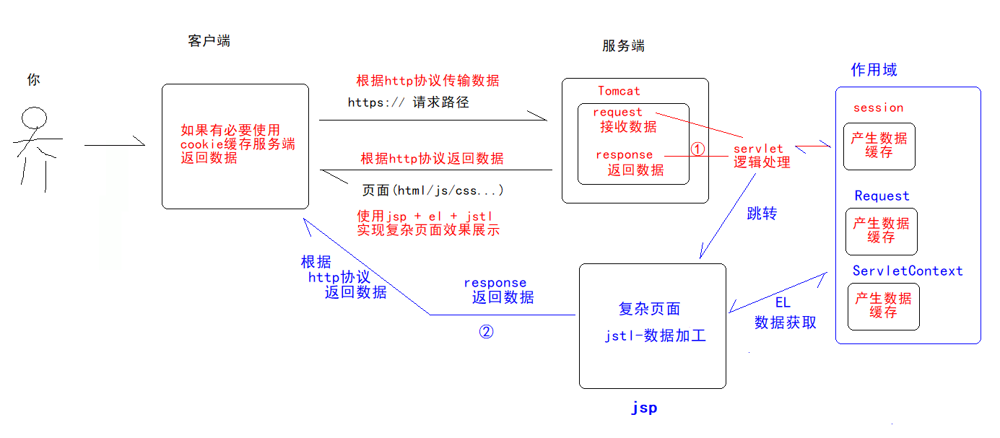

# 商品CRUD

# 目标

- [ ] 理解 MVC 思想 `*****`
- [ ] 理解并掌握 WEB CRUD 的组件 交互图 `*****`
- [ ] 能独立画出 WEB CRUD 每个操作的组件交互图 `*****`
- [ ] 理解并掌握 WEB CRUD 的代码实现 `*****`
- [ ] 理解并掌握请求分发器的作用和设计 `*****`


# 一、MVC 思想

## 1.1 几个思考

思考：观察下面Servlet操作流程图中，思考几个点：

- Servlet与JSP分别扮演什么角色？
- Servlet与JSP通过数据交互载体是啥？---**JavaBean**



## 1.2 开发模式

上面问题算是业内问题，无数前辈通过无数项目的实践，总结出3种常用开发模式：

**Model1（模型一）**，**Model2(模型二)**，**MVC**

### 1.2.1 Model1 

以  JSP 为中心

**核心技术**： JSP + JavaBean

**


**JSP的职责**:

1. 界面输出（页面渲染）.
2. 接受请求参数
3. 调用业务方法,处理请求
4. 控制界面跳转.


**优势**:  适用于简单的功能,快速开发,适合简单项目（毕业设计级别）
**劣势**:  没有体现出责任分离原则.


### 1.2.2 Model2

解决了 Model1 存在的责任不分离的问题，以 Servlet 为中心 (所有请求都发送给 Servlet)
**核心技术**： JSP + Servlet + JavaBean

**


**Servlet/JSP/JavaBean 的职责**:

+ JSP :  界面输出(页面渲染)
+ Servlet
  + 1:接受请求参数,封装成对象
  + 2:调用业务方法,处理请求
  + 3:控制跳转.
+ JavaBean : 体现封装，封装数据，封装业务操作API,可重复使用.


**优势**:  体现出责任分离原则，提高代码可读性和维护度,适合小型项目（入门级商业项目）
**劣势**:  实现相对 Model1 复杂一点.


### 1.2.3 MVC (理解)

**目的**:  责任分离,把业务代码从视图中剥离出来，早期运用于 CS 领域(桌面程序).

**核心掌握点**：

M : Model，模型对象 (封装业务操作,算法,可重复使用api,JavaBean).DAO,domain
V :  View，视图 (界面)  JSP,HTML
C :  Controller，控制器 (接受请求，控制跳转.)  Servlet


**MVC 实现图**：

**


**结论**： 

1. Model2 就是一个小型的 MVC 架构
2. 后续项目都是 MVC 架构 JSP + Servlet + Model（Domain,DAO）【中小型项目】
3. 跟着老师走，潜移默化中会学到很多好的设计思想，代码规范


# 二、货品信息管理系统

## 2.1 项目分析

**目标**：构建一个项目--**货品信息管理系统**

**核心功能**：商品的CRUD

- 货品列表(查多个)
- 货品明细(查单个)
- 货品添加
- 货品删除
- 货品修改

**技术选型**

+ 页面显示：JSP
+ 接受用户请求：Servlet
+ 和数据库交互：JDBC

**技术架构**：


## 2.2 项目准备

### 2.2.1 构建pmis项目

按照之前创建Web项目步骤，构造出下面代码结构

**

### 2.2.2 商品CRUD代码

**步骤1：创建数据库pmis导入相关表**

```sql
/*
MySQL Data Transfer
Source Host: localhost
Source Database: mysqltest
Target Host: localhost
Target Database: mysqltest
Date: 2011-3-12 20:41:24
*/

SET FOREIGN_KEY_CHECKS=0;
-- ----------------------------
-- Table structure for product
-- ----------------------------
DROP TABLE IF EXISTS `product`;
CREATE TABLE `product` (
  `id` bigint(11) NOT NULL auto_increment,
  `productName` varchar(50) default NULL,
  `dirId` bigint(11) default NULL,
  `salePrice` decimal(10,2) default NULL,
  `supplier` varchar(50) default NULL,
  `brand` varchar(50) default NULL,
  `cutoff` double(2,2) default NULL,
  `costPrice` decimal(10,2) default NULL,
  PRIMARY KEY  (`id`)
) ENGINE=MyISAM DEFAULT CHARSET=utf8;

-- ----------------------------
-- Records 
-- ----------------------------
INSERT INTO `product` VALUES ('1', '罗技M90', '3', '90.00', '罗技', '罗技', '0.50', '35.00');
INSERT INTO `product` VALUES ('2', '罗技M100', '3', '49.00', '罗技', '罗技', '0.90', '33.00');
INSERT INTO `product` VALUES ('3', '罗技M115', '3', '99.00', '罗技', '罗技', '0.60', '38.00');
INSERT INTO `product` VALUES ('4', '罗技M125', '3', '80.00', '罗技', '罗技', '0.90', '39.00');
INSERT INTO `product` VALUES ('5', '罗技木星轨迹球', '3', '182.00', '罗技', '罗技', '0.80', '80.00');
INSERT INTO `product` VALUES ('6', '罗技火星轨迹球', '3', '349.00', '罗技', '罗技', '0.87', '290.00');
INSERT INTO `product` VALUES ('7', '罗技G9X', '3', '680.00', '罗技', '罗技', '0.70', '470.00');
INSERT INTO `product` VALUES ('8', '罗技M215', '2', '89.00', '罗技', '罗技', '0.79', '30.00');
INSERT INTO `product` VALUES ('9', '罗技M305', '2', '119.00', '罗技', '罗技', '0.82', '48.00');
INSERT INTO `product` VALUES ('10', '罗技M310', '2', '135.00', '罗技', '罗技', '0.92', '69.80');
INSERT INTO `product` VALUES ('11', '罗技M505', '2', '148.00', '罗技', '罗技', '0.92', '72.00');
INSERT INTO `product` VALUES ('12', '罗技M555', '2', '275.00', '罗技', '罗技', '0.88', '140.00');
INSERT INTO `product` VALUES ('13', '罗技M905', '2', '458.00', '罗技', '罗技', '0.88', '270.00');
INSERT INTO `product` VALUES ('14', '罗技MX1100', '2', '550.00', '罗技', '罗技', '0.76', '300.00');
INSERT INTO `product` VALUES ('15', '罗技M950', '2', '678.00', '罗技', '罗技', '0.78', '320.00');
INSERT INTO `product` VALUES ('16', '罗技MX Air', '2', '1299.00', '罗技', '罗技', '0.72', '400.00');
INSERT INTO `product` VALUES ('17', '罗技G1', '4', '155.00', '罗技', '罗技', '0.80', '49.00');
INSERT INTO `product` VALUES ('18', '罗技G3', '4', '229.00', '罗技', '罗技', '0.77', '96.00');
INSERT INTO `product` VALUES ('19', '罗技G500', '4', '399.00', '罗技', '罗技', '0.88', '130.00');
INSERT INTO `product` VALUES ('20', '罗技G700', '4', '699.00', '罗技', '罗技', '0.79', '278.00');

```

**步骤2：配置数据库四要素**

创建resources/db.properties,配置数据库四要素，注意：resources文件要加入classpath中


```properties
# db.properties
driverClassName=com.mysql.jdbc.Driver
url=jdbc:mysql://localhost:3306/pmis
username=root
password=admin
```

**步骤3：导入相关依赖**

mysql数据库依赖、lombok、jstl、el、jsp、单元测试等依赖

**

并将这些jar添加到classpath环境，注意跟以前普通项目不同，这里是web项目，必须按照下面方式配置依赖


**步骤3：编写数据库操作代码**

JDBCUtil工具类

```java
package cn.wolfcode.pmis.util;

import com.alibaba.druid.pool.DruidDataSource;
import com.alibaba.druid.pool.DruidDataSourceFactory;

import java.io.InputStream;
import java.sql.Connection;
import java.sql.DriverManager;
import java.sql.ResultSet;
import java.sql.Statement;
import java.util.Properties;

public class JDBCUtil {
    private JDBCUtil() { }


    private static Properties p = new Properties();
    private static DruidDataSource ds = null;
    static {
        // 该操作,在整个程序中只需要执行一次
        try {
            // properties配置文件只需要加载一次
            InputStream in =Thread.currentThread().getContextClassLoader()
                    .getResourceAsStream("db.properties");
            p.load(in);
            // new DruidDataSource();
            ds = (DruidDataSource) DruidDataSourceFactory.createDataSource(p);
            ds.setInitialSize(5);
        } catch (Exception e) {
            e.printStackTrace();
        }
    }

    /**
     * 直接从连接池获取连接对象，效率高
     * @return Connection对象
     */
    public static Connection getConnection() {
        // 1 写配置文件配置四要素
        // 2 把配置文件交个DruidDataSourceFactory工厂生成连接池对象
        // 3 直接从连接池获取连接对象
        try {
            Connection con = ds.getConnection();
            return con;
        } catch (Exception e) {
            e.printStackTrace();
            return null;
        }
    }

    public static void close(Connection conn, Statement pst) {
        close(conn, pst, null);
    }

    // 释放资源
    public static void close(Connection conn, Statement pst, ResultSet rs) {
        try {
            if (rs != null) {
                rs.close();
            }
        } catch (Exception e) {
            e.printStackTrace();
        }
        // 释放资源
        try {
            if (pst != null) {
                pst.close();
            }
        } catch (Exception e) {
            e.printStackTrace();
        }
        try {
            if (conn != null) {
                conn.close();
            }
        } catch (Exception e) {
            e.printStackTrace();
        }
    }
}
```

domain

```java
package cn.wolfcode.pmis.domain;

import lombok.*;

import java.math.BigDecimal;

@Getter
@Setter
@AllArgsConstructor
@NoArgsConstructor
@ToString
public class Product {
    private Long id;
    private String productName;
    private Long dirId;
    private BigDecimal salePrice;
    private String supplier;
    private String brand;
    private Double cutoff;
    private BigDecimal costPrice;
}
```

dao

```java
package cn.wolfcode.pmis.dao;

import cn.wolfcode.pmis.domain.Product;

import java.util.List;

public interface IProductDAO {
    /**
     * 添加
     */
    void save(Product product);
    /**
     * 更新
     */
    void update(Product product);
    /**
     * 删除
     */
    void delete(Long id);
    /**
     * 查单个
     */
    Product get(Long id);
    /**
     * 查多个
     */
    List<Product> list();
}

```

daoImpl

```java
package cn.wolfcode.pmis.dao.impl;

import cn.wolfcode.pmis.dao.IProductDAO;
import cn.wolfcode.pmis.domain.Product;
import cn.wolfcode.pmis.util.JDBCUtil;

import java.math.BigDecimal;
import java.sql.Connection;
import java.sql.PreparedStatement;
import java.sql.ResultSet;
import java.sql.SQLException;
import java.util.ArrayList;
import java.util.List;

public class ProductDAOImpl implements IProductDAO {


    @Override
    public void save(Product product) {
        Connection conn = JDBCUtil.getConnection();
        PreparedStatement ps = null;
        String sql = "insert into product(productName,dirId,salePrice,supplier,brand,cutoff,costPrice) " +
                "values(?,?,?,?,?,?,?)";
        try {
            ps = conn.prepareStatement(sql);
            ps.setString(1, product.getProductName());
            ps.setLong(2, product.getDirId());
            ps.setBigDecimal(3, product.getSalePrice());
            ps.setString(4, product.getSupplier());
            ps.setString(5, product.getBrand());
            ps.setDouble(6, product.getCutoff());
            ps.setBigDecimal(7, product.getCostPrice());

            ps.executeUpdate();
        } catch (SQLException e) {
            e.printStackTrace();
        }finally {
            JDBCUtil.close(conn, ps);
        }

    }

    @Override
    public void update(Product product) {
        Connection conn = JDBCUtil.getConnection();
        PreparedStatement ps = null;
        String sql = "update product " +
                "set productName = ?," +
                "    dirId = ?," +
                "    salePrice = ?," +
                "    supplier = ?," +
                "    brand = ?," +
                "    cutoff = ?," +
                "    costPrice = ? " +
                "where id = ?";
        try {
            ps = conn.prepareStatement(sql);
            ps.setString(1, product.getProductName());
            ps.setLong(2, product.getDirId());
            ps.setBigDecimal(3, product.getSalePrice());
            ps.setString(4, product.getSupplier());
            ps.setString(5, product.getBrand());
            ps.setDouble(6, product.getCutoff());
            ps.setBigDecimal(7, product.getCostPrice());
            ps.setLong(8, product.getId());

            ps.executeUpdate();
        } catch (SQLException e) {
            e.printStackTrace();
        }finally {
            JDBCUtil.close(conn, ps);
        }
    }

    @Override
    public void delete(Long id) {
        Connection conn = JDBCUtil.getConnection();
        PreparedStatement ps = null;
        String sql = " delete from product  where id = ?";
        try {
            ps = conn.prepareStatement(sql);
            ps.setLong(1, id);

            ps.executeUpdate();
        } catch (SQLException e) {
            e.printStackTrace();
        }finally {
            JDBCUtil.close(conn, ps);
        }
    }

    @Override
    public Product get(Long id) {
        Connection conn = JDBCUtil.getConnection();
        PreparedStatement ps = null;
        ResultSet rs = null;
        Product product = null;
        String sql = " select *  from product  where id = ?";
        try {
            ps = conn.prepareStatement(sql);
            ps.setLong(1, id);
            rs = ps.executeQuery();


            while(rs.next()){
                long pid = rs.getLong("id");
                long dirId = rs.getLong("dirId");
                String productName = rs.getString("productName");
                String supplier = rs.getString("supplier");
                String brand = rs.getString("brand");
                BigDecimal salePrice = rs.getBigDecimal("salePrice");
                BigDecimal costPrice = rs.getBigDecimal("costPrice");
                Double cutoff = rs.getDouble("cutoff");

                product = new Product(pid,productName,dirId,salePrice,supplier,brand,cutoff,costPrice);
            }

        } catch (SQLException e) {
            e.printStackTrace();
        }finally {
            JDBCUtil.close(conn, ps,rs);
        }
        return product;
    }
    @Override
    public List<Product> list() {
        Connection conn = JDBCUtil.getConnection();
        PreparedStatement ps = null;
        ResultSet rs = null;
        List<Product>  list = new ArrayList<>();
        String sql = " select *  from product ";
        try {
            ps = conn.prepareStatement(sql);
            rs = ps.executeQuery();


            while(rs.next()){
                long pid = rs.getLong("id");
                long dirId = rs.getLong("dirId");
                String productName = rs.getString("productName");
                String supplier = rs.getString("supplier");
                String brand = rs.getString("brand");
                BigDecimal salePrice = rs.getBigDecimal("salePrice");
                BigDecimal costPrice = rs.getBigDecimal("costPrice");
                Double cutoff = rs.getDouble("cutoff");

                Product product = new Product(pid,productName,dirId,salePrice,supplier,brand,cutoff,costPrice);
                list.add(product);
            }

        } catch (SQLException e) {
            e.printStackTrace();
        }finally {
            JDBCUtil.close(conn, ps,rs);
        }

        return list;
    }
}

```

测试

```java
package cn.wolfcode.pmis.test;

import cn.wolfcode.pmis.dao.IProductDAO;
import cn.wolfcode.pmis.dao.impl.ProductDAOImpl;
import cn.wolfcode.pmis.domain.Product;
import org.junit.Test;

import java.math.BigDecimal;
import java.util.List;


public class ProductDAOImplTest {

    private IProductDAO productDAO = new ProductDAOImpl();
    @Test
    public void save() {
        Product product = new Product();
        product.setProductName("dafei手机");
        product.setDirId(1L);
        product.setSalePrice(new BigDecimal("10000"));
        product.setSupplier("dafei");
        product.setBrand("大飞牌");
        product.setCutoff(0.8d);
        product.setCostPrice(new BigDecimal("8999"));

        productDAO.save(product);


    }

    @Test
    public void update() {
        Product product = new Product();
        product.setId(21L);
        product.setProductName("dafei手机1");
        product.setDirId(1L);
        product.setSalePrice(new BigDecimal("100001"));
        product.setSupplier("dafei1");
        product.setBrand("大飞牌1");
        product.setCutoff(0.8d);
        product.setCostPrice(new BigDecimal("89991"));

        productDAO.update(product);

    }

    @Test
    public void delete() {
        productDAO.delete(21L);
    }

    @Test
    public void get() {
        Product product = productDAO.get(21L);
        System.out.println(product);
    }

    @Test
    public void list() {
        List<Product> list = productDAO.list();
        list.forEach(System.out::println);
    }
}
```

### 2.2.3 工具类拓展

JDBCUtil改造---拓展

```java
package cn.wolfcode.pmis.util;

import com.alibaba.druid.pool.DruidDataSource;
import com.alibaba.druid.pool.DruidDataSourceFactory;

import java.beans.BeanInfo;
import java.beans.Introspector;
import java.beans.PropertyDescriptor;
import java.io.InputStream;
import java.lang.reflect.Method;
import java.sql.*;
import java.util.ArrayList;
import java.util.List;
import java.util.Properties;

public class JDBCUtil {
    private JDBCUtil() { }


    private static Properties p = new Properties();
    private static DruidDataSource ds = null;
    static {
        // 该操作,在整个程序中只需要执行一次
        try {
            // properties配置文件只需要加载一次
            InputStream in =Thread.currentThread().getContextClassLoader()
                    .getResourceAsStream("db.properties");
            p.load(in);
            // new DruidDataSource();
            ds = (DruidDataSource) DruidDataSourceFactory.createDataSource(p);
            ds.setInitialSize(5);
        } catch (Exception e) {
            e.printStackTrace();
        }
    }

    /**
     * 直接从连接池获取连接对象，效率高
     * @return Connection对象
     */
    public static Connection getConnection() {
        // 1 写配置文件配置四要素
        // 2 把配置文件交个DruidDataSourceFactory工厂生成连接池对象
        // 3 直接从连接池获取连接对象
        try {
            Connection con = ds.getConnection();
            return con;
        } catch (Exception e) {
            e.printStackTrace();
            return null;
        }
    }

    public static void close(Connection conn, Statement pst) {
        close(conn, pst, null);
    }

    // 释放资源
    public static void close(Connection conn, Statement pst, ResultSet rs) {
        try {
            if (rs != null) {
                rs.close();
            }
        } catch (Exception e) {
            e.printStackTrace();
        }
        // 释放资源
        try {
            if (pst != null) {
                pst.close();
            }
        } catch (Exception e) {
            e.printStackTrace();
        }
        try {
            if (conn != null) {
                 conn.close();
            }
        } catch (Exception e) {
            e.printStackTrace();
        }
    }


    /**
     * 处理增删改操作
     * @param sql 要执行的 SQL语句
     * @param params 执行的 SQL需要的参数
     * @return 返回修改了多少行
     */
    public static int executeUpdate(String sql,Object...params){
        Connection conn = null;
        PreparedStatement pst = null;
        int row = 0;
        try {
            conn = ds.getConnection();
            pst = conn.prepareStatement(sql);
            // 通过指定参数顺序来设置参数
            for (int i = 0; i < params.length; i++) {
                pst.setObject(i + 1,params[i]);
            }
            // 执行操作
            row = pst.executeUpdate();
        } catch (SQLException e) {
            throw new RuntimeException(e);
        }finally {
            close(conn,pst,null);
        }
        return row;
    }

    /**
     * 处理查询操作
     * <T>:是声明泛型类型
     * List<T>, Class<T> 使用声明好的 T
     * @param sql 要执行的 SQL语句
     * @param type 将每行数据封装的对象类型
     * @param params 执行的 SQL需要的参数
     * @return 返回查询到的结果,统一放到 List 集合中
     */
    public static <T> List<T> executeQuery(String sql, Class<T> type,Object...params){
        Connection conn = null;
        PreparedStatement ps = null;
        ResultSet rs = null;
        List<T> list = new ArrayList<>();
        try {
            conn = ds.getConnection();
            ps = conn.prepareStatement(sql);
            //为占位符设值
            for (int i = 0; i < params.length; i++) {
                ps.setObject(i + 1, params[i]);
            }
            rs = ps.executeQuery();
            // 直到next方法返回false时结束
            while (rs.next()) {
                // 获取这一行中的指定列的数据
                //使用反射创建对象
                T t = type.getDeclaredConstructor().newInstance();
                //将数据从结果集中获取到,并设置给对象t
                //通常情况下,属性名和列名一样,所以我们可以根据属性名去获取对应列的值
                BeanInfo beanInfo = Introspector.getBeanInfo(t.getClass(),
                        Object.class);
                PropertyDescriptor[] pds = beanInfo.getPropertyDescriptors();
                //操作每个属性
                for (PropertyDescriptor pd : pds) {
                    //获取到属性名
                    String name = pd.getName();
                    //根据这个属性名从结果集中获取到数据
                    Object value = rs.getObject(name);
                    //获取到属性对应的set方法
                    Method writeMethod = pd.getWriteMethod();
                    writeMethod.invoke(t, value);
                }
                list.add(t);
            }
        } catch (Exception e) {
            e.printStackTrace();
        } finally {
            JDBCUtil.close(conn, ps, rs);
        }
        return list;
    }
}
```

ProductDAOImpl--改造

```java
package cn.wolfcode.pmis.dao.impl;

import cn.wolfcode.pmis.dao.IProductDAO;
import cn.wolfcode.pmis.domain.Product;
import cn.wolfcode.pmis.util.JDBCUtil;

import java.math.BigDecimal;
import java.sql.Connection;
import java.sql.PreparedStatement;
import java.sql.ResultSet;
import java.sql.SQLException;
import java.util.ArrayList;
import java.util.List;

public class ProductDAOImpl implements IProductDAO {


    @Override
    public void save(Product product) {
        String sql = "insert into product(productName,dirId,salePrice,supplier,brand,cutoff,costPrice) " +
                "values(?,?,?,?,?,?,?)";
        JDBCUtil.executeUpdate(sql
                , product.getProductName()
                ,product.getDirId()
                , product.getSalePrice()
                , product.getSupplier()
                , product.getBrand()
                , product.getCutoff()
                , product.getCostPrice());

    }

    @Override
    public void update(Product product) {
        String sql = "update product " +
                "set productName = ?," +
                "    dirId = ?," +
                "    salePrice = ?," +
                "    supplier = ?," +
                "    brand = ?," +
                "    cutoff = ?," +
                "    costPrice = ? " +
                "where id = ?";
        JDBCUtil.executeUpdate(sql
                , product.getProductName()
                ,product.getDirId()
                , product.getSalePrice()
                , product.getSupplier()
                , product.getBrand()
                , product.getCutoff()
                , product.getCostPrice()
                , product.getId());
    }

    @Override
    public void delete(Long id) {
        String sql = " delete from product  where id = ?";
        JDBCUtil.executeUpdate(sql, id);
    }

    @Override
    public Product get(Long id) {
        String sql = " select *  from product  where id = ?";
        List<Product> list = JDBCUtil.executeQuery(sql, Product.class, id);
        return list != null && list.size() > 0? list.get(0):null;
    }
    @Override
    public List<Product> list() {
        String sql = " select *  from product  where id = ?";
        return JDBCUtil.executeQuery(sql, Product.class);
    }
}

```


## 2.3 CRUD路径设计

### 2.3.1 需求梳理

**项目需求：**

- 货品列表(查多个)
- 货品明细(查单个)
- 货品添加
- 货品删除
- 货品修改

**目前掌握的技术**：

JSP ： 数据展示（商品列表/明细）

Servlet : 接收请求，处理请求，响应请求

**操作流程图**

**

### 2.3.2 URL设计分析

请求URL设计，其实就是Servlet代码如何设计？

**思考**：当前项目几个操作？

分析：5个操作--添加---删除--修改--查询(单个/多个)

**思考**：是一个serlvet执行所有操作，还是多个serlvet执行操作？

分析：有2套操作思路  **1>servlet方式 2>命令参数方式**


### 2.3.3 方案1：Servlet方式

这种方案，相对简单，一个操作对应一个servlet：

+ 查询商品列表： 需要一个 Servlet 来处理，ProductListServlet
+ 查询商品明细： 需要一个 Servlet 来处理，ProductDetailServlet
+ 删除指定的商品：需要一个 Servlet 来处理，ProductDeleteServlet
+ 点击编辑和添加都是进入到可编辑的界面 : 需要一个 Servlet 来处理，ProductInputServlet
+ 在编辑界面,点击保存 :  需要一个 Servlet 来处理，ProductSaveOrUpdateServlet

**分析：可行，但不建议(serlvet臃肿-项目复杂后，servlet会爆炸式增长)**


### 2.3.4 方案2：命令参数式

这种方案，相对方案1来说，没有servlet爆炸式增长的隐患，一个servlet操作所有

**思考**：一个serlvet操作所有，就意味着要在service 方法中区分 增-删-改-查  5个操作，那怎么区分？

**分析**：使用cmd命令参数，

**约定**：页面发起请求时，必须带上cmd参数

- **增--cmd=add     删--cmd=delete   改--cmd-update  查(单个)--cmd=detail   查(多个)--cmd=list**

- 一个特殊命令：**跳转--cmd=input**    页面(页面放置在WEB-INF下，必须跳转才能过去)跳转用

```java
protected void service(HttpServletRequest req, HttpServletResponse resp) throws ServletException, IOException {
    	// 使用 cmd 参数值来区分不同的请求操作
        String cmd = req.getParameter("cmd");
        if("delete".equals(cmd)){
            delete(req,resp);
        }else if("input".equals(cmd)){
            input(req,resp);
        }else if("save".equals(cmd)){
            save(req,resp);
        }else if("update".equals(cmd)){
            update(req,resp);
        }else{
            list(req,resp);
        }
    }

	// 查询列表操作
    private void list(HttpServletRequest req, HttpServletResponse resp) throws 	ServletException, IOException {
        System.out.println("ProductServlet.list");
    }
	// 删除操作
    private void delete(HttpServletRequest req, HttpServletResponse resp) throws ServletException, IOException {
        System.out.println("ProductServlet.delete");
    }
	// 跳转到录入数据页面
    private void input(HttpServletRequest req, HttpServletResponse resp) throws ServletException, IOException {
        System.out.println("ProductServlet.input");
    }
	// 保存
    private void save(HttpServletRequest req, HttpServletResponse resp) throws ServletException, IOException {
        System.out.println("ProductServlet.saveOrUpdate");
    }
    //更新
    private void update(HttpServletRequest req, HttpServletResponse resp) throws ServletException, IOException {
        System.out.println("ProductServlet.saveOrUpdate");
    }
```


## 2.4 代码实现

### 2.4.1 商品列表

**流程分析**

**

**代码**

ProductServlet

```java
package cn.wolfcode.pmis.web.servlet;

import cn.wolfcode.pmis.dao.IProductDAO;
import cn.wolfcode.pmis.dao.impl.ProductDAOImpl;
import cn.wolfcode.pmis.domain.Product;
import jakarta.servlet.ServletException;
import jakarta.servlet.annotation.WebServlet;
import jakarta.servlet.http.HttpServlet;
import jakarta.servlet.http.HttpServletRequest;
import jakarta.servlet.http.HttpServletResponse;

import java.io.IOException;
import java.util.List;

@WebServlet("/product")
public class ProductServlet extends HttpServlet {

    private IProductDAO dao = new ProductDAOImpl();

    @Override
    protected void service(HttpServletRequest req, HttpServletResponse resp) throws ServletException, IOException {
        String cmd = req.getParameter("cmd");
        //列表
        if("list".equals(cmd)){
            list(req, resp);
        }
    }

    //列表
    private void list(HttpServletRequest req, HttpServletResponse resp) throws ServletException, IOException {
        List<Product> list = dao.list();
        req.setAttribute("list", list);
        req.getRequestDispatcher("/WEB-INF/views/product/list.jsp").forward(req, resp);
    }
}

```

**list.jsp**

在WEB-INF/views/product/list.jsp

```jsp
<%@ page contentType="text/html;charset=UTF-8" language="java" %>
<%@taglib prefix="c" uri="http://java.sun.com/jsp/jstl/core" %>
<html>
<head>
    <title>商品列表</title>
</head>
<body>
<a href="#">添加</a>
<table border="1" cellspacing="0" cellpadding="0" width="80%">
    <tr>
        <th>编号</th>
        <th>货品名</th>
        <th>分类编号</th>
        <th>零售价</th>
        <th>供应商</th>
        <th>品牌</th>
        <th>折扣</th>
        <th>进货价</th>
        <th>操作</th>
    </tr>
    <c:forEach var="product" items="${list}" varStatus="status">
        <tr>
            <td>${status.count}</td>
            <td>${product.productName}</td>
            <td>${product.dirId}</td>
            <td>${product.salePrice}</td>
            <td>${product.supplier}</td>
            <td>${product.brand}</td>
            <td>${product.cutoff}</td>
            <td>${product.costPrice}</td>
            <td>
                <a href="#">删除</a>
                <a href="#">编辑</a>
            </td>
        </tr>
    </c:forEach>
</table>
</body>
</html>
```


### 2.4.2 商品删除

**流程分析**：(掌握)


**代码**：

list.jsp

```html
<%@ page contentType="text/html;charset=UTF-8" language="java" %>
<%@taglib prefix="c" uri="http://java.sun.com/jsp/jstl/core" %>
<html>
<head>
    <title>商品列表</title>
</head>
<body>
<a href="#">添加</a>
<table border="1" cellspacing="0" cellpadding="0" width="80%">
    <tr>
        <th>编号</th>
        <th>货品名</th>
        <th>分类编号</th>
        <th>零售价</th>
        <th>供应商</th>
        <th>品牌</th>
        <th>折扣</th>
        <th>进货价</th>
        <th>操作</th>
    </tr>
    <c:forEach var="product" items="${list}" varStatus="status">
        <tr>
            <td>${status.count}</td>
            <td>${product.productName}</td>
            <td>${product.dirId}</td>
            <td>${product.salePrice}</td>
            <td>${product.supplier}</td>
            <td>${product.brand}</td>
            <td>${product.cutoff}</td>
            <td>${product.costPrice}</td>
            <td>
                <a href="/product?cmd=delete&id=${product.id}">删除</a>
                <a href="#">编辑</a>
            </td>
        </tr>
    </c:forEach>
</table>
</body>
</html>

```

ProductServlet

```java
package cn.wolfcode.pmis.web.servlet;

import cn.wolfcode.pmis.dao.IProductDAO;
import cn.wolfcode.pmis.dao.impl.ProductDAOImpl;
import cn.wolfcode.pmis.domain.Product;
import jakarta.servlet.ServletException;
import jakarta.servlet.annotation.WebServlet;
import jakarta.servlet.http.HttpServlet;
import jakarta.servlet.http.HttpServletRequest;
import jakarta.servlet.http.HttpServletResponse;

import java.io.IOException;
import java.util.List;

@WebServlet("/product")
public class ProductServlet extends HttpServlet {

    private IProductDAO dao = new ProductDAOImpl();

    @Override
    protected void service(HttpServletRequest req, HttpServletResponse resp) throws ServletException, IOException {
        String cmd = req.getParameter("cmd");
       
        if("list".equals(cmd)){
            //列表
            list(req, resp);
        }else if("delete".equals(cmd)){
            //删除
            delete(req, resp);
        }
    }

    //列表
    private void list(HttpServletRequest req, HttpServletResponse resp) throws ServletException, IOException {
        List<Product> list = dao.list();
        req.setAttribute("list", list);
        req.getRequestDispatcher("/WEB-INF/views/product/list.jsp").forward(req, resp);
    }

    //删除
    private void delete(HttpServletRequest req, HttpServletResponse resp) throws ServletException, IOException {
        String id = req.getParameter("id");
        if(id != null && !"".equals(id)){
            dao.delete(Long.parseLong(id));
        }
        resp.sendRedirect("/product?cmd=list");
    }
}

```

### 2.4.3 商品添加

**流程分析**


**代码**

list.jsp

```jsp
<a href="/product?cmd=input">添加</a>
```

save.jsp

```jsp
<%@ page contentType="text/html;charset=UTF-8" language="java" %>
<%@taglib prefix="c" uri="http://java.sun.com/jsp/jstl/core" %>
<html>
<head>
    <title>商品保存</title>
</head>
<body>
<h3>请录入商品数据</h3>
<form action="/product?cmd=save" method="post">
    <p>商品名称: <input type="text" name="productName"></p>
    <p>分类编号:<select name="dirId">
        <option value="2">无线鼠标</option>
        <option value="3">有线鼠标</option>
        <option value="4">游戏鼠标</option>
    </select>
    </p>
    <p>零售价: <input type="number" name="salePrice"></p>
    <p>供应商: <input type="text" name="supplier"></p>
    <p>品牌名: <input type="text" name="brand"></p>
    <p>折扣: <input type="number" name="cutoff" step="0.1"></p>
    <p>进货价: <input type="number" name="costPrice"></p>
    <input type="submit" value="提交">
</form>
</body>
</html>

```

ProductServlet

```java
package cn.wolfcode.pmis.web.servlet;

import cn.wolfcode.pmis.dao.IProductDAO;
import cn.wolfcode.pmis.dao.impl.ProductDAOImpl;
import cn.wolfcode.pmis.domain.Product;
import jakarta.servlet.ServletException;
import jakarta.servlet.annotation.WebServlet;
import jakarta.servlet.http.HttpServlet;
import jakarta.servlet.http.HttpServletRequest;
import jakarta.servlet.http.HttpServletResponse;

import java.io.IOException;
import java.math.BigDecimal;
import java.util.List;

@WebServlet("/product")
public class ProductServlet extends HttpServlet {

    private IProductDAO dao = new ProductDAOImpl();

    @Override
    protected void service(HttpServletRequest req, HttpServletResponse resp) throws ServletException, IOException {
        String cmd = req.getParameter("cmd");

        if("list".equals(cmd)){
            //列表
            list(req, resp);
        }else if("delete".equals(cmd)){
            //删除
            delete(req, resp);
        }else if("input".equals(cmd)){
            //跳转
            input(req, resp);
        }else if("save".equals(cmd)){
            //保存
            save(req, resp);
        }
    }

    //列表
    private void list(HttpServletRequest req, HttpServletResponse resp) throws ServletException, IOException {
        List<Product> list = dao.list();
        req.setAttribute("list", list);
        req.getRequestDispatcher("/WEB-INF/views/product/list.jsp").forward(req, resp);
    }

    //删除
    private void delete(HttpServletRequest req, HttpServletResponse resp) throws ServletException, IOException {
        String id = req.getParameter("id");
        if(id != null && !"".equals(id)){
            dao.delete(Long.parseLong(id));
        }
        resp.sendRedirect("/product?cmd=list");
    }

    //跳转
    private void input(HttpServletRequest req, HttpServletResponse resp) throws ServletException, IOException {
        //添加
        req.getRequestDispatcher("/WEB-INF/views/product/save.jsp").forward(req, resp);
    }

    //保存
    private void save(HttpServletRequest req, HttpServletResponse resp) throws ServletException, IOException {
        String productName = req.getParameter("productName");
        Product product = new Product();
        product.setProductName(productName);

        String strDirId = req.getParameter("dirId");
        if(strDirId != null && !"".equals(strDirId)){
            product.setDirId(Long.valueOf(strDirId));
        }
        String strSalePrice = req.getParameter("salePrice");
        if(strSalePrice != null && !"".equals(strSalePrice)){
            product.setSalePrice(new BigDecimal(strSalePrice));
        }

        String supplier = req.getParameter("supplier");
        product.setSupplier(supplier);
        String brand = req.getParameter("brand");
        product.setBrand(brand);

        String strCutoff = req.getParameter("cutoff");
        if(strCutoff != null && !"".equals(strCutoff)){
            product.setCutoff(Double.valueOf(strCutoff));
        }

        String strCostPrice = req.getParameter("costPrice");
        if(strCostPrice != null && !"".equals(strCostPrice)){
            product.setCostPrice(new BigDecimal(strCostPrice));
        }
        dao.save(product);
        resp.sendRedirect("/product?cmd=list");
    }
}
```


### 2.4.4 商品编辑

**流程分析**


**代码**

list.jsp

```jsp
 <a href="/product?cmd=input&id=${product.id}">编辑</a>
```

ProductServlet

```java
package cn.wolfcode.pmis.web.servlet;

import cn.wolfcode.pmis.dao.IProductDAO;
import cn.wolfcode.pmis.dao.impl.ProductDAOImpl;
import cn.wolfcode.pmis.domain.Product;
import jakarta.servlet.ServletException;
import jakarta.servlet.annotation.WebServlet;
import jakarta.servlet.http.HttpServlet;
import jakarta.servlet.http.HttpServletRequest;
import jakarta.servlet.http.HttpServletResponse;

import java.io.IOException;
import java.math.BigDecimal;
import java.util.List;

@WebServlet("/product")
public class ProductServlet extends HttpServlet {

    private IProductDAO dao = new ProductDAOImpl();

    @Override
    protected void service(HttpServletRequest req, HttpServletResponse resp) throws ServletException, IOException {
        String cmd = req.getParameter("cmd");

        if("list".equals(cmd)){
            //列表
            list(req, resp);
        }else if("delete".equals(cmd)){
            //删除
            delete(req, resp);
        }else if("input".equals(cmd)){
            //跳转
            input(req, resp);
        }else if("save".equals(cmd)){
            //保存
            save(req, resp);
        }else if("update".equals(cmd)){
            //保存
            update(req, resp);
        }
    }

    //列表
    private void list(HttpServletRequest req, HttpServletResponse resp) throws ServletException, IOException {
        List<Product> list = dao.list();
        req.setAttribute("list", list);
        req.getRequestDispatcher("/WEB-INF/views/product/list.jsp").forward(req, resp);
    }

    //删除
    private void delete(HttpServletRequest req, HttpServletResponse resp) throws ServletException, IOException {
        String id = req.getParameter("id");
        if(id != null && !"".equals(id)){
            dao.delete(Long.parseLong(id));
        }
        resp.sendRedirect("/product?cmd=list");
    }

    //跳转
    private void input(HttpServletRequest req, HttpServletResponse resp) throws ServletException, IOException {
        String id = req.getParameter("id");
        if(id != null && !"".equals(id)){
            //编辑
            Product product = dao.get(Long.parseLong(id));
            req.setAttribute("product", product);
            req.getRequestDispatcher("/WEB-INF/views/product/update.jsp").forward(req, resp);
        }else{
            //添加
            req.getRequestDispatcher("/WEB-INF/views/product/save.jsp").forward(req, resp);
        }
    }

    //保存
    private void save(HttpServletRequest req, HttpServletResponse resp) throws ServletException, IOException {
        String productName = req.getParameter("productName");
        Product product = new Product();
        product.setProductName(productName);

        String strDirId = req.getParameter("dirId");
        if(strDirId != null && !"".equals(strDirId)){
            product.setDirId(Long.valueOf(strDirId));
        }
        String strSalePrice = req.getParameter("salePrice");
        if(strSalePrice != null && !"".equals(strSalePrice)){
            product.setSalePrice(new BigDecimal(strSalePrice));
        }

        String supplier = req.getParameter("supplier");
        product.setSupplier(supplier);
        String brand = req.getParameter("brand");
        product.setBrand(brand);

        String strCutoff = req.getParameter("cutoff");
        if(strCutoff != null && !"".equals(strCutoff)){
            product.setCutoff(Double.valueOf(strCutoff));
        }

        String strCostPrice = req.getParameter("costPrice");
        if(strCostPrice != null && !"".equals(strCostPrice)){
            product.setCostPrice(new BigDecimal(strCostPrice));
        }
        dao.save(product);
        resp.sendRedirect("/product?cmd=list");
    }

    //保存
    private void update(HttpServletRequest req, HttpServletResponse resp) throws ServletException, IOException {
        Product product = new Product();
        String productName = req.getParameter("productName");
        product.setProductName(productName);

        String id = req.getParameter("id");
        if(id != null && !"".equals(id)){
            product.setId(Long.parseLong(id));
        }
        String strDirId = req.getParameter("dirId");
        if(strDirId != null && !"".equals(strDirId)){
            product.setDirId(Long.valueOf(strDirId));
        }
        String strSalePrice = req.getParameter("salePrice");
        if(strSalePrice != null && !"".equals(strSalePrice)){
            product.setSalePrice(new BigDecimal(strSalePrice));
        }

        String supplier = req.getParameter("supplier");
        product.setSupplier(supplier);
        String brand = req.getParameter("brand");
        product.setBrand(brand);

        String strCutoff = req.getParameter("cutoff");
        if(strCutoff != null && !"".equals(strCutoff)){
            product.setCutoff(Double.valueOf(strCutoff));
        }

        String strCostPrice = req.getParameter("costPrice");
        if(strCostPrice != null && !"".equals(strCostPrice)){
            product.setCostPrice(new BigDecimal(strCostPrice));
        }
        dao.update(product);
        resp.sendRedirect("/product?cmd=list");
    }
}

```

update.jsp

```jsp
<%@ page contentType="text/html;charset=UTF-8" language="java" %>
<%@taglib prefix="c" uri="http://java.sun.com/jsp/jstl/core" %>
<html>
<head>
    <title>商品编辑</title>
</head>
<body>
<h3>请录入商品数据</h3>
<form action="/product?cmd=update" method="post">
    <%-- id 使用来判断是添加还是编辑的操作,所以必须带上--%>
    <input type="hidden" name="id" value="${product.id}">
    <%--value 是用来做回显的--%>
    <p>商品名称: <input type="text" name="productName" value="${product.productName}"></p>
    <p>分类编号:
        <select name="dirId">
            <option value="2" ${product.dirId == 2 ? 'selected' : ''}>无线鼠标</option>
            <option value="3" ${product.dirId == 3 ? 'selected' : ''}>有线鼠标</option>
            <option value="4" ${product.dirId == 4 ? 'selected' : ''}>游戏鼠标</option>
        </select>
    </p>
    <p>零售价: <input type="number" name="salePrice" value="${product.salePrice}"></p>
    <p>供应商: <input type="text" name="supplier" value="${product.supplier}"></p>
    <p>品牌名: <input type="text" name="brand" value="${product.brand}"></p>
    <p>折扣: <input type="number" name="cutoff" step="0.1" value="${product.cutoff}"></p>
    <p>进货价: <input type="number" name="costPrice" value="${product.costPrice}"></p>
    <input type="submit" value="提交">
</form>
</body>
</html>

```


## 2.5 找 bug套路

1. 看错误信息描述，定位错误位置
2. 如果没有错误信息，只是数据不对
   1. 打开浏览器 F12 查看请求数据是否正确
   2. 在 servlet 的 service方法中打断点，查看数据的变化，判断是封装问题还是业务方法问题
3. 定位到错误思考原因，解决问题
4. 收集异常，写明原因和解决方案


**常见的错误**:(掌握)

1. NumberFormatException  : 没有给字符判断是否为空,直接转为 number 类型
2. 做编辑操作变成了保存操作 :---save.jsp  update.jsp
   1.  input.jsp 没有带id,
   2.  要么 saveOrUpdate 方法没有根据id来做业务处理
   3.  字符串判空有问题

3. PropertyNotFoundException: 类型[cn.wolfcode.pmis.domain.Product]上找不到属性[dirId]
   1. 页面获取的属性和类中的属性名不一致

**注意事项**: 以后不需要数据共享的跳转统统使用重定向即可


# 小结

1. 理解理清 WEB CRUD 的执行流程(画图)
2. 掌握 WEB CRUD 的代码实现 (完成一个模型的 WEB CRUD : 直接拷贝后台 crud 代码,重点练习前台CRUD 实现.
3. 完成 product(其他表) 表的 WEB CRUD (从零开始写,复习后台的crud,巩固前台的crud操作)
4. 鼠标悬停效果,删除确认效果(拓展)
5. 理解 MVC 思想 (M:  V:  C: )


# 练习

1. 写总结,收集异常

2. 今晚完成一个模型的前台 CRUD 练习代码（JSP + Servlet）,不熟多整理思路,画图再继续练习
   
   1. **注意**： 先画图整理思路再写代码
   
3. 明天开始练习完整的 WEB CRUD ,在2小时内完成 WEB CRUD 编码以及各种 bug 解决.
   
   1. 目标：1.5个小时内完成完整 WEB CRUD 的编码并解决遇到的各种 bug
   
4. 拓展

   情景：目前需要开发一个帖子的管理系统，请完成该系统需要的功能（表自行设计，功能自行设计）

   1、登录功能实现

   2、登录成功查看所有帖子的功能

   3、登录成功添加帖子功能
   
   4、登录成功查看该用户发布的帖子列表
   
   5、登录成功查看删除该用户发布的某个帖子


