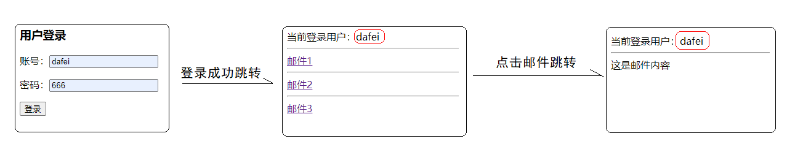
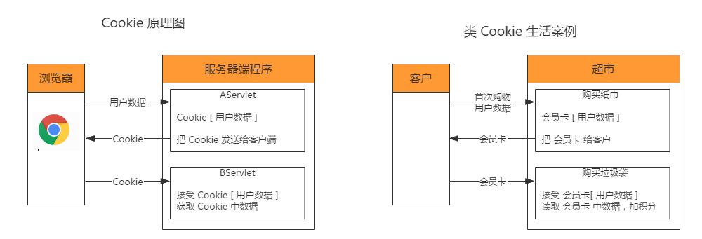
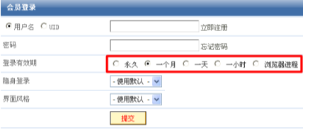
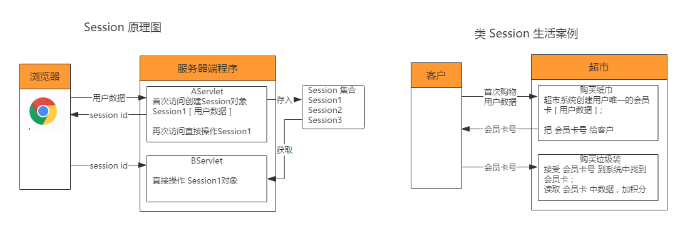
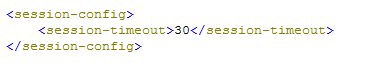
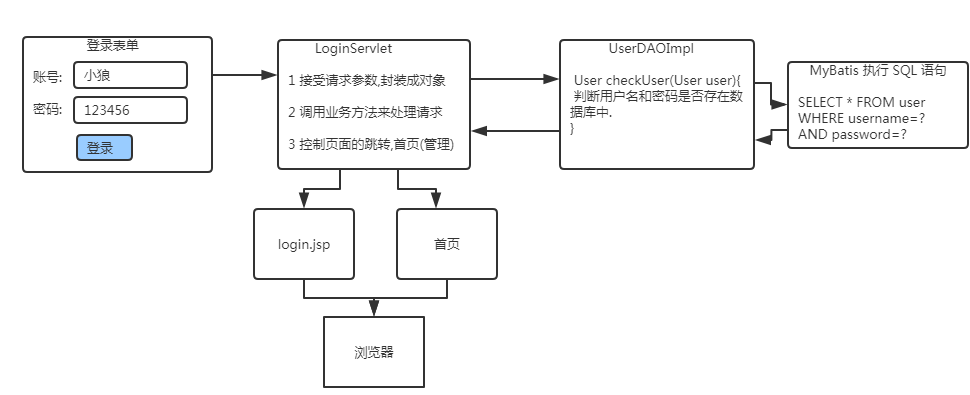
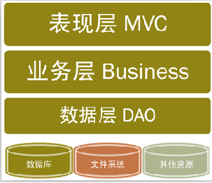
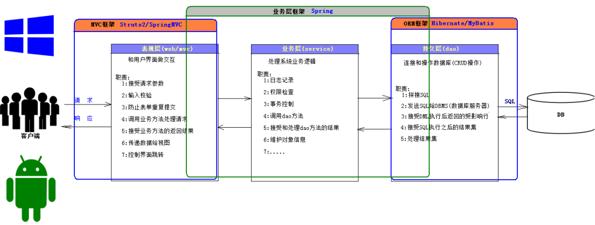

# 会话跟踪技术

# 目标 `*****`

- [ ] 掌握会话跟踪的 3 种实现方式 `*****`
- [ ] 理解 Cookie 技术的原理和作用 `*****`
- [ ] 掌握 Cookie 技术的基本使用 `*****`
- [ ] 了解 Cookie 技术的细节操作 `***`
- [ ] 理解 Session 技术的原理和作用 `*****`
- [ ] 掌握 Session 技术的基本使用 `*****`
- [ ] 了解 Session 技术的细节操作 `***`
- [ ] 掌握登录业务逻辑 `****`
- [ ] 三层架构理解 `*****`


# 一、开场白

每天来上一遍，没有学不会的Web，回想一下，上节课讲内容属于哪一块？

今天的课堂主角有3个：

**会话跟踪技术**----Cookie-客户端

**会话跟踪技术**----Session-服务端

**三层架构**----表现层---业务层(服务层)---持久层(数据层)


# 二、问题引入

## 2.1 问题引入

**一个简单业务场景：用户登录邮箱，成功后查看邮箱列表，点击某封邮箱查看内容**



要求：

- 设计代码实现跳转流程
- 关注页面2，页面3，都能显示当前登录用户信息

思考点：有哪些技术能实现上面逻辑？


## 2.2 问题分析

上面问题核心有2个

- 流程跳转
- 登录用户信息共享


### 2.2.1 流程跳转

这个相对简单，观察流程，就可以确定3个jsp：login.jsp   list.jsp   content.jsp

那跳转流程就清晰了

步骤1：访问login.jsp，输入账号密码登录--LoginServlet

步骤2：登录成功跳转到list.jsp

步骤3：点击邮件超链接，跳转到ContentServlet

步骤4：查询邮件内容，然后跳转到content.jsp

流程图：浏览器---login.jsp----LoginServlet----list.jsp---ContentServlet----content.jsp

login.jsp

```jsp

<%@ page contentType="text/html;charset=UTF-8" language="java" %>
<html>
<head>
    <title>用户登录</title>
</head>
<body>
<h3>用户登录</h3>
<form action="/email/login" method="post">
    <p>账号：<input type="text" name="username"></p>
    <p>密码：<input type="text" name="password"></p>
    <input type="submit" value="登录">
</form>
</body>
</html>

```

LoginServlet

```java
package cn.wolfcode.servlet._14_email;

import jakarta.servlet.ServletException;
import jakarta.servlet.annotation.WebServlet;
import jakarta.servlet.http.HttpServlet;
import jakarta.servlet.http.HttpServletRequest;
import jakarta.servlet.http.HttpServletResponse;

import java.io.IOException;

@WebServlet("/email/login")
public class LoginServlet  extends HttpServlet {
    @Override
    protected void service(HttpServletRequest req, HttpServletResponse resp) throws ServletException, IOException {

        String username = req.getParameter("username");
        String password = req.getParameter("password");

        if("dafei".equals(username) && "666".equals(password)){
            System.out.println("登录成功");
            req.getRequestDispatcher("/email/list.jsp").forward(req, resp);
        }else{
            System.out.println("登录失败");
            req.getRequestDispatcher("/email/login.jsp").forward(req, resp);
        }
    }
}
```

list.jsp

```jsp
<%@ page contentType="text/html;charset=UTF-8" language="java" %>
<html>
<head>
    <title>列表</title>
</head>
<body>
当前登录用户：
<hr>
<a href="/email/content">邮件1</a>
<hr>
<a href="/email/content">邮件2</a>
<hr>
<a href="/email/content">邮件3</a>
</body>
</html>

```

ContentServlet

```java
package cn.wolfcode.servlet._14_email;

import jakarta.servlet.ServletException;
import jakarta.servlet.annotation.WebServlet;
import jakarta.servlet.http.HttpServlet;
import jakarta.servlet.http.HttpServletRequest;
import jakarta.servlet.http.HttpServletResponse;

import java.io.IOException;

@WebServlet("/email/content")
public class ContentServlet extends HttpServlet {
    @Override
    protected void service(HttpServletRequest req, HttpServletResponse resp) throws ServletException, IOException {
        req.getRequestDispatcher("/email/content.jsp").forward(req, resp);
    }
}

```

content.jsp

```jsp
<%@ page contentType="text/html;charset=UTF-8" language="java" %>
<html>
<head>
    <title>邮件内容</title>
</head>
<body>
当前登录用户：
<hr>
这是邮件内容
</body>
</html>

```

### 2.2.2 登录用户信息共享

**主干思路**：从流程图看，只需要保证LoginServlet接收到的登录用户信息在后续servlet跟jsp中共享就行。

**思考**：数据共享方式有哪些？

分析：四大作用域：Page   Request  Session  Context

**思考**：此处适合实现方式？

分析：

​	Request----通过请求共享 + 请求参数携带方式将用户信息携带到页面（别扭）

​	session---将数据共享在session中，通会话中数据共享（完美）

​	Cookie---直接将数据缓存在浏览器中，不需要服务端折腾（优雅）

## 2.3 问题解决

### 2.3.1 方案1：Request参数方式

这种方案，参数会配置在请求url上面，不安全，放弃，课下自己尝试实现

### 2.3.2 方案2：Session方式

将上面文件重新拷贝一份，建包session

LoginServlet

```java
@WebServlet("/session/login")
public class LoginServlet  extends HttpServlet {
    @Override
    protected void service(HttpServletRequest req, HttpServletResponse resp) throws ServletException, IOException {

        String username = req.getParameter("username");
        String password = req.getParameter("password");

        if("dafei".equals(username) && "666".equals(password)){
            System.out.println("登录成功");
            req.getSession().setAttribute("username", username);
            req.getRequestDispatcher("/session/list.jsp").forward(req, resp);
        }else{
            System.out.println("登录失败");
            req.getRequestDispatcher("/session/login.jsp").forward(req, resp);
        }
    }
}
```

list.jsp

```jsp
<%@ page contentType="text/html;charset=UTF-8" language="java" %>
<html>
<head>
    <title>列表</title>
</head>
<body>
当前登录用户：${username}
<hr>
<a href="/session/content">邮件1</a>
<hr>
<a href="/session/content">邮件2</a>
<hr>
<a href="/session/content">邮件3</a>
</body>
</html>

```

ContentServlet

```java
package cn.wolfcode.servlet._14_email;

import jakarta.servlet.ServletException;
import jakarta.servlet.annotation.WebServlet;
import jakarta.servlet.http.HttpServlet;
import jakarta.servlet.http.HttpServletRequest;
import jakarta.servlet.http.HttpServletResponse;

import java.io.IOException;

@WebServlet("/session/content")
public class ContentServlet extends HttpServlet {
    @Override
    protected void service(HttpServletRequest req, HttpServletResponse resp) throws ServletException, IOException {
        req.getRequestDispatcher("/session/content.jsp").forward(req, resp);
    }
}

```

content.jsp

```jsp
<%@ page contentType="text/html;charset=UTF-8" language="java" %>
<html>
<head>
    <title>邮件内容</title>
</head>
<body>
当前登录用户：${username}
<hr>
这是邮件内容
</body>
</html>
```

### 2.3.3 方案3：Cookie方式

将上面文件重新拷贝一份，建包cookie

LoginServlet

```java
@WebServlet("/cookie/login")
public class LoginServlet  extends HttpServlet {
    @Override
    protected void service(HttpServletRequest req, HttpServletResponse resp) throws ServletException, IOException {

        String username = req.getParameter("username");
        String password = req.getParameter("password");

        if("dafei".equals(username) && "666".equals(password)){
            System.out.println("登录成功");
            //创建cookie
            Cookie cookie = new Cookie("username", username);
            //将cookie回传给浏览器
            resp.addCookie(cookie);
            //这里要注意使用重定向
            resp.sendRedirect("/cookie/list.jsp");
        }else{
            System.out.println("登录失败");
            req.getRequestDispatcher("/cookie/login.jsp").forward(req, resp);
        }
    }
}
```

list.jsp

```jsp
<%@ page contentType="text/html;charset=UTF-8" language="java" %>
<html>
<head>
    <title>列表</title>
</head>
<body>
当前登录用户：${cookie.username.value}
<hr>
<a href="/email/content">邮件1</a>
<hr>
<a href="/email/content">邮件2</a>
<hr>
<a href="/email/content">邮件3</a>
</body>
</html>
```

content.jsp

```jsp
<%@ page contentType="text/html;charset=UTF-8" language="java" %>
<html>
<head>
    <title>邮件内容</title>
</head>
<body>
当前登录用户：${cookie.username.value}
<hr>
这是邮件内容
</body>
</html>

```


**思考：对比Cookie跟Session，应该选择哪个？**


cookie: 1>客户端存储  2>少量数据  3>非敏感数据----一些不算太私密信息可以缓冲在cookie

​       --浏览记录/历史---个性化配置--用户浏览行为

**session**:1>服务端存储 2>大量数据  3>敏感数据---涉及到账号，金额，个人隐私相关数据都建议使用session


# 三、客户端缓存：Cookie

## 3.1 Cookie 概述

Cookie是 **客户端技术**，程序把每个用户的数据以 cookie 的形式写给用户各自的浏览器。当用户使用浏览器再次去访问服务器中的 web 资源时，就会带着各自的 cookie 过去服务器。这样, web 资源处理的就是用户各自的数据了。

**思考**：

1. Cookie 是服务器端创建的还是客户创建的？ 服务器端程序创建
2. Cookie 从哪里带到哪里？服务器端  -> 客户端
3. Cookie 最终存在什么地方？ 浏览器
4. Cookie 什么时候实现数据共享？ 再一次访问服务器端资源时(存入,拿出)
5. Cookie 中数据的传递方向？ 浏览器 -> 服务器 (Cookie)-> 浏览器(存入) ->服务器(获取Cookie数据)


## 3.2 Cookie 原理图




## 3.3 Cookie  API操作

Cookie 使用分3步走

- 创建Cookie
- 发送 Cookie
- 获取Cookie

### 3.3.1 创建 Cookie 对象

创建对象：

```java
 Cookie  cookie = new Cookie (String name,String value)
```

| 属性  |    方法    |         描述         |
| :---: | :--------: | :------------------: |
| name  | getName()  | 共享数据名称（唯一） |
| value | getValue() |     要共享的数据     |


### 3.3.2 响应 Cookie 给浏览器

使用响应对象中的 addCookie (cookie 对象) 将数据响应给浏览器.

> resp.addCookie(cookie)

### 3.3.3 获取 Cookie

浏览器发请求时,自动将 Cookie 发送到服务器,服务器程序直接获取即可。

数据在请求中，使用请求对象中的 getCookies() 方法获取所有的 Cookie 对象

servlet：

> Cookie[] cs = request对象.getCookies();

jsp：

> ${cooke.cookie名称.value}

### 3.3.4 Cookie案例

**需求：设计2个Servlet：CookieCreateServlet   CookieGetServlet    一个jsp：cookie.jsp**

- CookieCreateServlet   访问该servlet，创建2个cookie
- CookieGetServlet        访问该servlet，获取上面servlet创建2个cookie
- cookie.jsp                     访问CookieGetServlet   跳转到cookie.jsp


CookieCreateServlet   

```java
@WebServlet("/cookie/create")
public class CookieCreateServlet extends HttpServlet {
    @Override
    protected void service(HttpServletRequest req, HttpServletResponse resp) throws ServletException, IOException {

        Cookie cookie1 = new Cookie("name", "dafei");
        Cookie cookie2 = new Cookie("age", "18");

        resp.addCookie(cookie1);
        resp.addCookie(cookie2);
    }
}
```

CookieGetServlet        

```java
package cn.wolfcode.servlet._15_cookie;

import jakarta.servlet.ServletException;
import jakarta.servlet.annotation.WebServlet;
import jakarta.servlet.http.Cookie;
import jakarta.servlet.http.HttpServlet;
import jakarta.servlet.http.HttpServletRequest;
import jakarta.servlet.http.HttpServletResponse;

import java.io.IOException;

@WebServlet("/cookie/get")
public class CookieGetServlet extends HttpServlet {
    @Override
    protected void service(HttpServletRequest req, HttpServletResponse resp) throws ServletException, IOException {
        Cookie[] cookies = req.getCookies();
        for (Cookie cookie : cookies) {
            System.out.println(cookie.getName() + " <--> "+ cookie.getValue());
        }

        req.getRequestDispatcher("/cookie/cookie.jsp").forward(req, resp);
    }
}

```

cookie.jsp

```jsp
<%@ page contentType="text/html;charset=UTF-8" language="java" %>
<html>
<head>
    <title>cookie获取</title>
</head>
<body>
name：${cookie.name.value}
<hr>
age：${cookie.age.value}
</body>
</html>
```

### 3.3.5 Cookie 细节

**细节1：Cookie 存活时间(掌握)**

默认情况下 Cookie 属于会话 Cookie ，即浏览器关闭则失效，无法使用。

<br/>

要实现以上功能则需要在创建 Cookie之后给 Cookie 设置存活时间。

**API**：Cookie 对象的 setMaxAge(int expiry) 

|  expiry数值   |     例子      | 含义                                  |
| :-----------: | :-----------: | ------------------------------------- |
| 大于 0 的数值 | setMaxAge(60) | Cookie 存活的时间，单位为秒，例：60秒 |
|       0       | setMaxAge(0)  | 立即删除当前 Cookie 对象              |
| 小于 0 的数值 | setMaxAge(-1) | 会话 Cookie，浏览器关闭则销毁         |

**测试：在CookieCreateServlet 设置name cookie 存活时间5s中，5s之后再访问get请求**


**细节2：删除 Cookie**

删除 Cookie 只需要使用设置Cookie 存活时间的方法即可，当然需要注意的是一般是中途删除 Cookie ，不是 创建了马上删除，所以在设置删除之后需要重新发送给浏览器去更新删除。

**API**：

```java
Cookie 对象.setMaxAge(0);
response.addCookie(Cookie对象);  //通知浏览器删除cookie
```


**细节3：Cookie 中文问题**

Cookie 中的 name 属性和 value 都不支持中文,如果有中文,抛以下异常  (Tomcat8.5 以下存在的问题)


Tomcat8.5 自动处理了 Cookie 中文问题，所以无需手动解决。

**Tomcat 8.5 以下解决思路**： 将中文进行处理,转换成另一种非中文字符串，获取时转化回来。

**API**

|     类     |            方法             |           作用           |
| :--------: | :-------------------------: | :----------------------: |
| URLEncoder |   encode(“中文”,“UTF-8”)    | 把中文字符串转化为非中文 |
| URLDecoder | decode（“非中文”，“UTF-8”） |    把非中文转化为中文    |

> 小狼   <===>    %E5%B0%8F%E7%8B%BC


**Cookie 使用**：

```java
// Cookie 封装数据方式
Cookie cookie = new Cookie("name",URLEncoder.encode("小狼","UTF-8"));
resp.addCookie(cookie);
// Cookie 获取数据方式
Cookie[] cs = request.getCookies();
for (Cookie c : cs) {
    if("name".equals(c.getName())){
        System.out.println(URLDecoder.decode(c.getValue(),"UTF-8"));
    }
}
```


## 3.4 Cookie限制

### 3.4.1  Cookie 的域和路径限制（了解）

为了让浏览器可以设别 Cookie 发送给对应的服务器，以及设别哪些请求需要带 Cookie，默认 Cookie 都带了服务器的设别标识以及需要带 Cookie 的资源标识。

**设别服务器**： IP:端口,可设别到服务器，但需要两个数据，域名是 IP:端口 整合，所以使用 **域名**，只能是创建Cookie 的服务器的域名。

**域名分类**： www.baidu.com

+ 一级（主）域名：baidu.com
+ 多级域名：news.**baidu.com**

想要在相同的主域名下来共享数据，例如，百度和百度地图，百度音乐共用账号，则只需要设置 Cookie 的 domain 即可。主域不同，无法共享数据。

```java
cookie.setDomain(".baidu.com");
```


**设别资源**： 使用**路径 path**，默认为创建 Cookie的资源所在目录。例：/cookie/login 创建 Cookie，则path为/cookie,则访问 /cookie 打头的资源都会带上该 Cookie。

想要在访问服务器上的任意资源都带上 Cookie ，则只需要在创建 Cookie 之后设置下path 为 / 即可。

```java
cookie.setPath("/");
```

**注意**：

1. 主域名不同，不管 path 为啥，都无法带上 Cookie

2. **localhost/login 中创建的 Cookie，path 也为 /，则任意资源访问都会带该 Cookie**


### 3.4.2 Cookie 使用限制

- 如果是一个用户一台电脑,没有问题,但是如果多个人公用一个电脑就存在,不安全

- 使用中文的 (Tomcat8.5 之内) 比较麻烦(编码,解码)

- 一个 Cookie 只能设置一个值,value 是 String 类型

- 一台服务器在一个客户端存储的 Cookie 大小和数量有限 
   Cookie 大小限制在 4KB 之内；
   一台服务器在一个客户端最多保存 20 个 Cookie；
   一个浏览器最多可以保存 300 个 Cookie；


# 四、服务端缓存：Session

## 4.1 Session 概述

Session是**服务器端技术**，利用这个技术，服务器在运行时可以为每一个 **用户的浏览器** 创建一个其**独享的session对象**，由于session为用户浏览器独享，所以用户在访问服务器的 web 资源时，可以把各自的数据放在各自的session中，当用户再去访问服务器中的其它 web 资源时，其它 web 资源再从用户各自的 session 中取出数据为用户服务。

**思考**：

1. Session 谁来创建？ 服务器
2. Session 存在什么地方？ 服务器
3. Session 什么时候实现数据共享？ 再一次访问服务器端资源时(存入,取出)
4. Session 中数据的传递方向？ 浏览器 -> 服务器(Session)  -> 服务器资源
5. 服务器如何设别不同用户的 Session？ 浏览器 -> 服务器(Session)  sessionId -> 浏览器 sessionId -> 服务器 


## 4.2 Session 的原理图



Session 其底层任然需要依赖Cookie 来传递 Session 的id 值。传递 sessionId 的 Cookie 为会话 Cookie。

所以 Session 在浏览器关闭之后就无法使用了。原因是 sessionId 丢失了，服务器会在 30 分钟内清除未有操作的Session 对象。

**Session 本质是Cookie**


## 4.3 Session API操作

Sessioon 的基本使用无非是如何得到 Session 对象以及如何做数据的共享


### 4.3.1 获取 Session 对象

获取 Session 使用 HttpServletRequest 的 API

| 方法              | 作用                                                         |
| ----------------- | ------------------------------------------------------------ |
| getSession(true)  | 判断是否存在 Session ,存在则获取,不存在则创建新 Session 对象返回 |
| getSession(false) | 判断是否存在 Session ,存在则获取,不存在则返回 null （不符合需求） |
| getSession()      | 判断是否存在 Session (浏览器是否带了sessionId),存在则获取,不存在则创建新 Session 对象返回 （推荐） |

推荐使用 getSession () 满足需求的同时比较简洁


### 4.3.2 Session 数据共享

HttpSession API

| 方法                                    | 作用                                        |
| --------------------------------------- | ------------------------------------------- |
| setAttribute(String name, Object value) | 设置属性名和属性值                          |
| getAttribute(String name)               | 通过属性名去获取属性值                      |
| removeAttribute(String name)            | 从Session中移除指定属性名的属性值           |
| invalidate()                            | 移除整个Session 对象,删除所有的属性和属性值 |

removeAttribute 和 invalidate 视情况选择，一般使用 removeAttribute，避免删除session 对象之后有的数据任然需要使用。


### 4.3.3 Session 细节

**细节1：Session 超时管理**

设置会话的有效时间，比如金融项目，一般用户登陆状态只保留 1~3分钟，不会一直保留。中途离开，回来需要重新登陆。

> session对象.setMaxInactiveInterval(int interval) : 设置session超时时间(秒)(两次请求之间的时间)


Tomcat 默认是 30 分钟,实际上只保存20来分钟(web.xml)




**细节2：URL 重写**

Session 是一个特殊的 Cookie,存在浏览器上,用户可选择不接受 Cookie，此时Session 失效。

**解决方案**：

1. 手动在请求url后面拼接jsessionid,使用 **;** 来间隔

   http://localhost/session/list;jsessionid=6225FDD3988C3B11BD8320899E9B1D2F

2.  自动在请求的URL后面拼接 jsessionid  (自动检测用户是否开启Cookie接收,如果开启了,则不拼接jsessionid)

   response对象.encodeURL("/session/content") ;

**以之前邮件为案例**

```java
<%
    String url =  response.encodeURL("/session/content");
%>
<a href="<%=url%>">邮件1</a>
    
或者
<a href="${pageContext.response.encodeURL("/session/content")}">邮件1</a>
```


**注意： 一般开发中不去屏蔽Cookie ,一般用户也不会去做**


## 4.4 Session 使用规范

- **Session 的属性命名,一般我们命名: XX_IN_SESSION ,而且这个属性名是唯一的**
      **session.setAttribute(“USER_IN_SESSION”,user);**

- **Session 可以存放多个数据，但是如果数据之间是有联系的，比如username,password 需要封装起来再存入 User(username,password)**

- 服务器在做 session 数据共享时,session 中的对象类型必须实现 java.io.Serializable; 接口(在网络上传递数据). (了解)
      序  列  化: 把对象转成二进制
      反序列化: 把二进制恢复成对象


# 五、Session案例-登录功能

## 5.1 为什么做登录

服务器资源给合理的人访问，在这里只有登录的用户才可以访问，比如只有登录的用户就可以访问产品进行CRUD。

## 5.2 分析登录流程



## 5.3 登录实现

**步骤1：项目准备及新建 user 表**

打开之前 pmis 项目，在其对应的库中新建 user 表，并造一条数据，表结构如下：

```sql
CREATE TABLE `user` (
  `id` bigint(20) PRIMARY KEY AUTO_INCREMENT,
  `username` varchar(255) DEFAULT NULL,
  `password` varchar(255) DEFAULT NULL
) ENGINE=InnoDB DEFAULT CHARSET=utf8;

INSERT INTO user(username, password) VALUES('dafei', '666');
```

**步骤2：编写 User.java**

```java
@Setter
@Getter
@AllArgsConstructor
@NoArgsConstructor
public class User {
    private Long id;
    private String username;
    private String password;
}
```

**步骤3：编写 IUserDAO.java**

在 dao 包下新建 IUserDAO.java，文件内容如下：

```java
package cn.wolfcode.pmis.dao;

import cn.wolfcode.pmis.domain.User;

public interface IUserDAO {
    User checkUser(User user);
}
```

**步骤4：编写  UserDAOImpl.java**

里面提供根据用户名和密码查询用户的方法。

```java
package cn.wolfcode.pmis.dao.impl;

import cn.wolfcode.pmis.dao.IUserDAO;
import cn.wolfcode.pmis.domain.User;
import cn.wolfcode.pmis.util.JDBCUtil;

import java.util.List;

public class UserDAOImpl implements IUserDAO {
    public User checkUser(User user) {
        String sql = "SELECT * FROM user WHERE username=? and password=?";

        List<User> list = JDBCUtil.executeQuery(sql, User.class, user.getUsername(), user.getPassword());
        return list != null && list.size() > 0? list.get(0):null;
    }
}
```

**步骤5：编写 LoginServlet.java**

处理登录请求，对登录成功或失败进行响应。

```java
package cn.wolfcode.pmis.web.servlet;

import cn.wolfcode.pmis.dao.IUserDAO;
import cn.wolfcode.pmis.dao.impl.UserDAOImpl;
import cn.wolfcode.pmis.domain.User;
import jakarta.servlet.ServletException;
import jakarta.servlet.annotation.WebServlet;
import jakarta.servlet.http.HttpServlet;
import jakarta.servlet.http.HttpServletRequest;
import jakarta.servlet.http.HttpServletResponse;

import java.io.IOException;

@WebServlet("/login")
public class LoginServlet extends HttpServlet {
    private IUserDAO userDAO = new UserDAOImpl();
    @Override
    protected void service(HttpServletRequest req, HttpServletResponse resp) throws ServletException, IOException {
        // 接受请求参数，封装成对象
        User user = new User();
        user.setUsername(req.getParameter("username"));
        user.setPassword(req.getParameter("password"));
        // 调用业务方法来处理登录请求
        User u = userDAO.checkUser(user);
        if(u == null){
            // 通知用户账号或密码错误
            req.setAttribute("errorMsg", "账号或密码错误");
            req.getRequestDispatcher("/login.jsp").forward(req, resp);
            return;
        }
        // 登录成功，重定向产品列表页面
        resp.sendRedirect("/product");
    }
}

```

**步骤6：编写 login.jsp**

在 web 目录新建 login.jsp，文件内容如下：

```jsp
<%@ page contentType="text/html;charset=UTF-8" language="java" %>
<html>
<head>
    <title>登录</title>
</head>
<body>
    <h3>用户登录</h3>
    <span style="color:red;">${errorMsg}</span>
    <form action="/login" method="post">
        <p>账号: <input type="text" name="username"></p>
        <p>密码: <input type="text" name="password"></p>
        <input type="submit" value="登录">
    </form>
</body>
</html>
```

## 5.4 访问限制

因为上面虽然把登录需求做完，但大家发现，若在浏览器地址中直接输入 localhost/product 访问依然是可以的。那么怎么解决这个问题呢？

**步骤1：修改 LoginServlet.java**

当登录成功时往 Session 中存入一个标识，比如 User 对象，给其它需要登录才可以操作的资源做判断使用。

```java
package cn.wolfcode.pmis.web.servlet;

import cn.wolfcode.pmis.dao.IUserDAO;
import cn.wolfcode.pmis.dao.impl.UserDAOImpl;
import cn.wolfcode.pmis.domain.User;
import jakarta.servlet.ServletException;
import jakarta.servlet.annotation.WebServlet;
import jakarta.servlet.http.HttpServlet;
import jakarta.servlet.http.HttpServletRequest;
import jakarta.servlet.http.HttpServletResponse;

import java.io.IOException;

@WebServlet("/login")
public class LoginServlet extends HttpServlet {
    private IUserDAO userDAO = new UserDAOImpl();
    @Override
    protected void service(HttpServletRequest req, HttpServletResponse resp) throws ServletException, IOException {
        // 接受请求参数，封装成对象
        User user = new User();
        user.setUsername(req.getParameter("username"));
        user.setPassword(req.getParameter("password"));
        // 调用业务方法来处理登录请求
        User u = userDAO.checkUser(user);
        if(u == null){
            // 通知用户账号或密码错误
            req.setAttribute("errorMsg", "账号或密码错误");
            req.getRequestDispatcher("/login.jsp").forward(req, resp);
            return;
        }
        // 登录成功时往 Session 中加入一个登录成功的标识
        req.getSession().setAttribute("USER_IN_SESSION", u);
        // 登录成功，重定向产品列表页面
        resp.sendRedirect("/product");
    }
}

```

**步骤2：修改 ProductServlet 的 service 方法**

对产品 CRUD 的资源或者操作是需要登录才可以访问或操作，那么从 Session 中来获取登录的标识，获取到则有登录可以访问或操作；获取不到则没登录，没登录则跳转去登录页面。

```java
protected void service(HttpServletRequest req, HttpServletResponse resp) throws ServletException, IOException {
    req.setCharacterEncoding("UTF-8");
    
    // 判断 Session 中是否有登录的标示，有则说明登录成功了，没有则说明没有登录
    Object user = req.getSession().getAttribute("USER_IN_SESSION");
    if(user == null){
        // 没有登录滚去登录
        resp.sendRedirect("/login.jsp");
        return;
    }
   ......
}
```

## 5.5 存在的问题

**思考：Servlet定位是啥？当前servlet代码是否合理？**

Servlet定位： 接收请求， 处理请求(调用业务方法处理逻辑)， 响应请求


# 六、三层架构(理解)

## 6.1 三层架构介绍

Web 开发中的最佳实践：分层开发模式（技术层面的"分而治之"）。三层架构(3-tier architecture)：通常意义上的三层架构就是将整个业务应用划分为：**表现层、业务逻辑层、数据访问层**。区分层次的目的即为了“高内聚低耦合”的思想。在软件体系架构设计中，分层式结构是最常见，也是最重要的一种结构。	

- **表现层**（Predentation Layer）：MVC，负责处理与界面交互的相关操作。
- **业务层**（Business Layer）：Service，负责复杂的业务逻辑计算和判断。
- **持久层**（Persistent Layer）：DAO，负责将业务逻辑数据进行持久化存储。





**分层好处**：责任分离，各司其职，体现高内聚低耦合。

## 6.2 业务层命名规范(掌握)

- 包名：

  - 公司域名倒写.模块名.service：存放业务接口代码。
  - 公司域名倒写.模块名.service.impl：存放业务层接口的实现类。

- 类名：

  - IXxxService：业务层接口，Xxx 表示对应模型，比如操作 User 的就起名为 IUserService。

  - XxxServiceImpl：业务层接口对应的实现类，比如操作 User 的就起名为 UserServiceImpl。

  - XxxServiceTest：业务层实现的测试类。

    

# 七、登录加入业务层(掌握)

**步骤1：编写 IUserService.java 和 UserServiceImpl.java**

调用 DAO 对象的查询方法，若登录失败，通过抛出异常的方式，返回错误信息。

```java
package cn.wolfcode.pmis.service;

public interface IUserService {
    User login(String username, String password);
}
```

```java
package cn.wolfcode.pmis.service.impl;

public class UserServiceImpl implements IUserService {

    private IUserDAO userDAO = new UserDAOImpl();

    @Override
    public User login(String username, String password) {
        User user = userDAO.checkUser(username);
        // 用户名错误
        if(user == null) {
            throw new RuntimeException("账号不存在");
        }
        // 密码错误
        if(!user.getPassword().equals(password)) {
            throw new RuntimeException("密码错误");
        }
        return user;
    }
}
```

**步骤2：修改 LoginServlet.java**

调用业务对象的业务方法。

```java
package cn.wolfcode.pmis.web.servlet;

@WebServlet("/user/login")
public class LoginServlet extends HttpServlet {

    private IUserService userService = new UserServiceImpl();

    @Override
    protected void service(HttpServletRequest req, HttpServletResponse resp) throws ServletException, IOException {
        req.setCharacterEncoding("UTF-8");
        // 接受请求参数
        String username = req.getParameter("username");
        String password = req.getParameter("password");
        try {
            // 调用业务方法来处理登录请求
            User user = userService.login(username, password);
            // 登录成功时往 Session 中加入一个登录成功的标识，给其它需要登录才可以操作的资源做判断使用
            req.getSession().setAttribute("USER_IN_SESSION", user);
            // 控制跳转
            resp.sendRedirect("/product");
        }catch (Exception e){ // 有异常时表示登录失败，
            e.printStackTrace();
            req.setAttribute("errorMsg", e.getMessage());
            req.getRequestDispatcher("/login.jsp").forward(req, resp);
        }
    }
}
```


# 小结

3. 掌握会话跟踪的 3 种实现方式
4. 理解 Cookie 技术的原理和作用
5. 掌握 Cookie 技术的基本使用(写代码)
6. 了解 Cookie 技术的细节操作
7. 理解 Session 技术的原理和作用
8. 掌握 Session 技术的基本使用 (写代码)
9. 了解 Session 技术的细节操作


# 拓展练习

需求：完成购物车的记录（用户没登录的情况，用户登录的情况）（不做要求，至少要花20分思考下）

